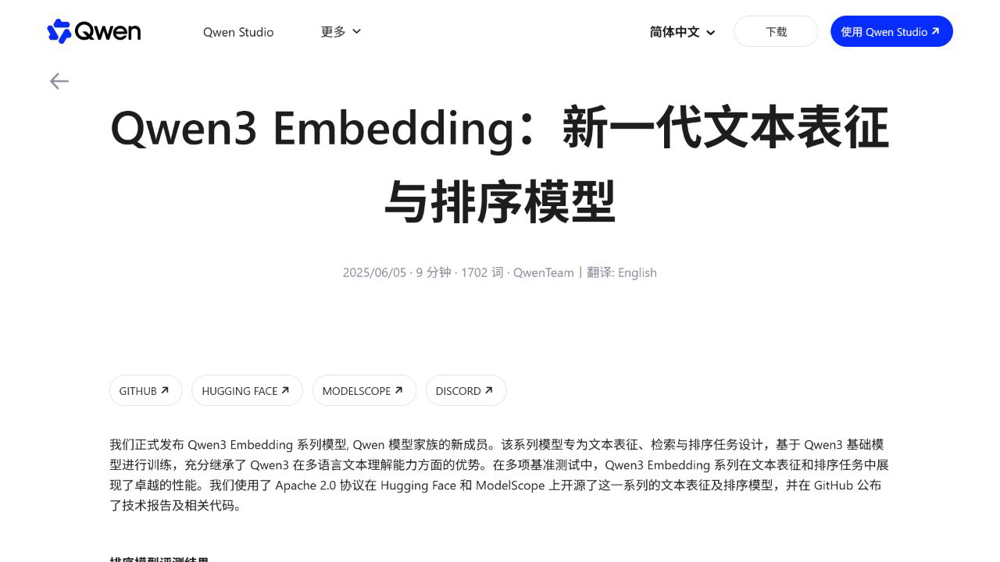
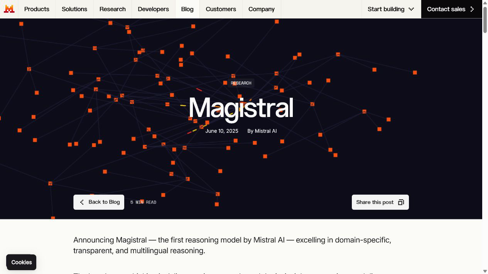
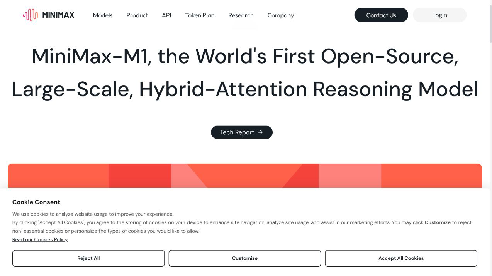
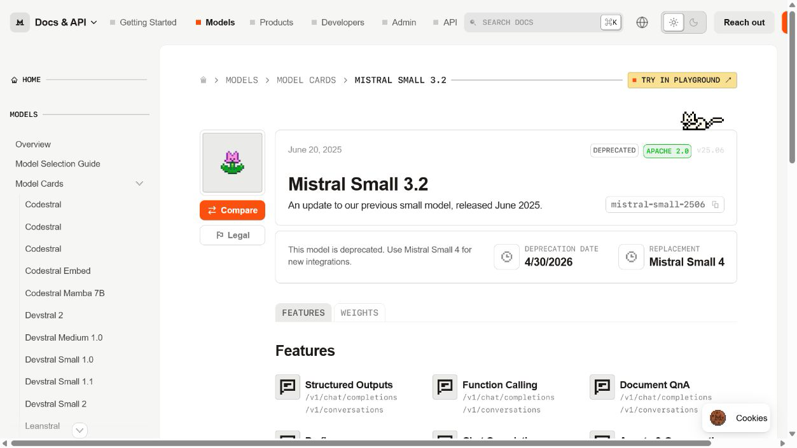
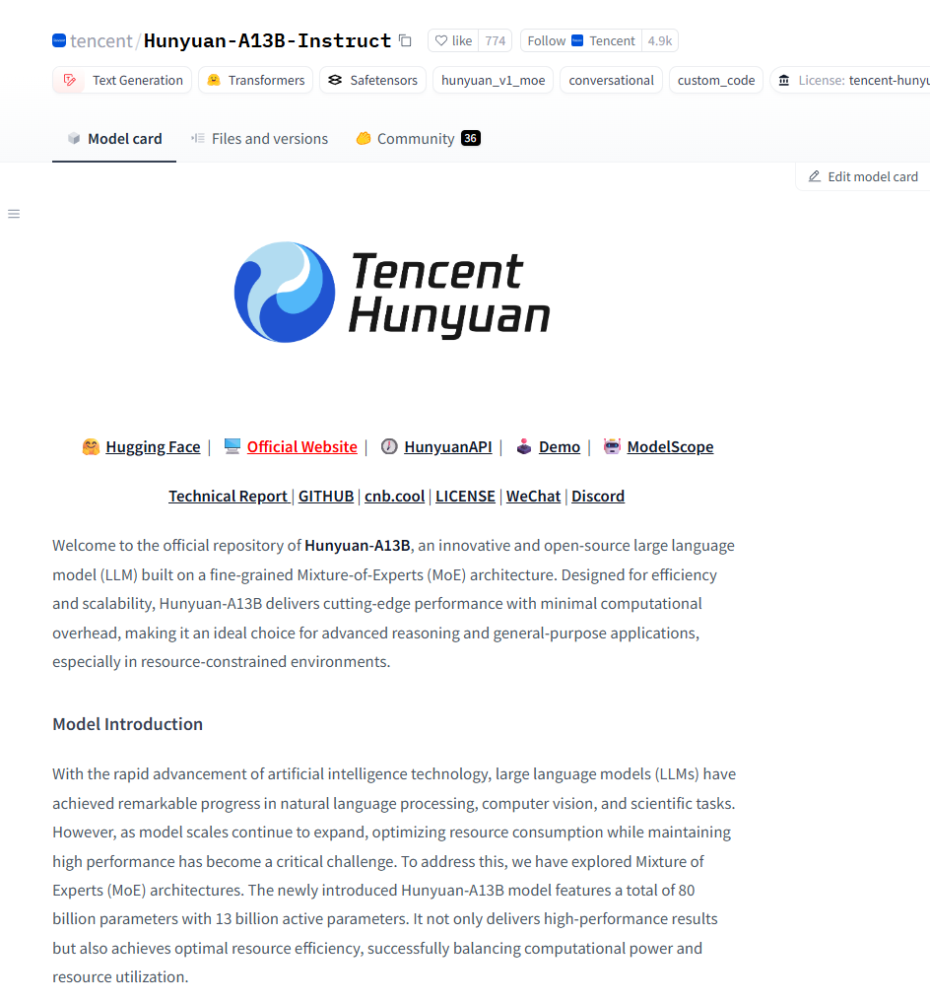
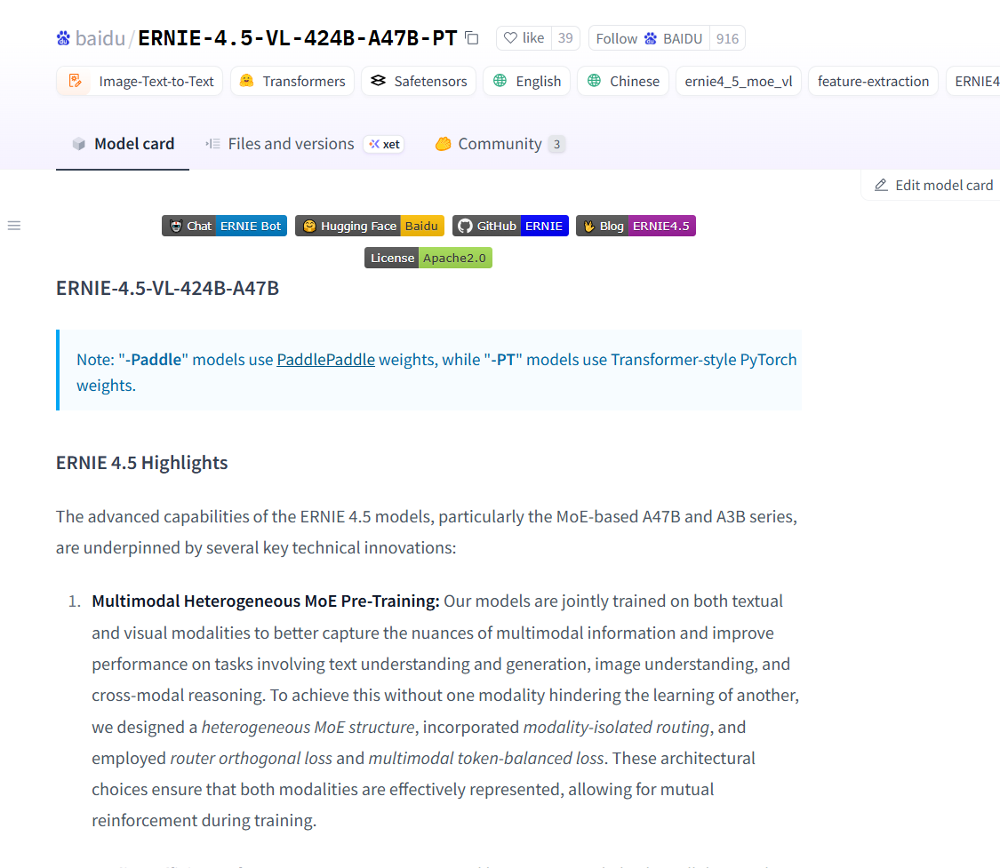

# 2025 年 6 月开源模型

- **06-05 · Qwen3 Embedding / Reranker** — 阿里通义千问开源文本向量与重排序系列，覆盖 0.6B、4B、8B，采用 Apache 2.0 许可证并支持 100 多种语言。[官方公告](https://qwenlm.github.io/blog/qwen3-embedding/)

  

- **06-10 · Magistral Small** — Mistral AI 发布 24B 开源推理模型，支持透明的多步推理，并以 Apache 2.0 许可证提供自部署。[官方公告](https://mistral.ai/news/magistral/)

  

- **06-16 · MiniMax-M1** — MiniMax 开源混合注意力推理模型，支持 100 万 token 上下文和 8 万 token 推理输出。[官方公告](https://www.minimax.io/news/minimaxm1)

  

- **06-20 · Mistral Small 3.2** — Mistral AI 更新 24B 级小模型，提供 128K 上下文，采用 Apache 2.0 许可证。[官方模型卡](https://docs.mistral.ai/models/model-cards/mistral-small-3-2-25-06)

  

- **06-27 · Hunyuan-A13B** — 腾讯混元开源，总参数 80B、激活参数 13B，补齐 70—80B 级别的模型尺寸。[相关文章](https://mp.weixin.qq.com/s/Eug1V_TI3-cUNr0zaUArSw)

  

- **06-30 · ERNIE 4.5** — 百度开源 ERNIE 4.5 系列，覆盖纯语言与多模态模型，并提供多种参数规模。

  
