# 2025 年 10 月开源模型

- **10-03 · Qwen3-VL-30B-A3B** — 阿里通义千问开源 Instruct、Thinking 和 FP8 版本。[评测](https://mp.weixin.qq.com/s/NBwPyH-V-GOqdzwb3fVD3g)

  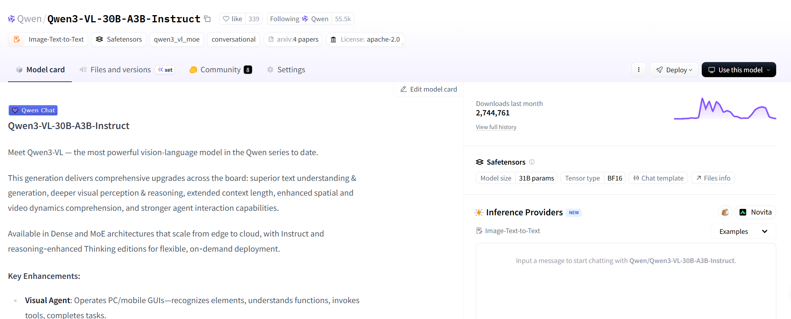

- **10-06 · Hunyuan-Vision-1.5** — 腾讯混元发布 Mamba—Transformer 混合架构视觉语言模型，面向图像、视频、视觉推理与 3D 空间理解；原始整理时仓库仍标注 Coming Soon。

  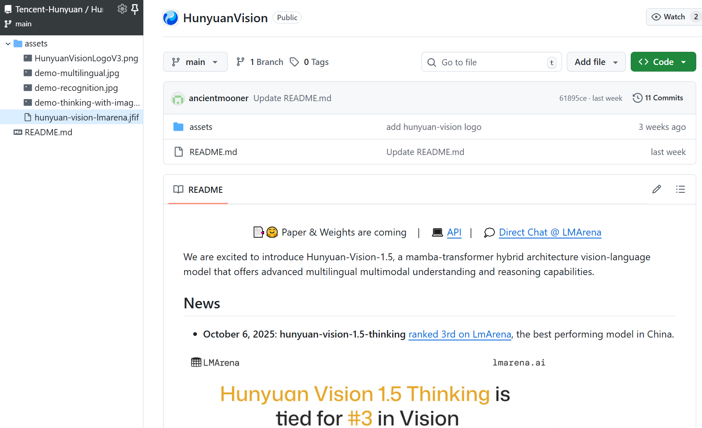

- **10-09 · Ling-1T** — 蚂蚁百灵开源首款 1T 参数非思考旗舰模型，基于 20T 高质量数据训练。[评测](https://mp.weixin.qq.com/s/VUfB5EQOfQ2cO_ff_iC4bA)

  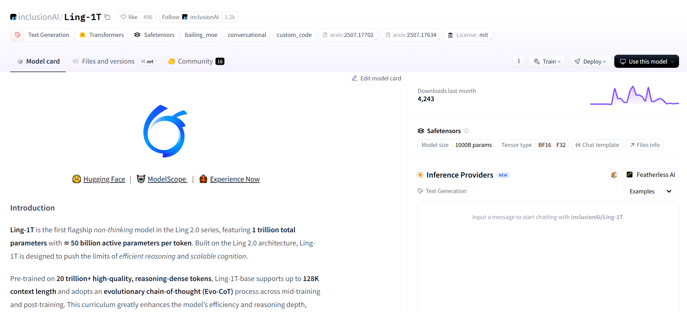

- **10-10 · DreamOmni2** — 香港科技大学开源图像生成与编辑模型，重点处理抽象概念。

  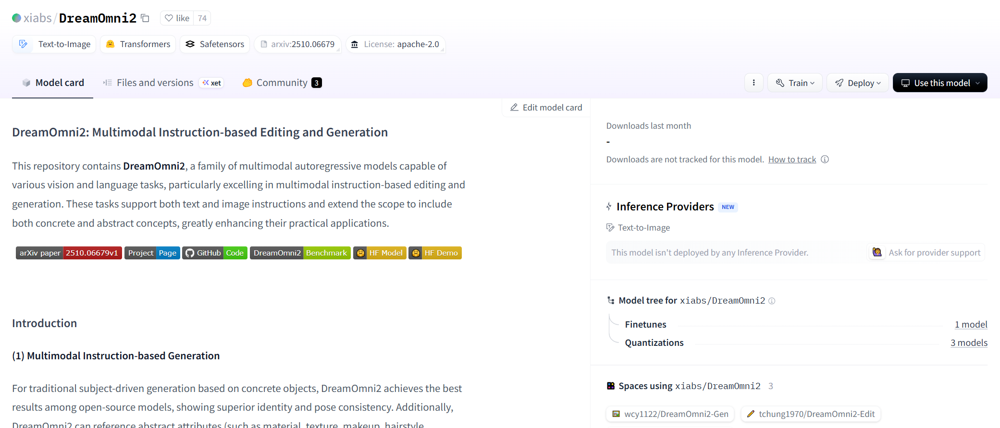

- **10-11 · KAT-Dev-72B-Exp** — 快手开源代码模型，在 SWE-bench Verified 上取得 74.6%。[相关文章](https://mp.weixin.qq.com/s/gCqZhW9prvxG1PrzJkOFEQ)

  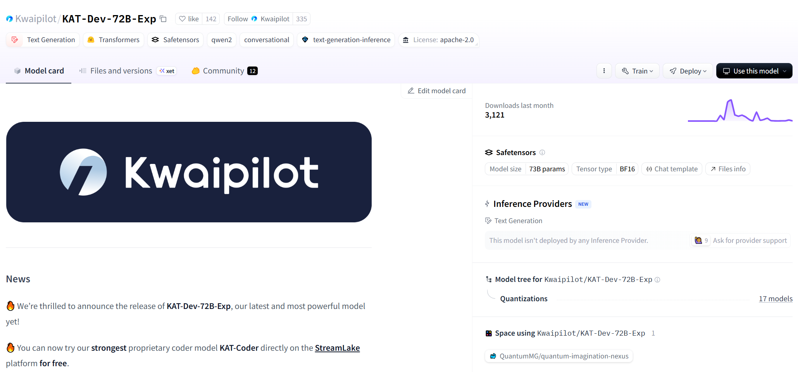

- **10-13 · FG-CLIP2** — 360 开源融合细粒度理解与双语能力的模型。

  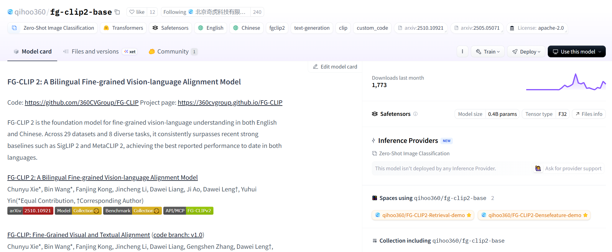

- **10-14 · Ring-1T** — 蚂蚁集团开源 1T 参数思考模型。

  

- **10-14 · FaceCLIP** — 字节跳动开源面向人脸理解与生成的视觉语言模型。

  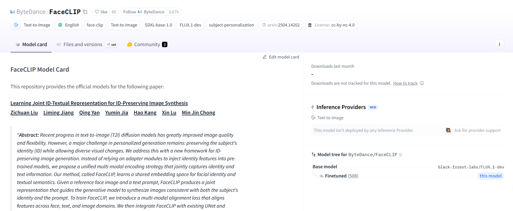

- **10-15 · Qwen3-VL 端侧系列** — 阿里通义千问开源 4B-Instruct、4B-Thinking、8B-Instruct 和 8B-Thinking。[相关文章](https://mp.weixin.qq.com/s/KlOZnELL9twYatL3UPr7kg)

  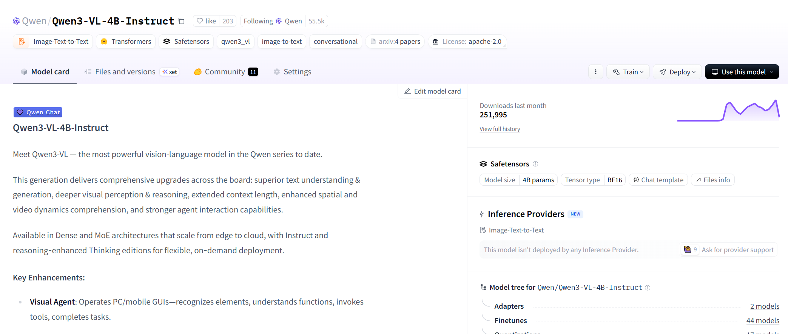

- **10-15 · Youtu-Embedding** — 腾讯优图实验室开源通用文本表示模型。

  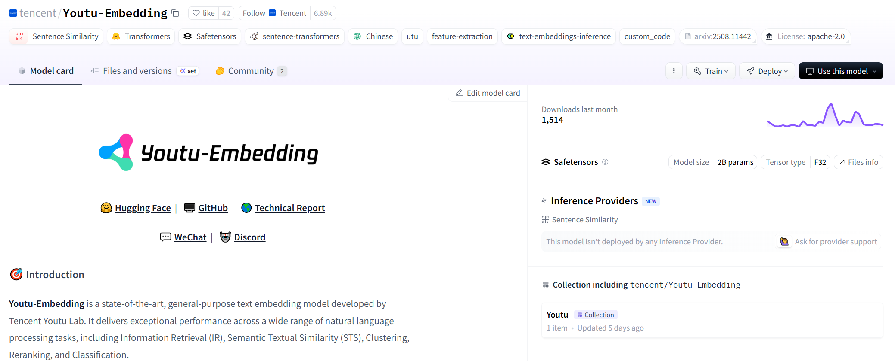

- **10-17 · PaddleOCR-VL-0.9B** — 百度开源文档解析模型。[评测](https://mp.weixin.qq.com/s/ksokCduU_xfnl6dR7P67_g)

  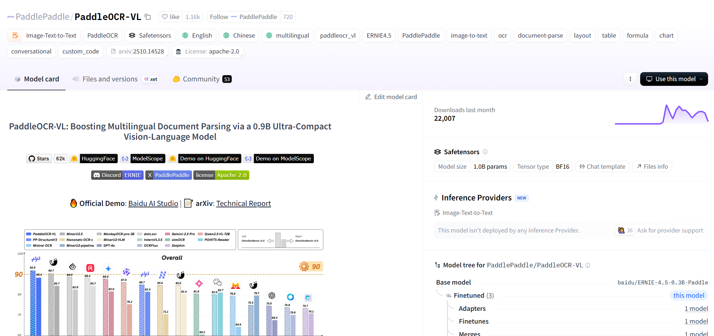

- **10-17 · LongCat-Audio-Codec** — 美团开源面向语音大模型的语音编解码方案。

  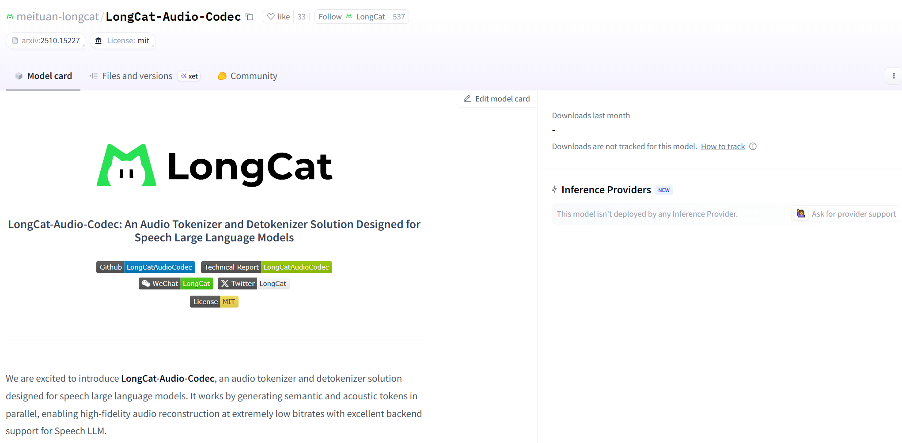

- **10-17 · EditScore-72B** — 智源开源图像编辑奖励模型；7B 版本已于 9 月 30 日开放。

  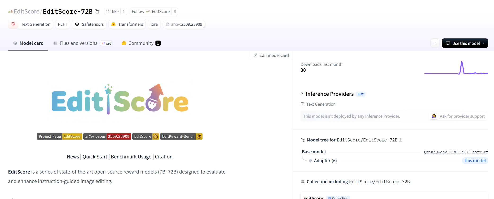

- **10-20 · DeepSeek-OCR** — DeepSeek 开源 OCR 与文本压缩模型，通过视觉模态压缩文本信息。[论文解读](https://mp.weixin.qq.com/s/MYfeRgAenf2J5Nl1zgJZhA)

  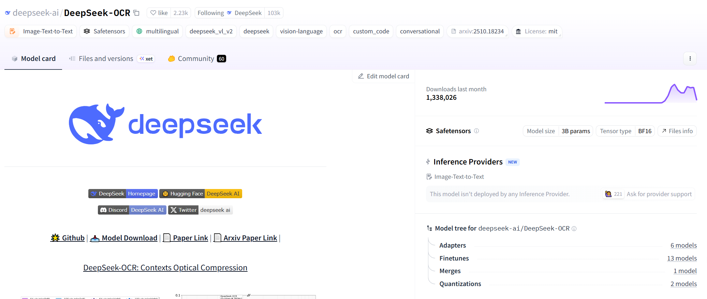

- **10-22 · Qwen3-VL-2B/32B** — 阿里通义千问开源 Instruct 和 Thinking 版本。

  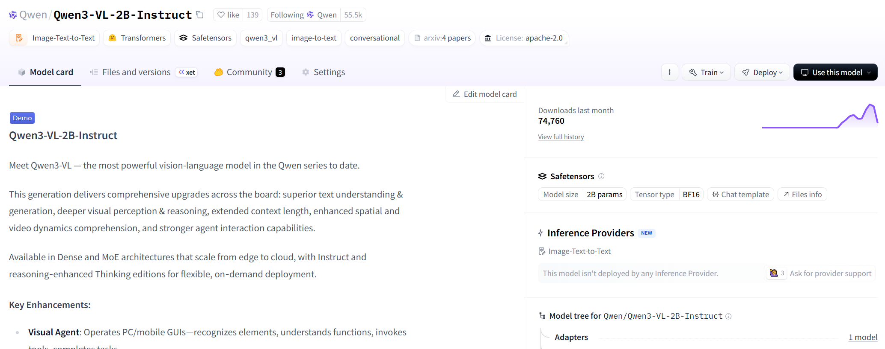

- **10-23 · HunyuanWorld-Mirror** — 腾讯混元开源世界模型 1.1，支持多视图与视频输入，可单卡部署并生成 3D 世界。

  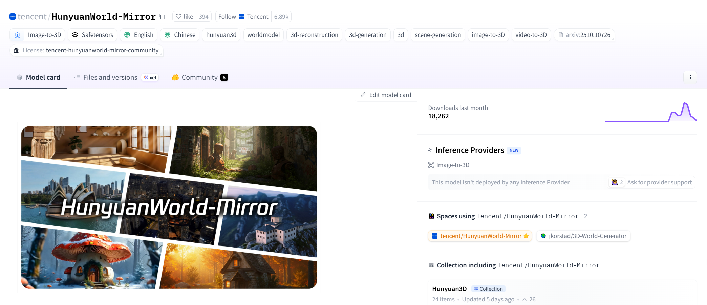

- **10-26 · LongCat-Video** — 美团开源 13.6B 视频生成模型，支持文生和图生视频以及分钟级视频生成。

  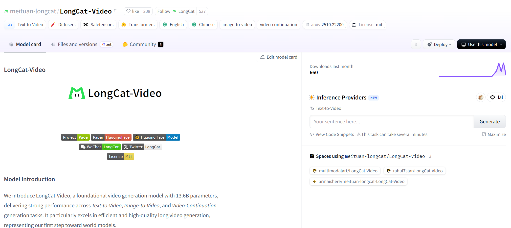

- **10-27 · MiniMax M2** — MiniMax 开源 230B-A10B MoE 模型。

  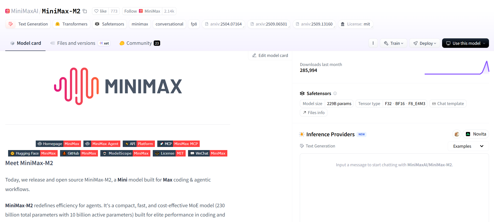

- **10-27 · Ming-flash-omni-Preview** — 蚂蚁集团开源 100B-A6B 全模态模型。

  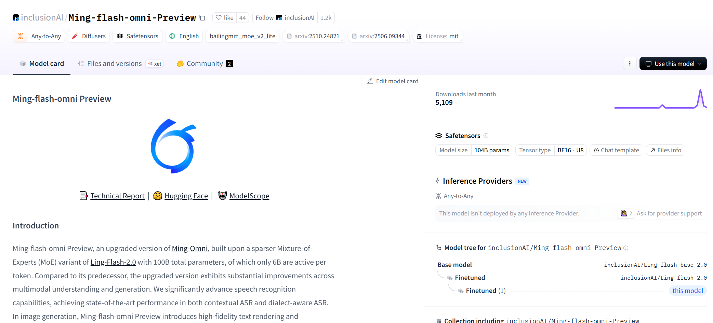

- **10-28 · Glyph** — 智谱开放模型权重，研究方向为使用视觉 Token 压缩文本。

  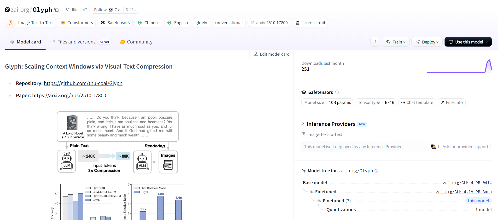

- **10-29 · JanusCoder** — 上海人工智能实验室开源代码模型系列。

  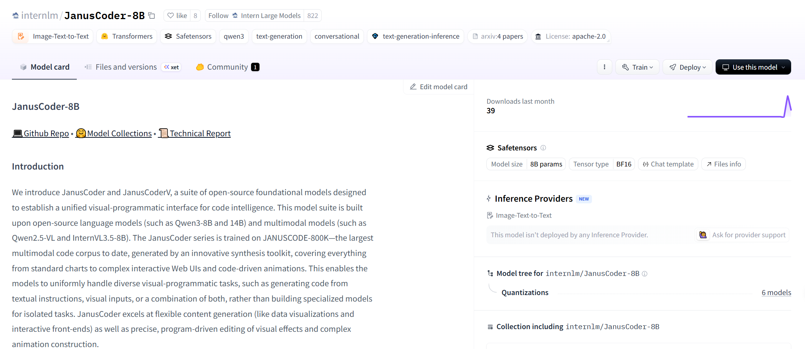
