# 2025 年 11 月开源模型

- **11-01 · LongCat-Flash-Omni** — 美团开源 560B MoE 全模态模型。[模型细节与评测](https://mp.weixin.qq.com/s/0Uc_JkHxgI1jUCnuIiZOUA)

  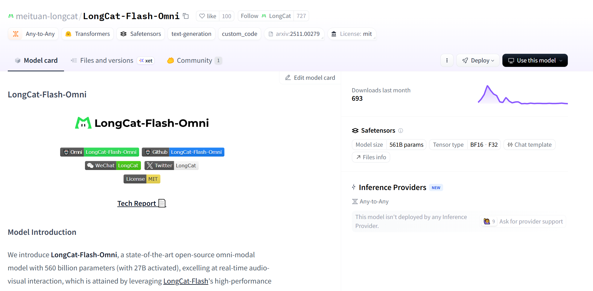

- **11-07 · Kimi K2 Thinking** — 月之暗面开源 1T 总参数、32B 激活参数的原生 INT4 推理模型。[评测](https://mp.weixin.qq.com/s/NDMXLVxkt6-EWfOE6KzUcQ)

  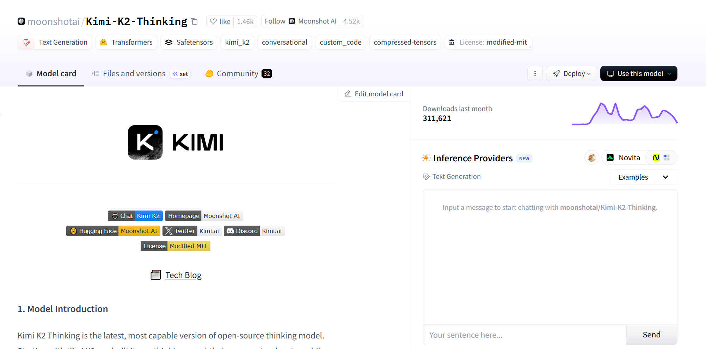

- **11-08 · Step-Audio-EditX** — 阶跃星辰开源音频编辑模型，支持情感、说话风格和副语言特征控制以及零样本 TTS。

  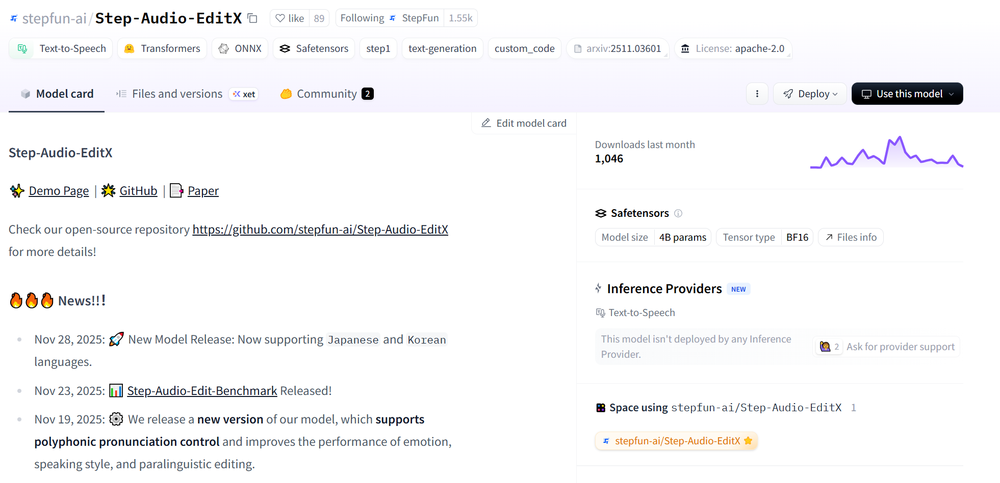

- **11-11 · ERNIE-4.5-VL-28B-A3B-Thinking** — 百度开源多模态推理 MoE 模型。

  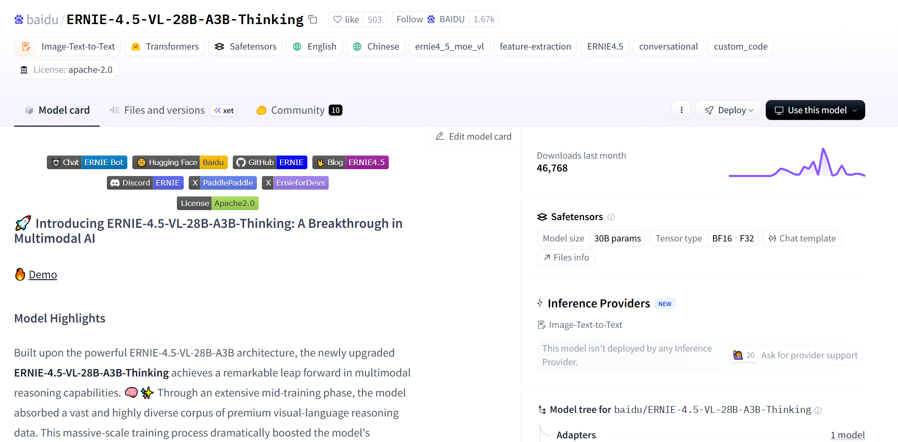

- **11-12 · VibeThinker** — 微博开源数学推理模型。

  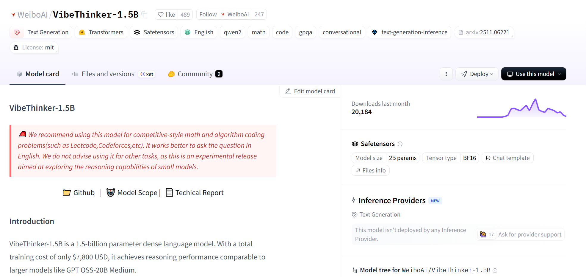

- **11-21 · HunyuanVideo 1.5** — 腾讯混元开源 8.3B 轻量视频生成模型，支持生成 5—10 秒高清视频。

  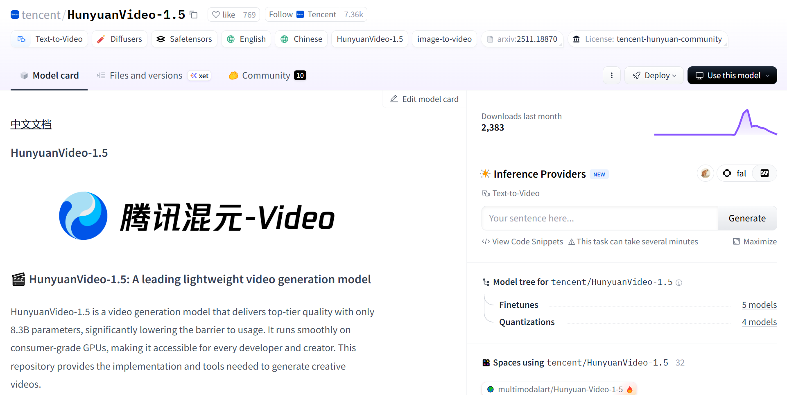

- **11-21 · MiMo-Embodied-7B** — 小米开源跨具身视觉语言模型，面向自动驾驶和具身智能任务。

  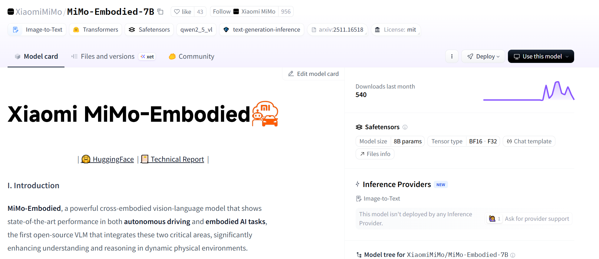

- **11-25 · HunyuanOCR** — 腾讯混元开源 1B OCR 模型，覆盖文本定位、信息提取、视频字幕和照片翻译。

  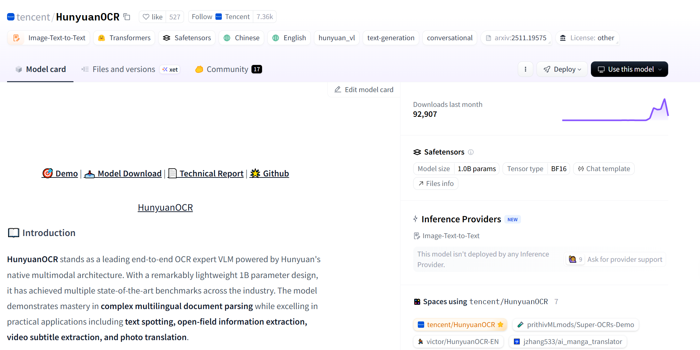

- **11-26 · Z-Image** — 阿里通义实验室开源 6B 图像生成模型。

  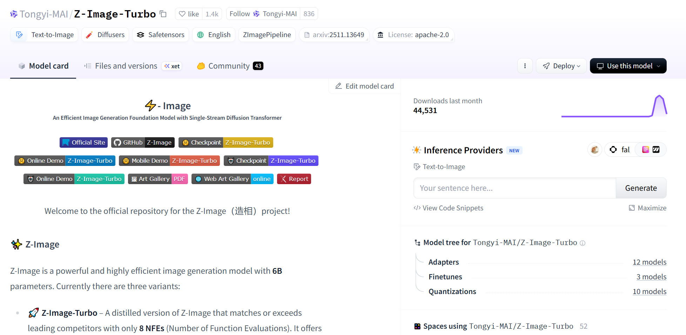

- **11-27 · DeepSeekMath-V2** — DeepSeek 开源数学推理模型。

  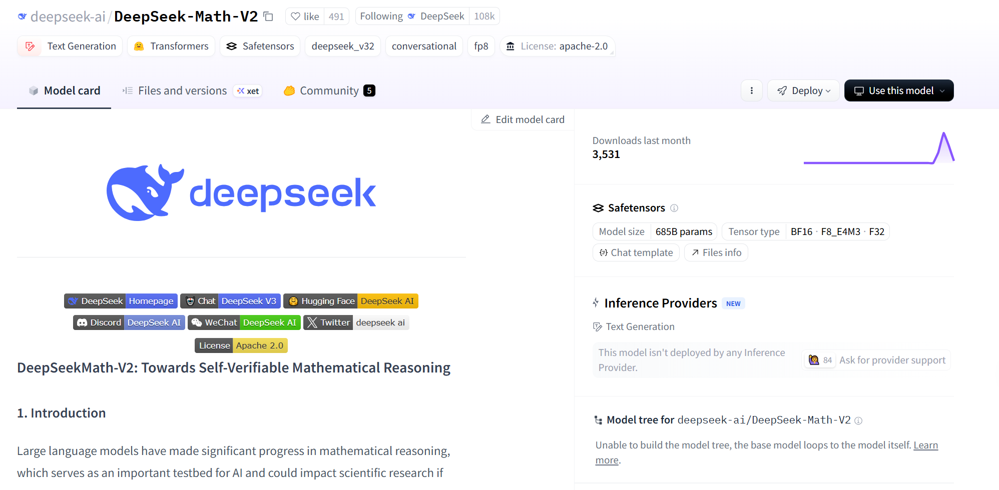

- **11-28 · Step-Audio-R1** — 阶跃星辰开源原生音频推理模型。

  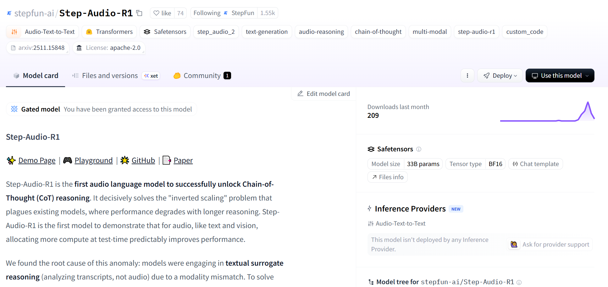

- **11-28 · Keye-VL-671B-A37B** — 快手开源多模态大模型。

  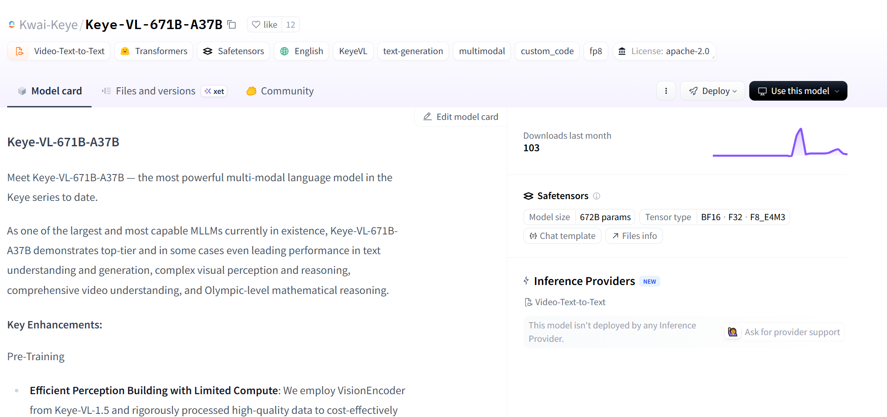
