# 2026 年 2 月开源模型

- **02-03 · Step 3.5 Flash** — 阶跃星辰开源 196B-A11B MoE 模型，45 层 Transformer 中前 3 层为 Dense、后续为 MoE。[相关文章](https://www.zhihu.com/question/2004487775068647845/answer/2004842586347684680)

  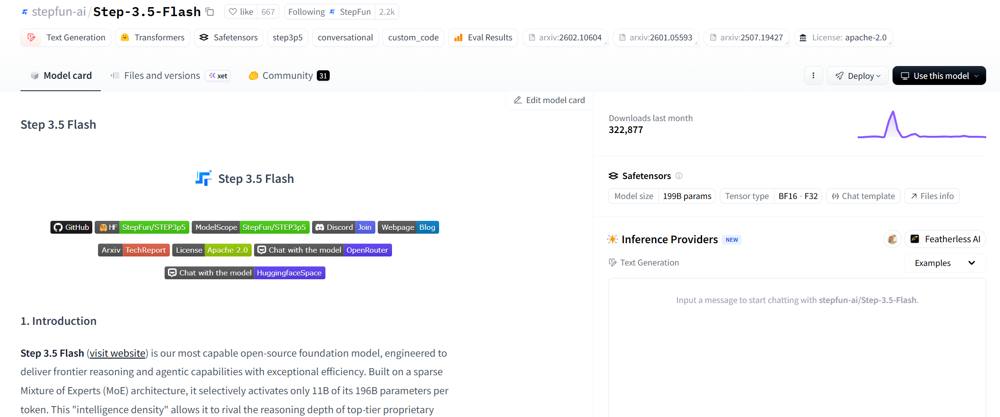

- **02-03 · GLM-OCR** — 智谱开源 0.9B OCR 模型。[对比评测](https://mp.weixin.qq.com/s/oOygjz0f1AvMTSZWlU9n1A)

  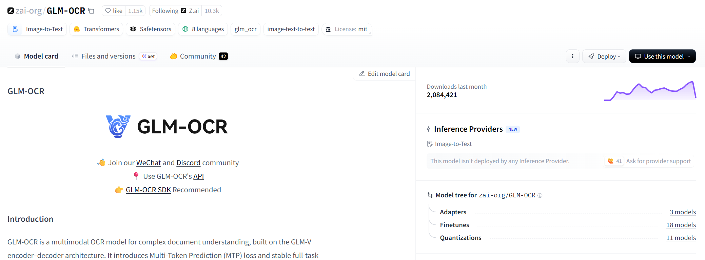

- **02-04 · Qwen3-Coder-Next** — 阿里通义千问基于 Qwen3-Next-80B-A3B-Base 开源代码模型。

  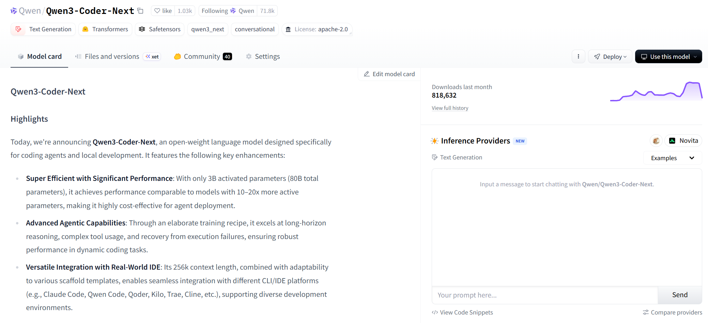

- **02-04 · MiniCPM-o 4.5** — 面壁智能开源 9B 全双工全模态模型，支持主动交互。[评测](https://mp.weixin.qq.com/s/Z43KoHej-J6AlPrKY0MD5A)

  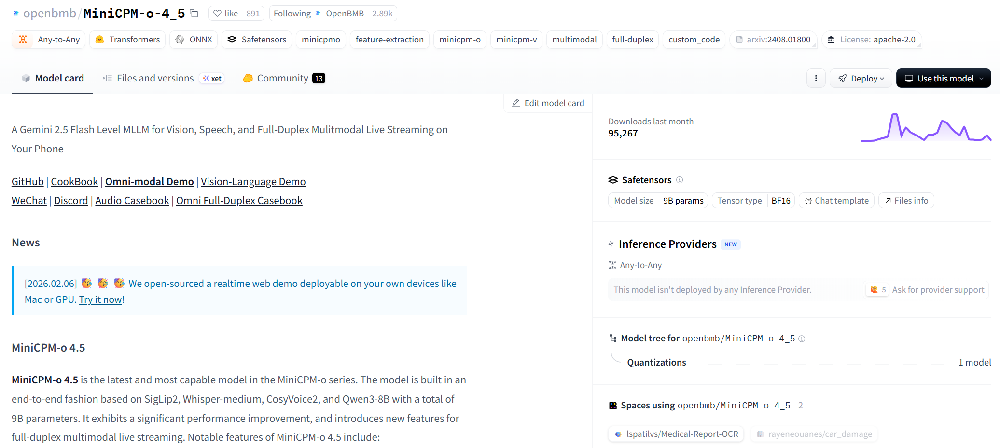

- **02-05 · Intern-S1-Pro** — 上海人工智能实验室开源 1T 多模态科学推理模型。

  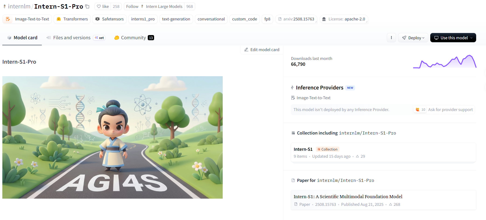

- **02-06 · LongCat-Flash-Lite** — 美团开源 68.5B 模型，并于 2 月 11 日推出 DeepResearch 功能。[相关文章](https://mp.weixin.qq.com/s/-UvyTsOwyktCXyacXP8Atg)

  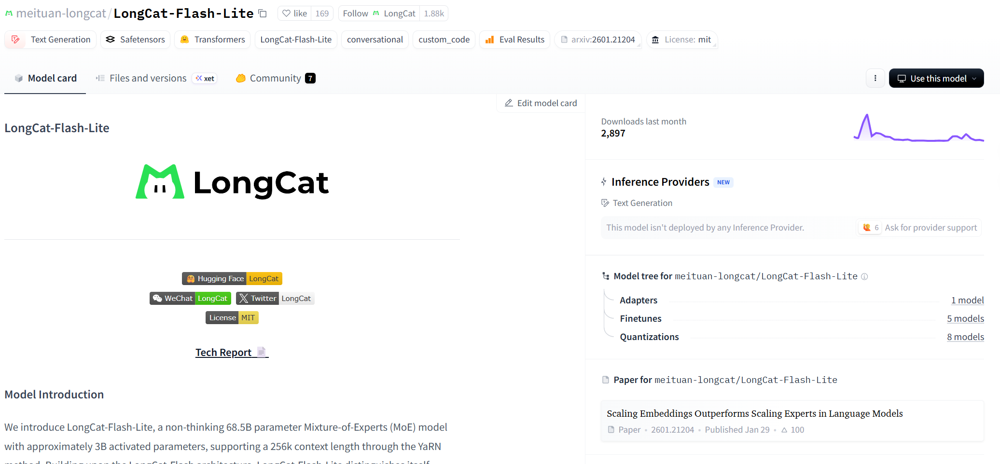

- **02-11 · HY-1.8B-2Bit** — 腾讯混元开源端侧 2-bit 量化模型。

  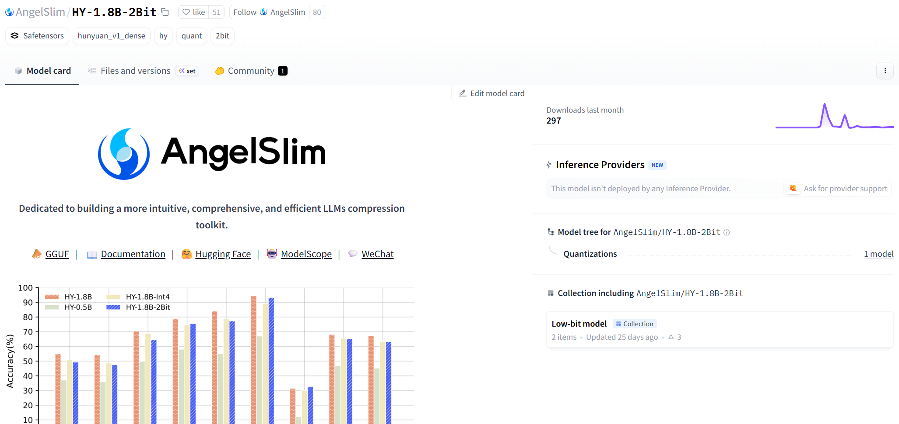

- **02-11 · LLaDA 2.1** — 蚂蚁集团开源 100B 和 16B 扩散语言模型，引入可纠错编辑机制。

  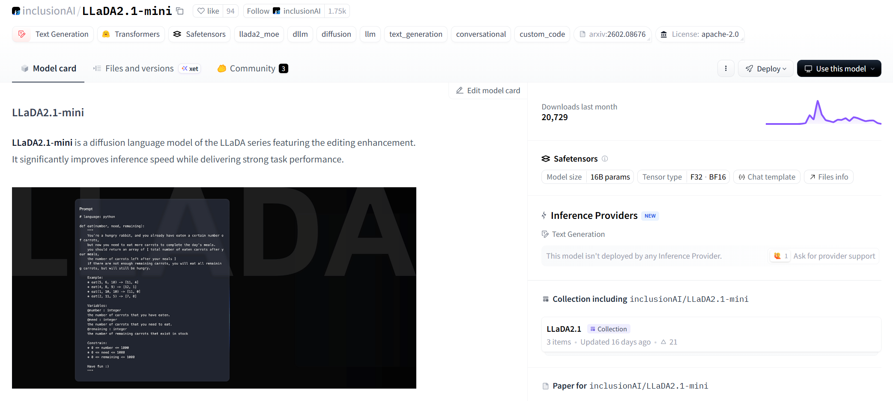

- **02-11 · Ming-flash-omni-2.0** — 蚂蚁集团开源 100B-A6B 全模态模型。

  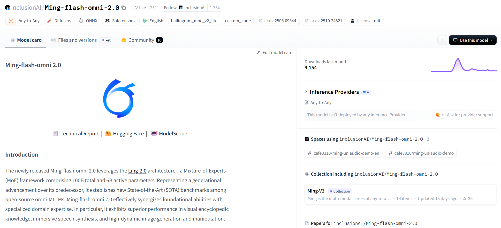

- **02-12 · GLM-5** — 智谱开源 744B-A40B 模型，训练数据 28.5T tokens，并采用 DeepSeek Sparse Attention。[相关文章](https://mp.weixin.qq.com/s/pitrevXHKaVi2EQQBK2Efg)

  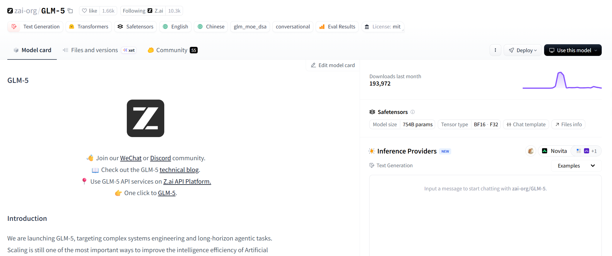

- **02-12 · MiniCPM-SALA** — 面壁智能开源采用线性—稀疏混合注意力的新架构模型。[相关文章](https://mp.weixin.qq.com/s/Vkk-kOfG2ScFclPNmB2ygw)

  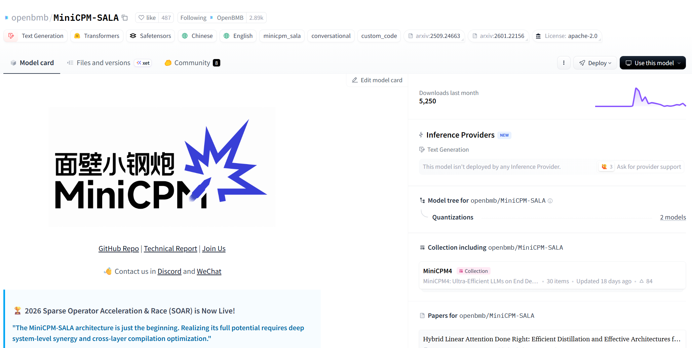

- **02-13 · Nanbeige 4.1-3B** — BOSS 直聘开源 3B 模型。

  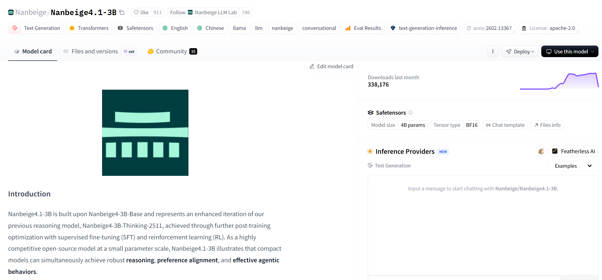

- **02-13 · Ring-2.5-1T** — 蚂蚁集团开源 1T 参数混合线性注意力推理模型。

  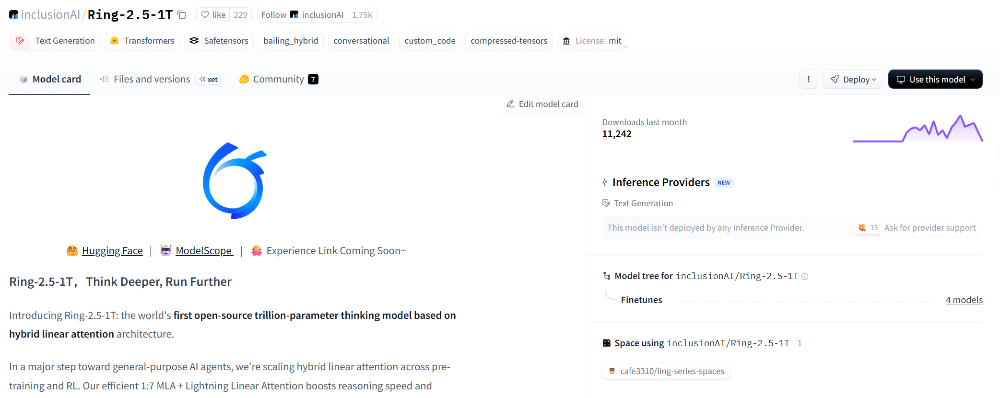

- **02-13 · MiniMax M2.5** — MiniMax 开源代码与 Agent 能力增强版本。

  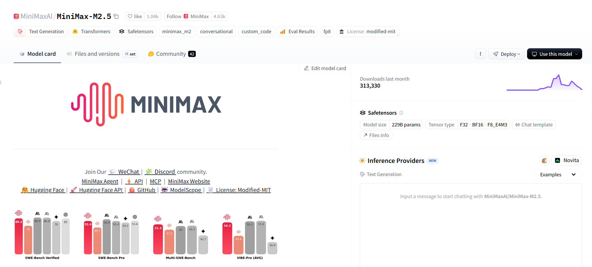

- **02-14 · FireRed-Image-Edit-1.0** — 小红书开源图像编辑模型。

  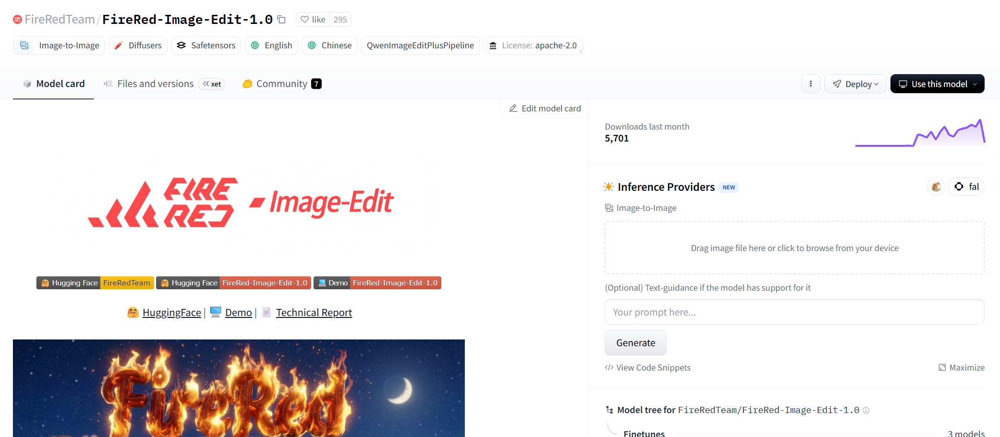

- **02-14 · FantasyWorld** — 高德地图开源世界模型。

  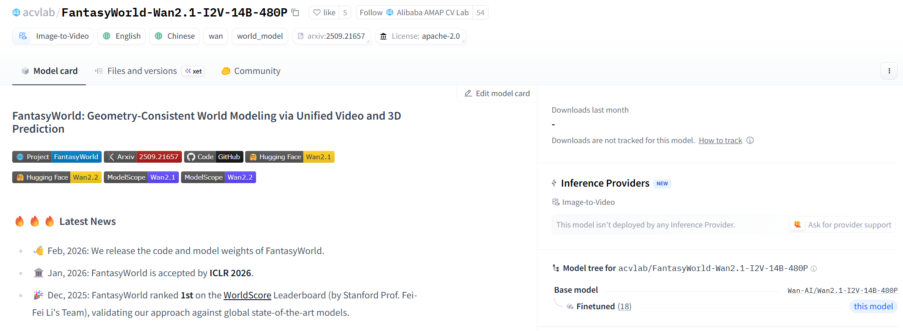

- **02-14 · Ming-omni-tts** — 蚂蚁集团开源 0.5B 和 16.8B-A3B 音频生成模型。

  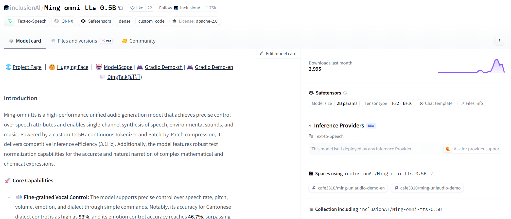

- **02-15 · JoyAI-LLM-Flash** — 京东开源语言模型。

  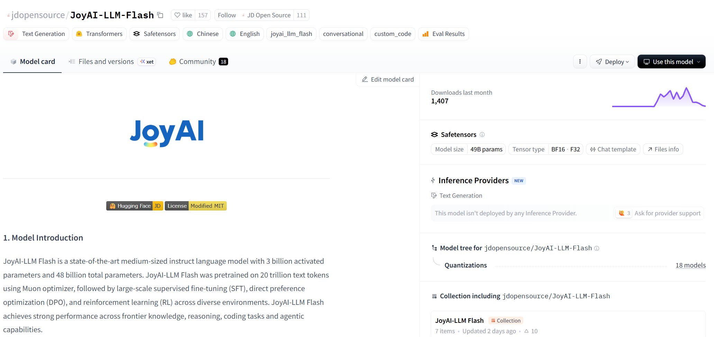

- **02-16 · Qwen3.5-397B-A17B** — 阿里通义千问开源原生多模态模型，强化视觉理解。[相关文章](https://mp.weixin.qq.com/s/q7sazucjlobwfDd3Mg8_Dg)

  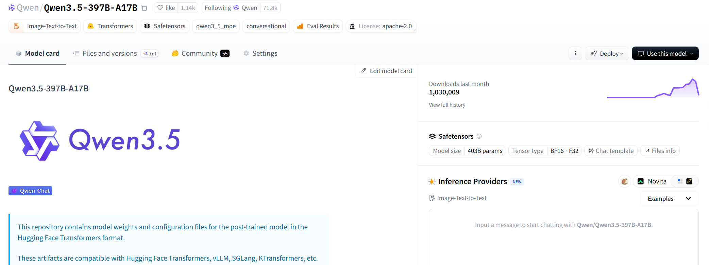

- **02-16 · Ling-2.5-1T** — 蚂蚁集团开源 1T-A63B 模型，使用 29T tokens 训练。

  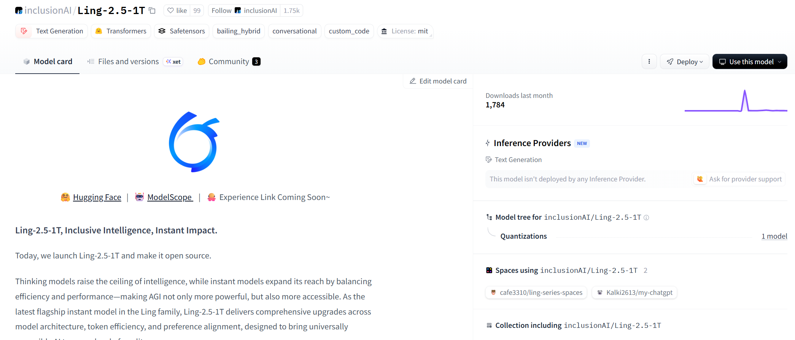

- **02-24 · Qwen3.5 中型系列** — 阿里通义千问开源 Qwen3.5-35B-A3B、Qwen3.5-122B-A10B 和 Qwen3.5-27B。

  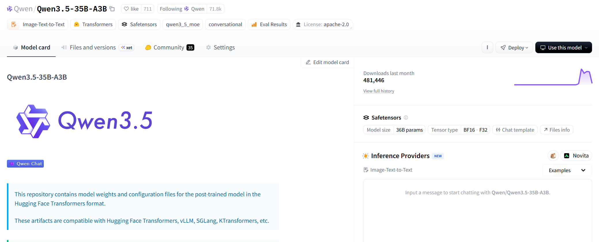

- **02-28 · FireRed-OCR** — 小红书开源 2B OCR 模型，重点优化结构幻觉。

  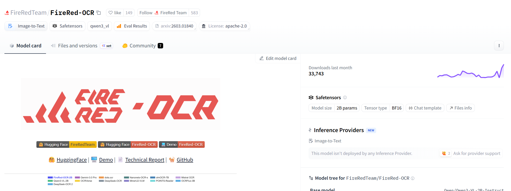
