# 2026 年 3 月开源模型

- **03-01 · LeVo 2** — Tencent AI Lab 开源 4B 音乐模型，支持生成最长约 4.5 分钟的完整歌曲。

  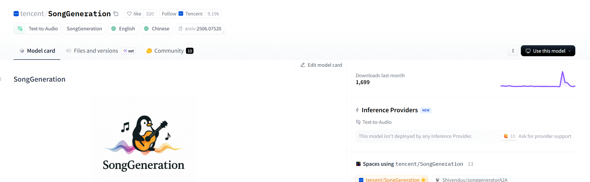

- **03-01 · MiroThinker-1.7** — MiroMind 开源长链条 Agent 与工具调用模型，支持 256K 上下文和单任务最多 300 次工具调用。

  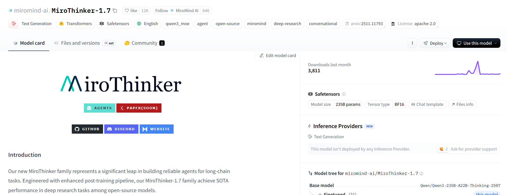

- **03-02 · Qwen3.5 小模型系列** — 阿里通义千问开源 0.8B、2B、4B、9B 四种尺寸。[相关文章](https://mp.weixin.qq.com/s/jl__7W9D6hh25PbuczdUFQ)

  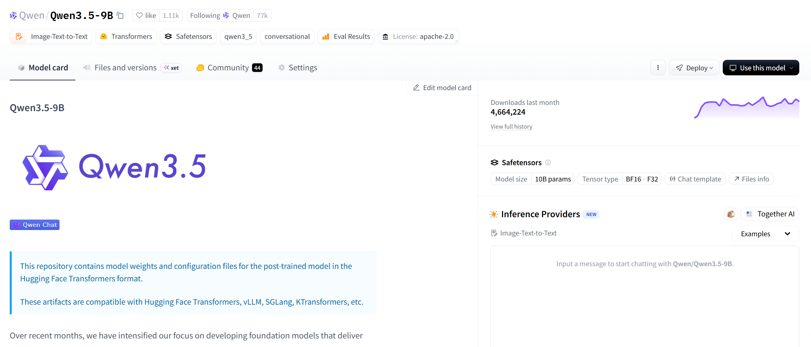

- **03-02 · IQuest-Coder-V1 系列** — 至知创新研究院开源 7B、14B、40B 的 Base、Instruct 和 Thinking 版本。

  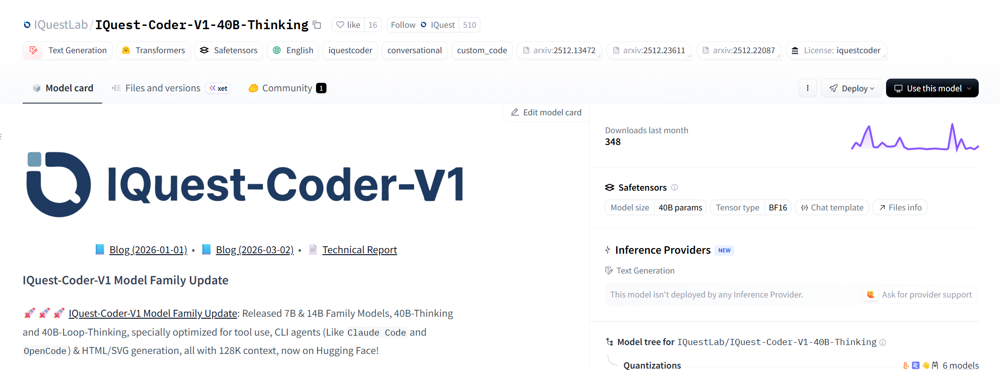

- **03-03 · FireRed-Image-Edit-1.1** — 小红书开源图像编辑模型，强化身份一致性、多元素融合、人像美妆和字体风格参考。

  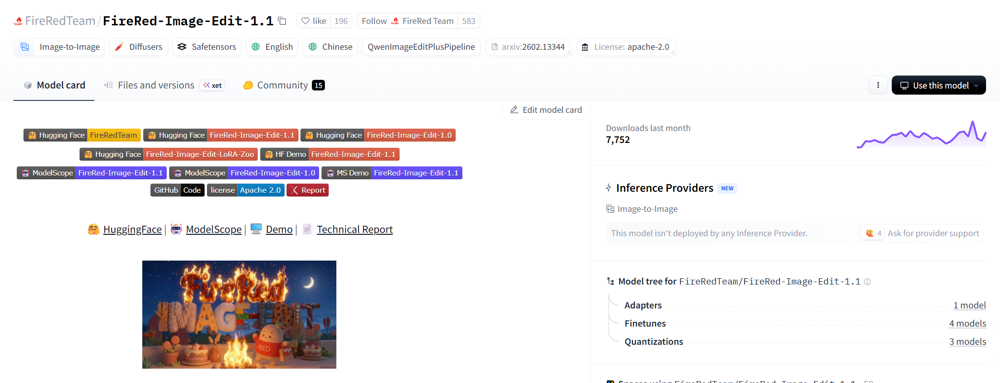

- **03-04 · Step-3.5-Flash-Base** — 阶跃星辰开源 Step 3.5 Flash 的基础模型。

  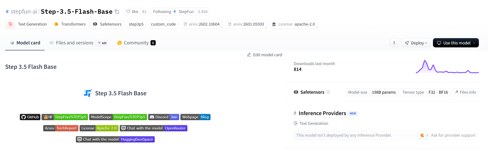

- **03-04 · Helios** — 北京大学开源 14B 视频生成模型，可在单张 H100 上以 19.5 FPS 生成分钟级视频。

  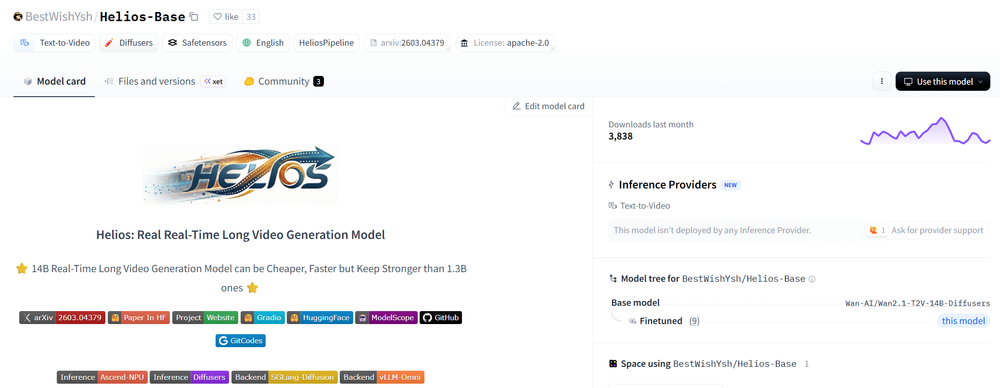

- **03-04 · Yuan 3.0 Ultra** — 浪潮开源 1010B 多模态模型，面向企业应用场景。

  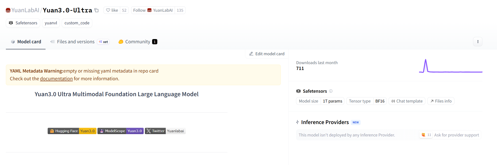

- **03-06 · InternVL-U** — 上海人工智能实验室开源 4B 统一多模态模型，覆盖理解、推理、生成和编辑。

  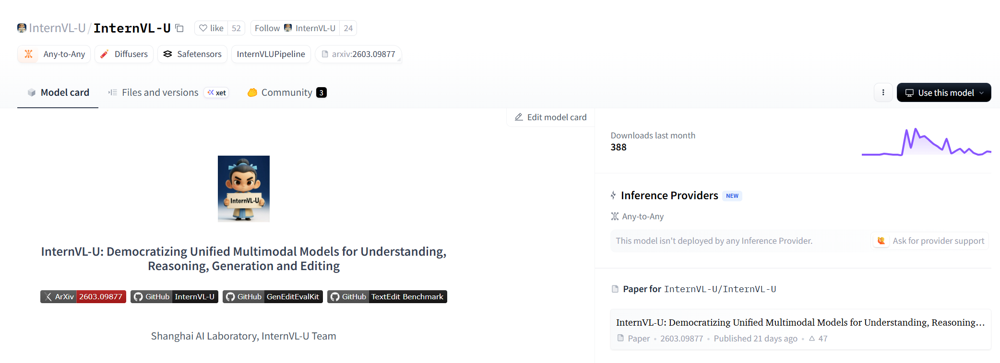

- **03-06 · OmniLottie** — OpenVGLab 开源多模态指令驱动的端到端矢量动画生成框架。

  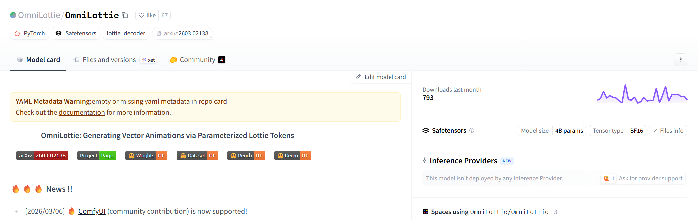

- **03-09 · Penguin-VL** — 腾讯开源视觉语言模型系列，包含 2B、8B 和 Encoder 模型。

  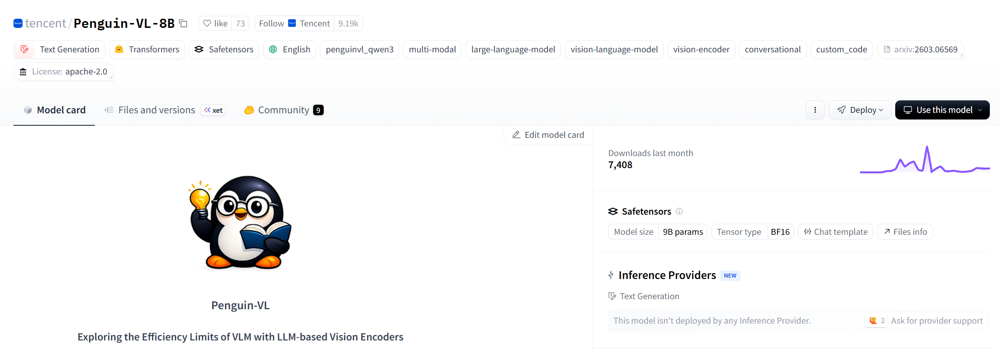

- **03-16 · Covo-Audio-Chat** — 腾讯开源原生全双工语音模型。

  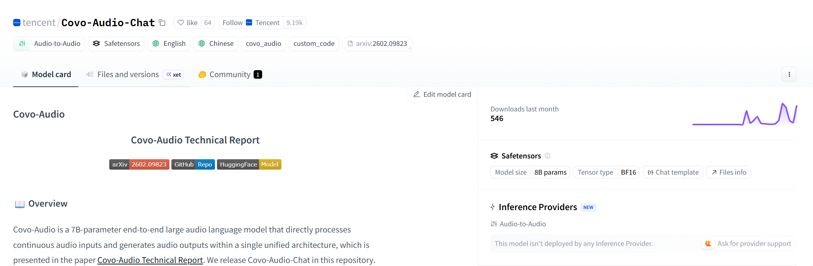

- **03-17 · Fun-CineForge** — 阿里通义实验室开源影视级配音多模态模型。

  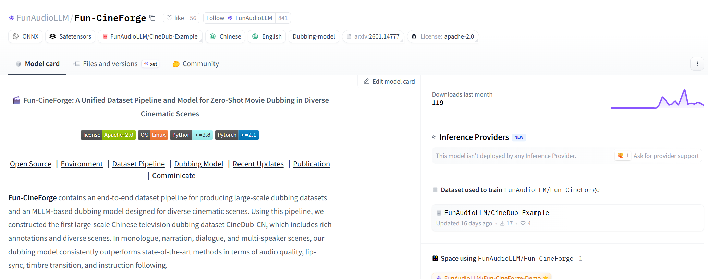

- **03-18 · Qianfan-OCR** — 百度开源 4B OCR 模型，在 OmniDocBench v1.5 上取得 93.12 分。

  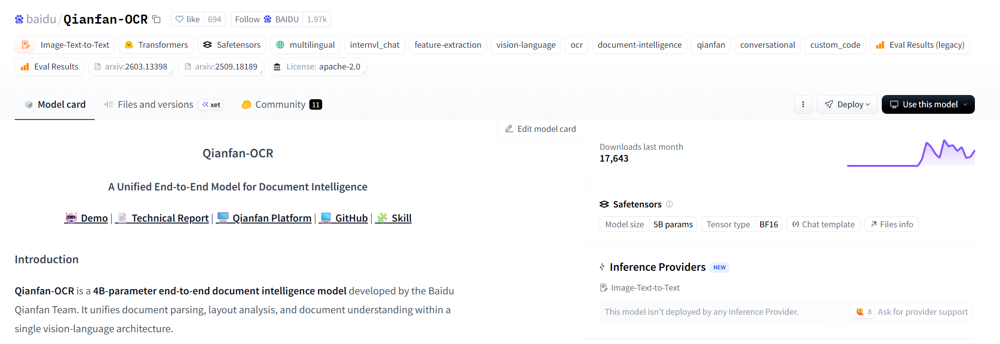

- **03-19 · dots.mocr / dots.mocr-svg** — 小红书开源 3B 多语言 OCR 与图像到 SVG 解析模型。

  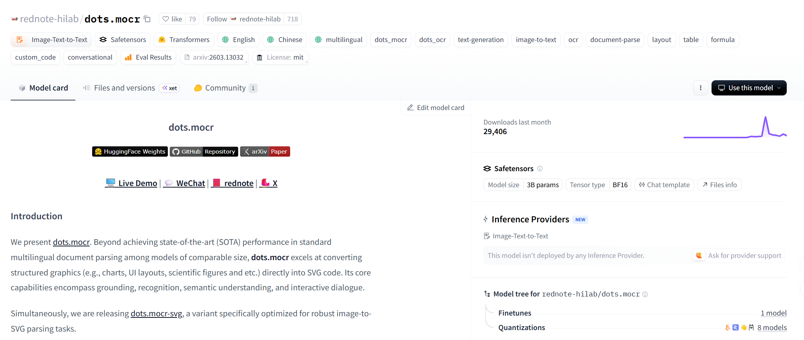

- **03-21 · LongCat-Flash-Prover** — 美团开源复杂定理证明模型。

  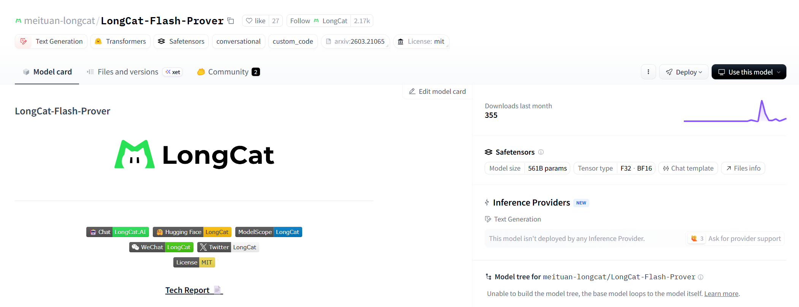

- **03-26 · LongCat-Next** — 美团开源原生全模态模型，可接受文本、语音和图像输入并生成文本、语音和图像，激活参数 3B。[相关文章](https://mp.weixin.qq.com/s/hqeos6Krys8jmX01jSV04Q)

  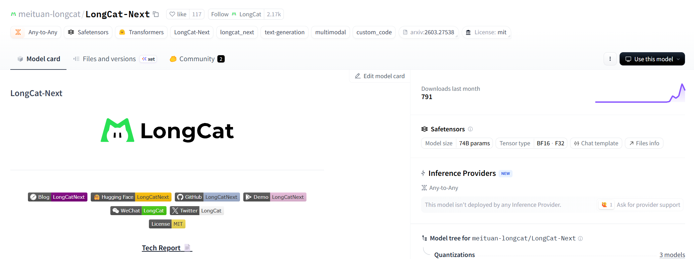

- **03-27 · Matrix-Game 3.0** — 天工开源 5B 交互式世界模型，面向 720p 实时长视频生成。

  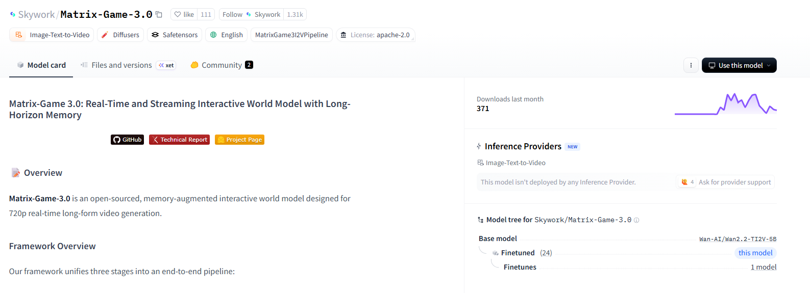

- **03-31 · LongCat-AudioDiT** — 美团开源扩散式 TTS 模型。

  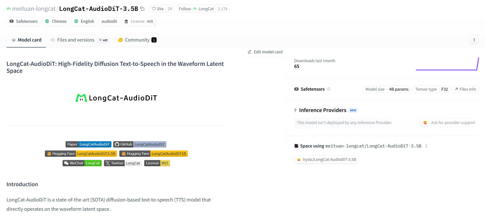
