# 2026 年 4 月开源模型

- **04-01 · QwenPaw-Flash** — 阿里开源 2B、4B、9B Agent 小模型系列，基于 Qwen3.5 微调，前身为 CoPaw。

  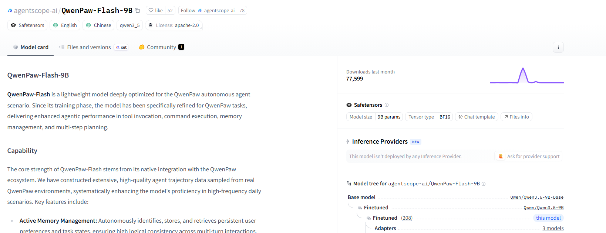

- **04-02 · JoyAI-Image / JoyAI-Image-Edit** — 京东发布统一多模态基础模型并开放图像编辑权重，同时发布 OpenSpatial-3M 数据集。

  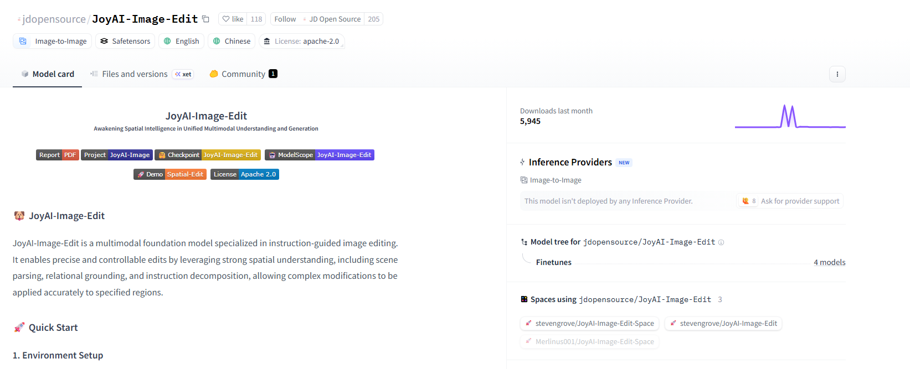

- **04-07 · VoxCPM2** — 面壁智能开源 2B 语音合成模型，支持 30 种语言、语音设计、可控克隆和 48kHz 输出。

  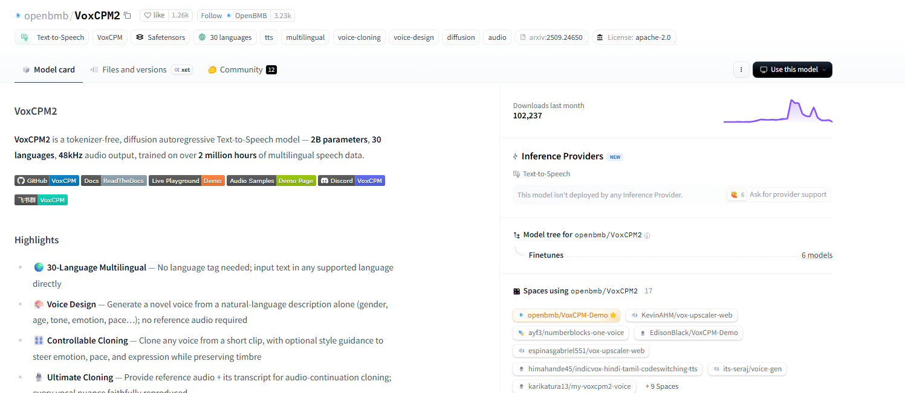

- **04-08 · GLM-5.1** — 智谱开源 744B-A40B 模型，主打长时间自主工作。

  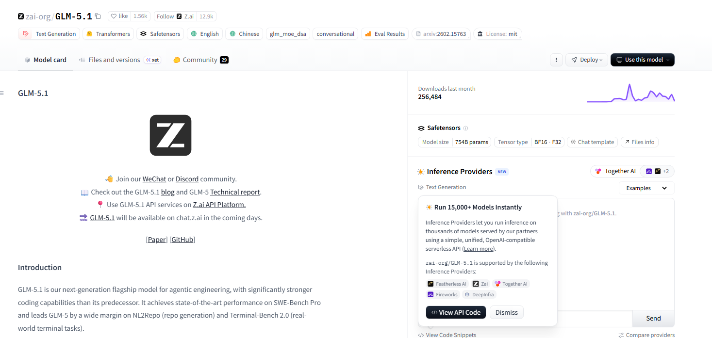

- **04-08 · Marco-MoE** — 阿里国际开源极稀疏 MoE 系列：Marco-Mini-Instruct 为 17.3B-A0.86B，Marco-Nano-Instruct 为 8B-A0.6B。

  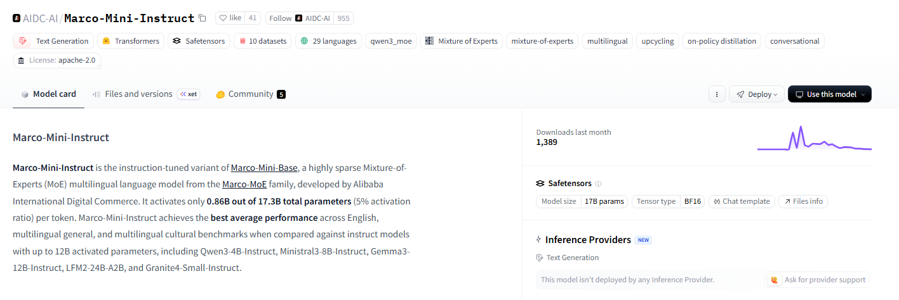

- **04-09 · HY-Embodied-0.5** — 腾讯开源面向现实世界具身智能的基础模型，覆盖时空感知、预测、交互和规划。

  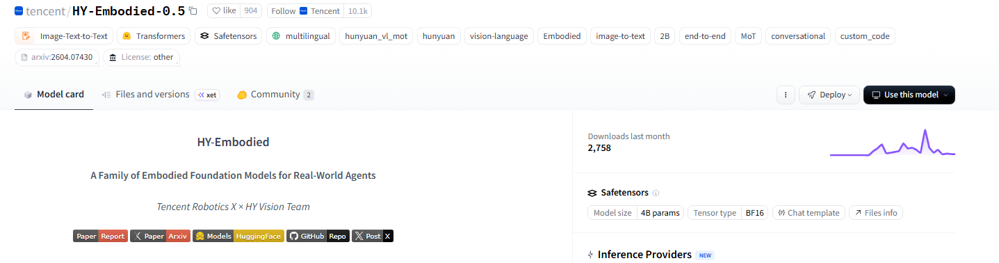

- **04-10 · MOSS-TTS-Nano** — OpenMOSS 开源 0.1B 多语言 TTS 模型，可在 CPU 上运行，并提供 ONNX 版本。

  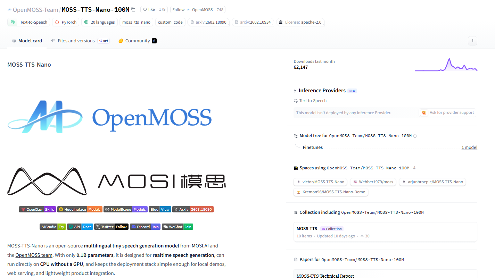

- **04-12 · MiniMax M2.7** — MiniMax 开源 230B-A10B 模型，强调模型参与自身进化。

  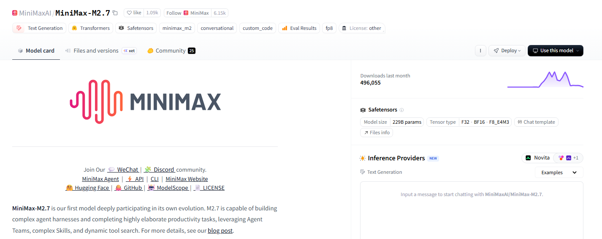

- **04-15 · ERNIE-Image** — 百度开源文生图模型，可在 24GB 显存设备运行。[相关文章](https://mp.weixin.qq.com/s/OjbbLeZyOh6nXQWRbRHZzQ)

  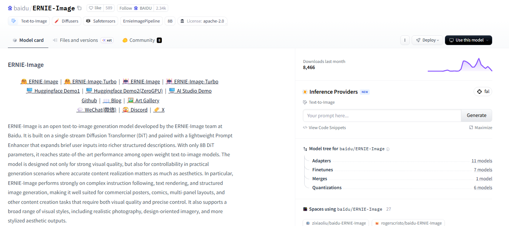

- **04-15 · Qwen3.6-35B-A3B** — 阿里通义千问开源 Qwen3.6 系列首个版本。

  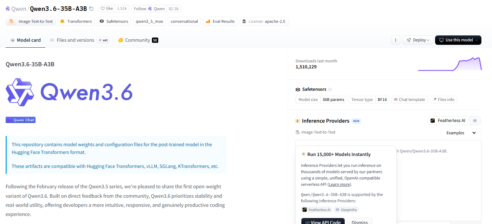

- **04-16 · HY-World 2.0** — 腾讯开源世界生成与重建框架，可接受文本、单视图、多视图和视频输入并生成网格或 3D 高斯点云。

  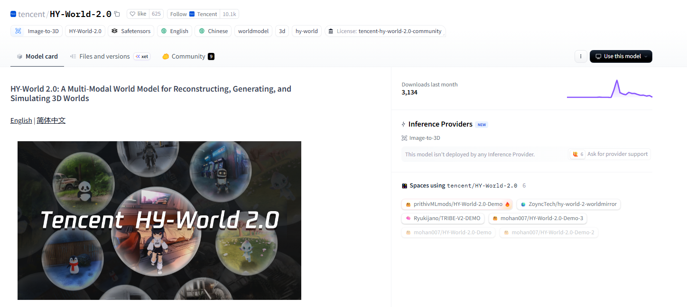

- **04-20 · Kimi K2.6** — 月之暗面开源 1T-A32B 多模态模型，主打多智能体交互。

  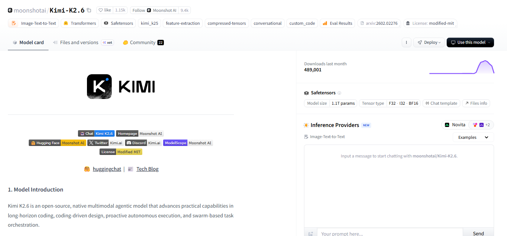

- **04-21 · MegaStyle** — 腾讯开源 1.4M 风格数据集及对应训练模型。

  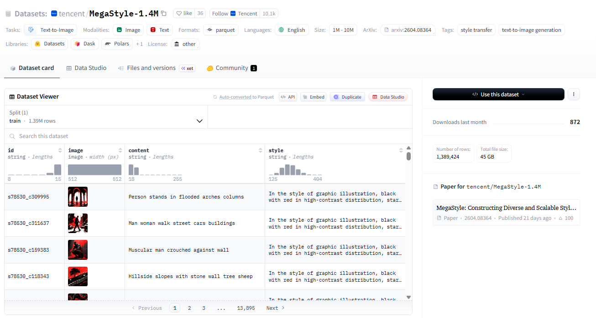

- **04-22 · Ling-2.6-flash** — 蚂蚁开源 104B-A7.4B 混合线性架构模型。[相关文章](https://mp.weixin.qq.com/s/3MHi2ISdh2UHL_rN_7Xuxw)

  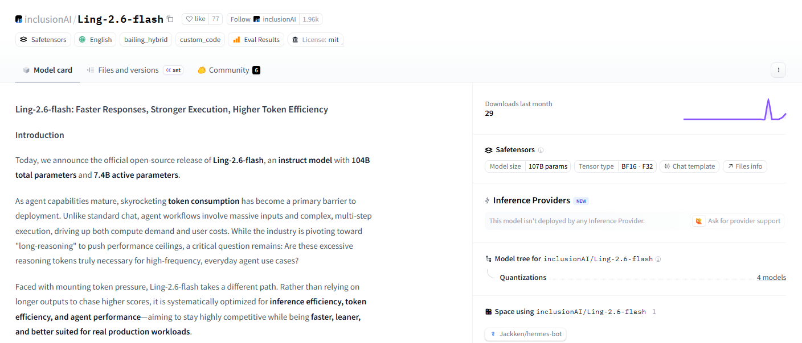

- **04-22 · Qwen3.6-27B** — 阿里通义千问开源 27B Dense 模型。

  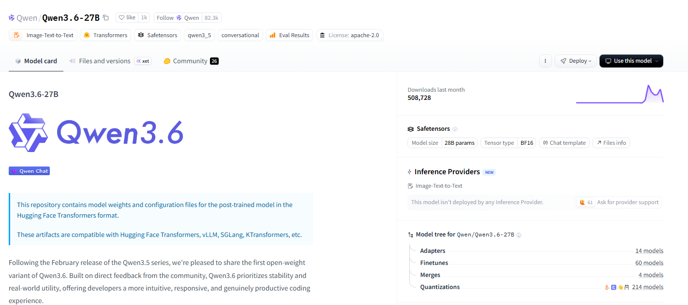

- **04-23 · Hy3-preview** — 腾讯开源 295B-A21B 模型。[相关文章](https://mp.weixin.qq.com/s/65GdBakywhBVvxFh_ltXCw)

  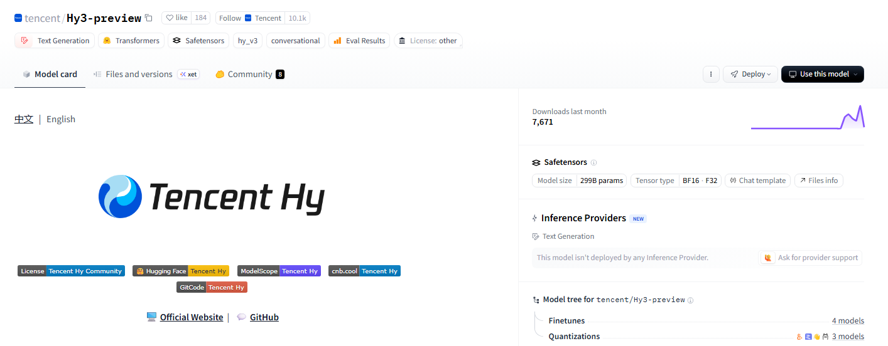

- **04-23 · Ling-2.6-1T** — 蚂蚁百灵开源 1T 非思考模型，重点强化精确指令执行和低 Token 消耗。

  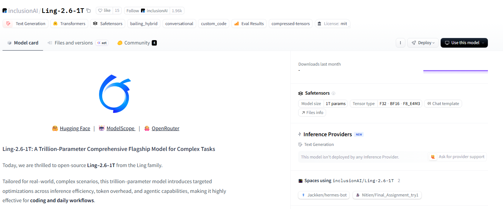

- **04-23 · LLaDA 2.0-Uni** — 蚂蚁百灵开源统一多模态模型，集成理解与生成。

  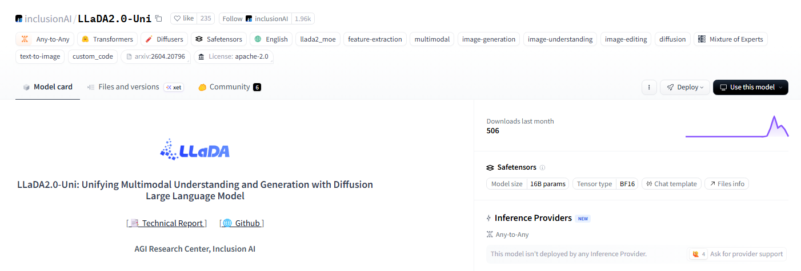

- **04-23 · MiMo-V2.5-ASR** — 小米开源中英双语语音识别模型，覆盖方言、语码转换、歌词、噪声和多说话人场景。

  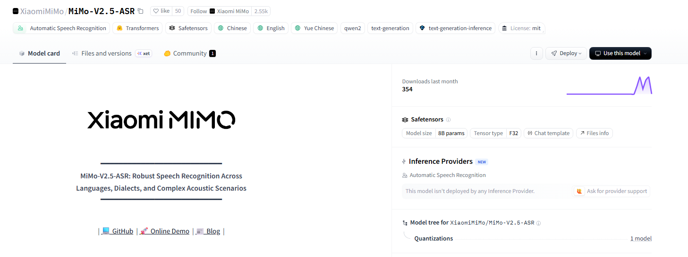

- **04-24 · DeepSeek-V4** — DeepSeek 开源 V4-Pro（1.6T-A49B）和 V4-Flash（284B-A13B）。[论文解读与评测](https://mp.weixin.qq.com/s/PiM-A-bHLSsZ-tDHOCl0cw) · [使用说明](https://mp.weixin.qq.com/s/ds5VFVcyOtd6BuKQXiYDNg)

  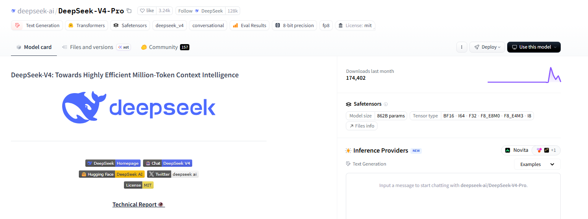

- **04-27 · SenseNova-U1** — 商汤开源统一多模态模型系列，在单一架构中统一理解、推理与生成，提供 8B 和 A3B 两个版本。

  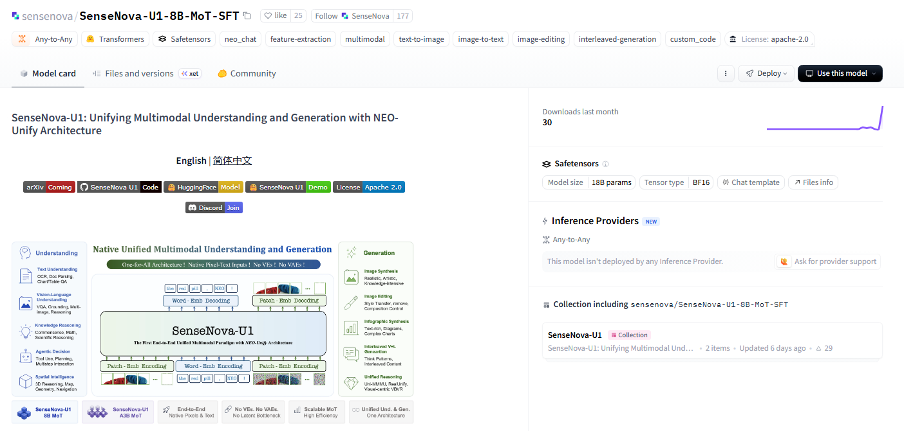

- **04-28 · MiMo-V2.5 系列** — 小米开源 MiMo-V2.5-Pro 和 MiMo-V2.5，并推出 100T Token 计划。

  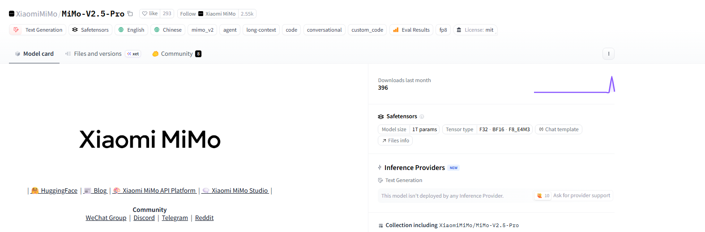

- **04-29 · HY-MT1.5-1.8B** — 腾讯开源端侧翻译模型，将支持 33 种语言的模型压缩到约 440MB。

  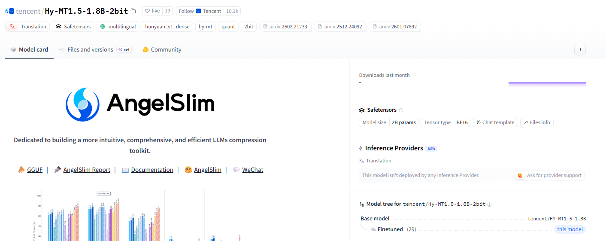
