# 2026 年 7 月开源模型

- **07-01 · Nemotron-Labs-TwoTower** — NVIDIA 开源 30B-A3B 双塔扩散语言模型，以双塔分别处理上下文与去噪。

  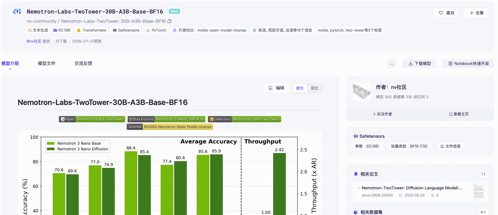

- **07-02 · Leanstral-1.5** — Mistral AI 开源面向 Lean 4 的 119B-A6B 数学形式化证明模型。

  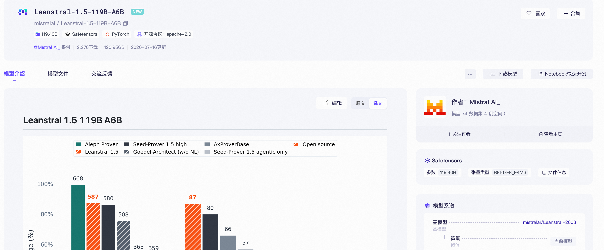

- **07-06 · LongCat-2.0** — 美团开源 1.6T、平均激活 48B 的 MoE 模型，引入 LSA 稀疏注意力与 N-gram Embedding。[相关文章](https://mp.weixin.qq.com/s/fE9WepkB3esmNpyXX7rZiA)

  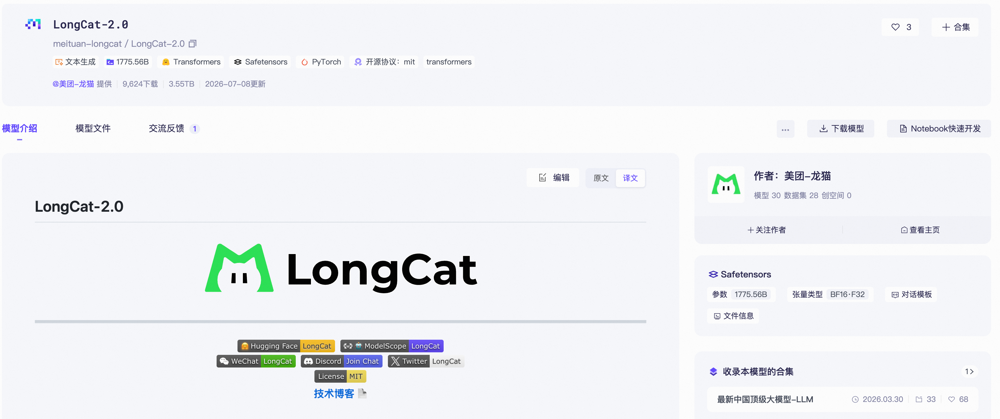

- **07-06 · Hunyuan Hy3** — 腾讯混元开源 295B-A21B、256K 上下文的正式版本。[评测](https://mp.weixin.qq.com/s/SaotOY6tKjBeDhpDQO5UyQ)

  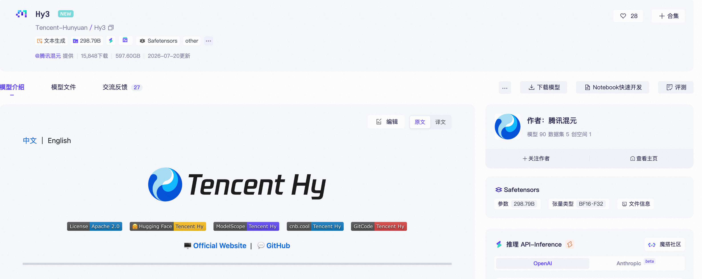

- **07-06 · KAT-Coder-V2.5-Dev** — 快手开源基于 Qwen3.6-35B-A3B 后训练的代码模型。

  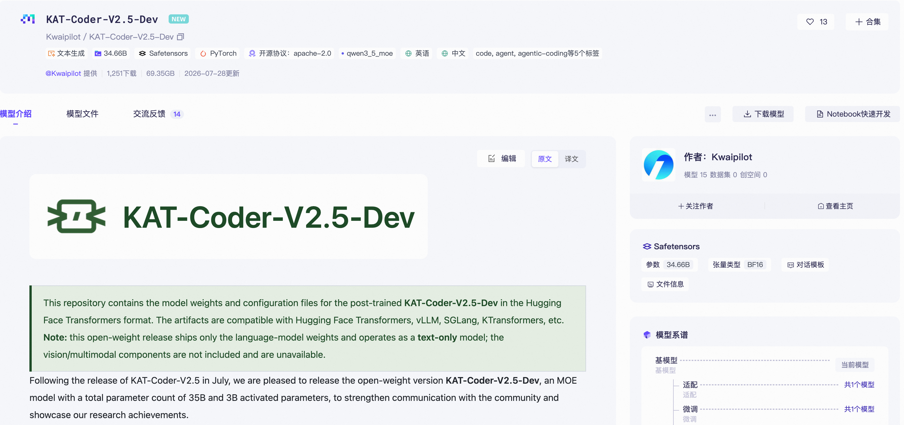

- **07-06 · Nemotron-Labs-Audex-30B-A3B** — NVIDIA 开源统一音频文本模型，保留语言推理、长上下文与 Agent 能力。

  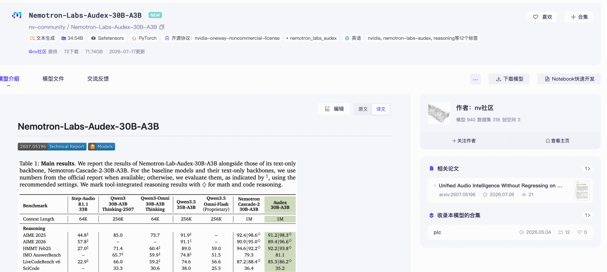

- **07-07 · LingBot-Depth 2.0** — 蚂蚁灵波开源空间感知模型，将训练数据扩充到 1.5 亿规模。

  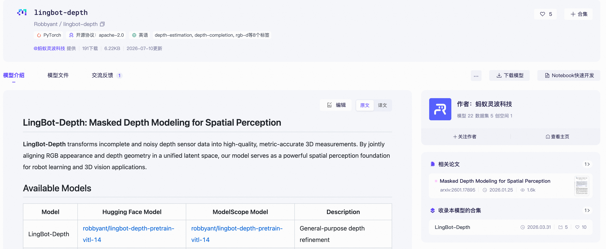

- **07-07 · LingBot-Vision** — 蚂蚁灵波开源 Small、Base、Large、Giant 四种视觉基座模型。

  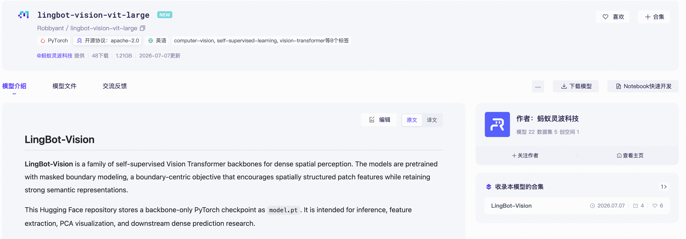

- **07-07 · HunyuanOCR-1.5** — 腾讯混元开源 1B OCR 模型，在 OmniDocBench 上取得 94.74 分。

  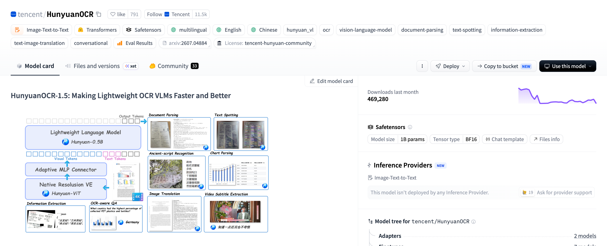

- **07-07 · RynnWorld-4D** — 阿里达摩院开源面向机器人操作的 4D 具身世界模型，可生成同步 RGB、深度和光流视频。

  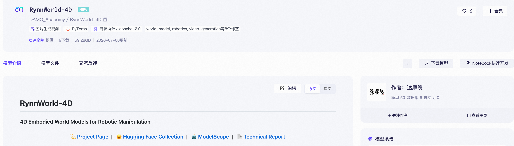

- **07-08 · SenseNova-Vision-7B-MoT** — 商汤开源统一多模态模型，将视觉感知任务统一为文本、图像或混合生成。

  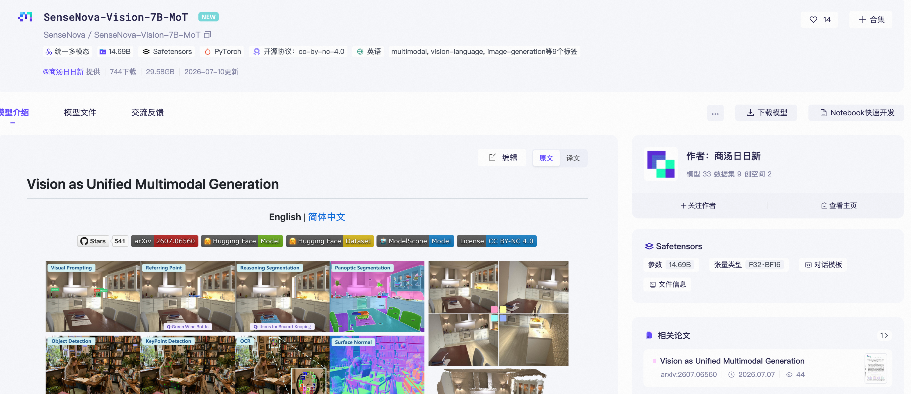

- **07-08 · GELab-Zero-4B-preview-Sico-Evolution** — Microsoft 开源基于阶跃 GELab-Zero-4B-preview 训练的 GUI 模型。

  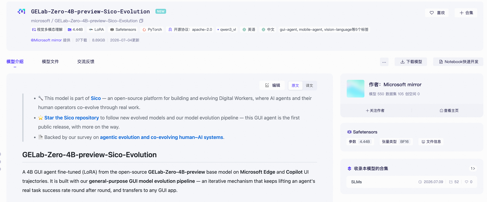

- **07-08 · R3-Embedding / R3-Rerank** — 腾讯开源两个 0.6B Agent 技能检索模型，分别负责召回和重排。

  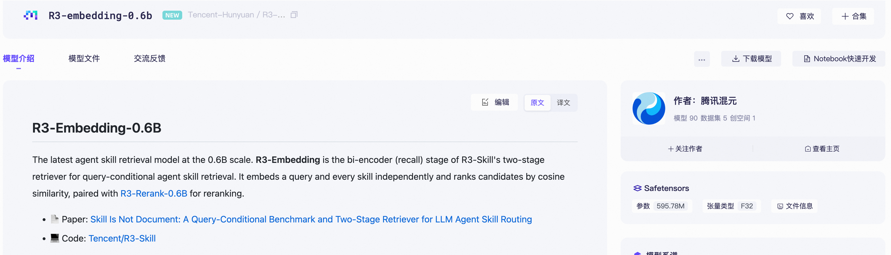

- **07-09 · LingBot-Video** — 蚂蚁灵波开源面向具身智能的视频生成基础模型，采用 DiT + MoE 架构。

  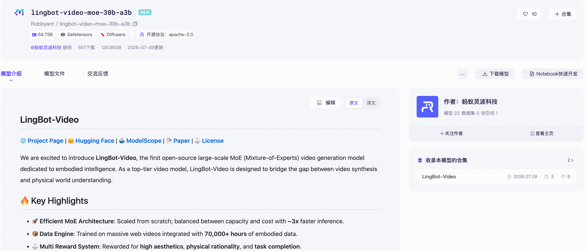

- **07-09 · LingBot-World 2.0** — 蚂蚁灵波开源实时交互世界模型，支持更多动作与事件并输出 720p/60fps 画面。

  

- **07-09 · MOSS-Transcribe-Diarize** — OpenMOSS 开源 0.9B 音频理解模型，支持 50 多种语言、说话人分离和最长 90 分钟单次推理。

  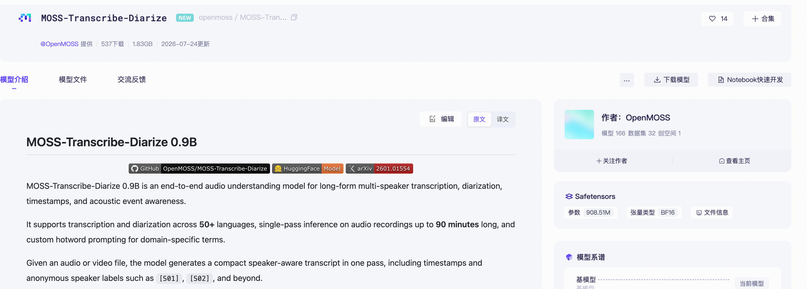

- **07-11 · MuScriptor** — Kyutai 与 Mirelo 开源多乐器自动转录模型，可把混音录音转换为多轨 MIDI，提供三种尺寸。

  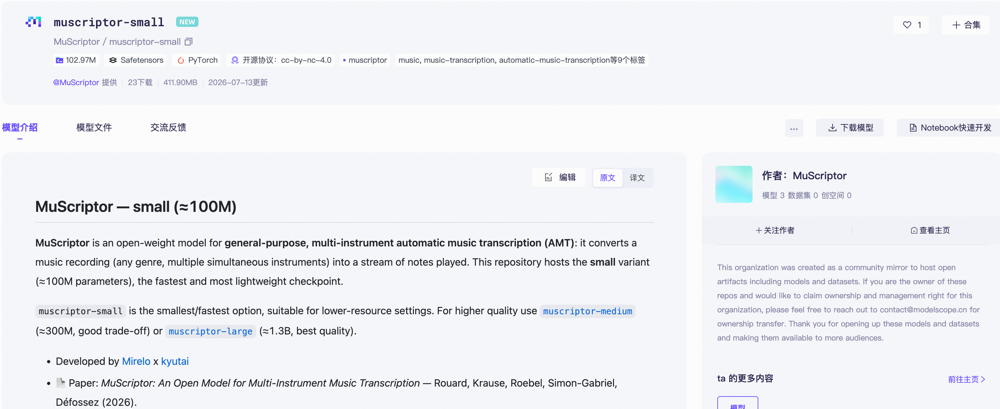

- **07-13 · Wan-Dancer-14B** — 阿里通义万相开源音乐驱动的长时舞蹈视频生成模型。

  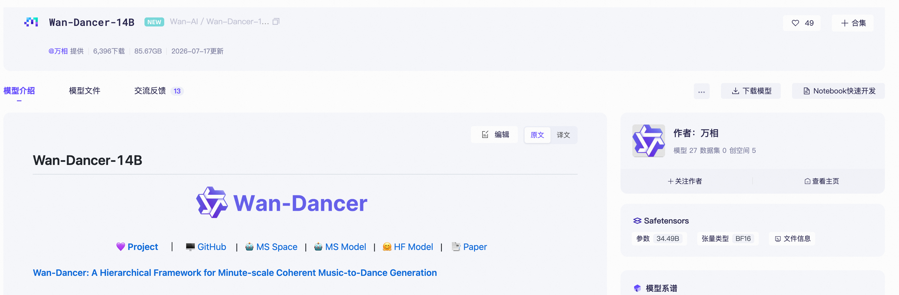

- **07-14 · Agents-A1** — 上海人工智能实验室开源 4B Agent 模型，强化长视野搜索、工程、科研和工具调用；35B-A3B 版本已于 6 月 26 日开放。

  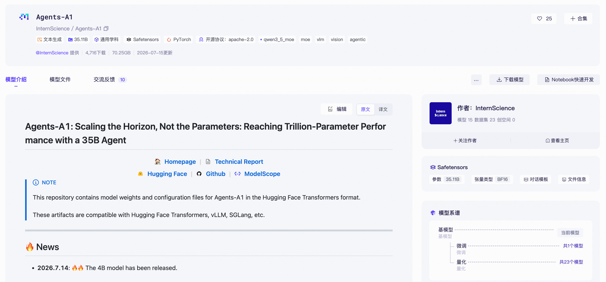

- **07-14 · MOSS-VL-Realtime** — OpenMOSS 开源 11B 实时流式视觉理解模型，以交叉注意力解耦视觉编码和语言推理。

  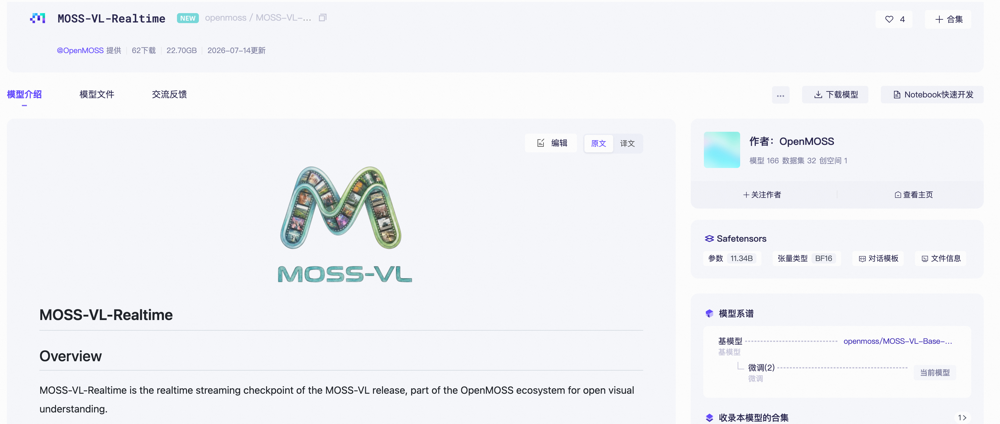

- **07-14 · MonkeyOCR v2** — 金山办公开源覆盖文档解析、理解、公式识别、篡改检测和重叠文本分割的模型。

  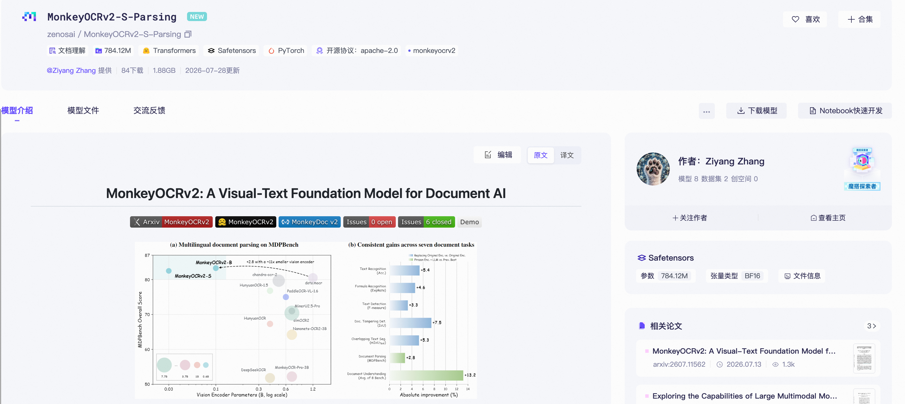

- **07-15 · Bonsai 27B** — PrismML 基于 Qwen3.6-27B 开源模型，并提供可在手机运行的 1-bit 版本。

  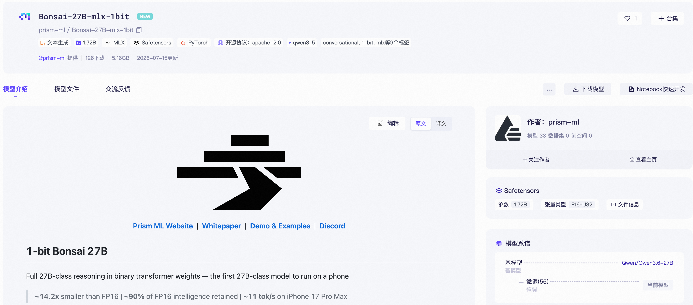

- **07-15 · OvisOCR 2** — 阿里开源基于 Qwen3.5-0.8B 训练的 OCR 模型，在 OmniDocBench v1.6 上取得 96.58 分。

  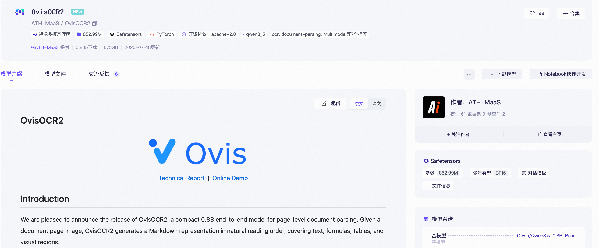

- **07-15 · Inkling** — Thinking Machines Lab 开源 975B-A41B 原生多模态模型，使用 4.5T tokens 训练。

  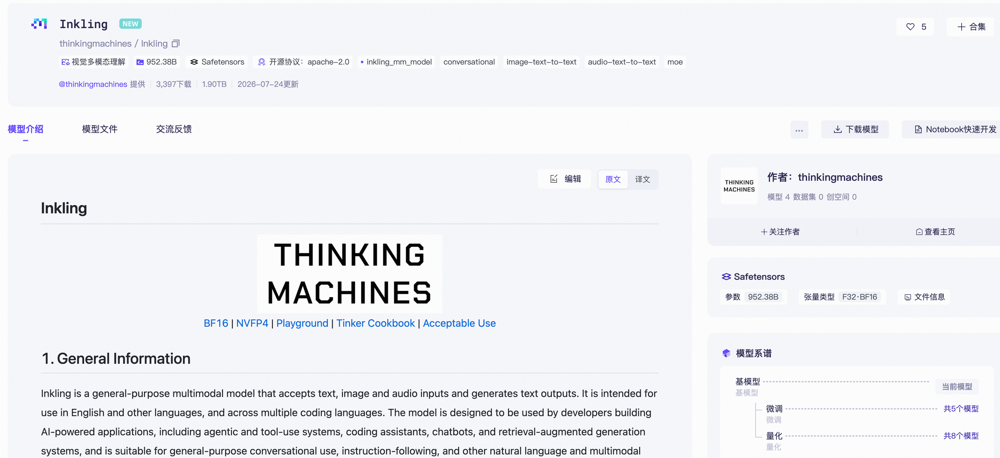

- **07-15 · Xiaomi-Robotics-U0** — 小米开源 38B 自回归世界基础模型，覆盖具身场景生成、迁移、视频生成与通用图文生成。

  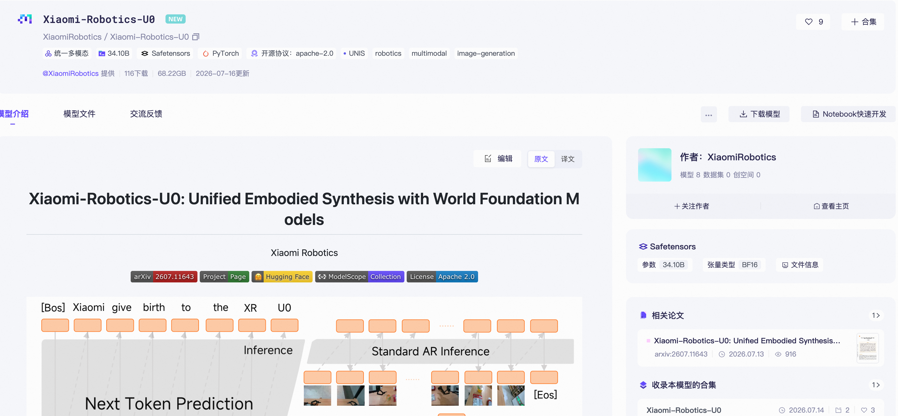

- **07-15 · HY-Embodied-VLM-1.0** — 腾讯开源面向物理世界具身智能体的视觉语言模型。

  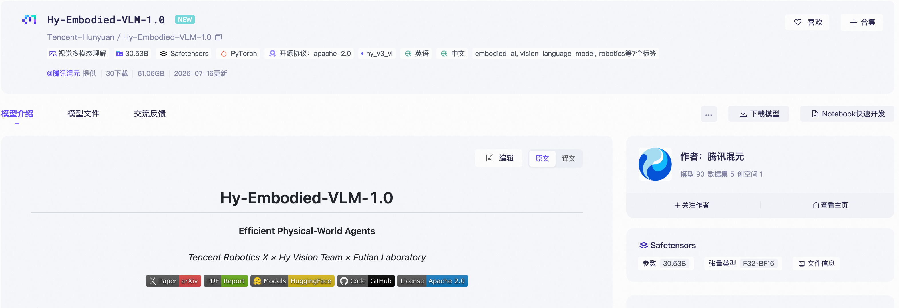

- **07-16 · Nemotron 3 Embed** — NVIDIA 开源 1B 和 8B 向量模型，支持 32K 上下文和 34 种语言检索。

  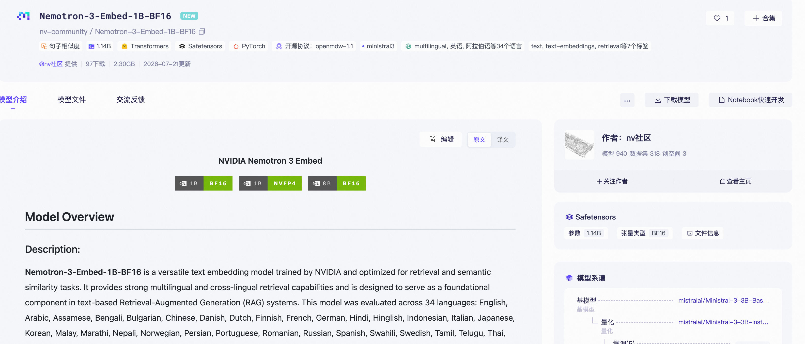

- **07-16 · LLaDA 2.2 Flash** — 蚂蚁开源面向 Agent 的扩散语言模型，支持 128K 上下文，并引入 Levenshtein Editing。

  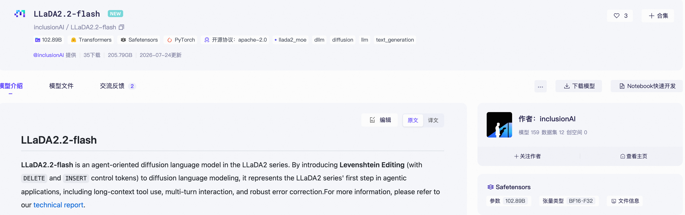

- **07-16 · HY-Embodied-RxBrain-1.0** — 腾讯开源面向具身认知的统一多模态基础模型。

  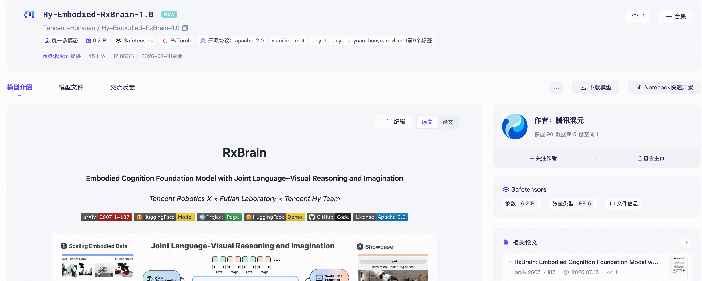

- **07-17 · Intern-S2-Preview-397B** — 上海人工智能实验室开源科学模型，在分子设计、材料结构生成等任务上追平上一代 1T 模型。

  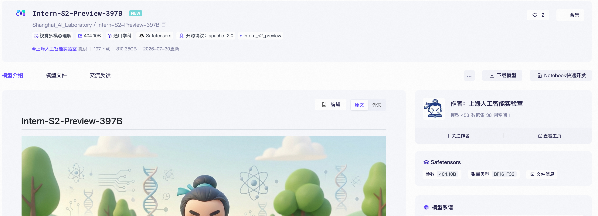

- **07-17 · 风和大模型** — 中国气象局基于 GLM-4.5-Air 开源气象领域模型，使用 5000 万 tokens 气象语料和 49 万指令数据微调。

  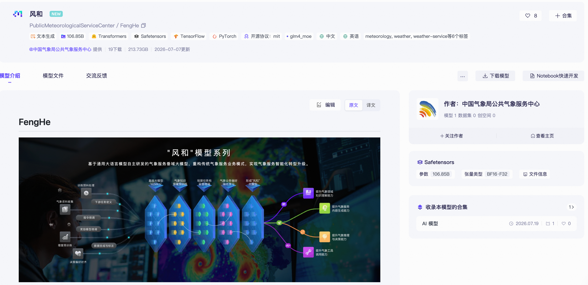

- **07-17 · VideoChat3** — 南京大学开源 4B 视频理解模型，支持长达一小时的视频、时间定位和在线响应。

  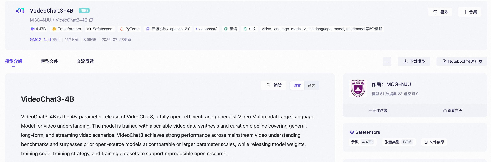

- **07-19 · Matrix-Game 3.5** — 昆仑万维开源交互世界模型，通过 Patch Memory 实现摄像机可控的 720p 视频生成。

  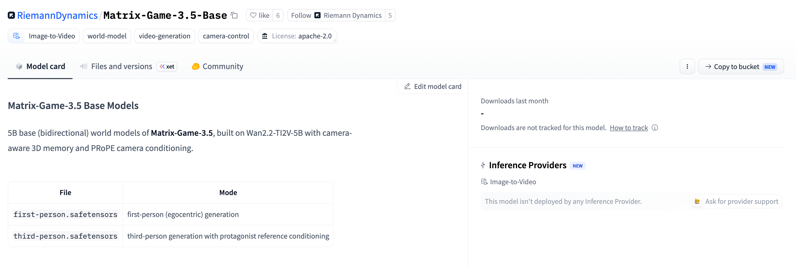

- **07-19 · MiniCPM-RobotManip** — 面壁智能开源机器人操作 VLA 模型。

  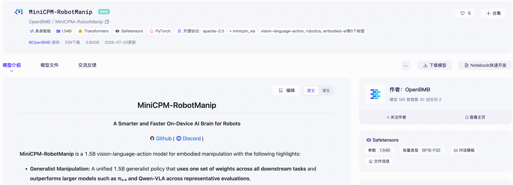

- **07-20 · Cosmos3-Edge** — NVIDIA 开源全模态世界模型，可接收文本、图像、视频和动作轨迹并生成视频、图像、音频和动作。

  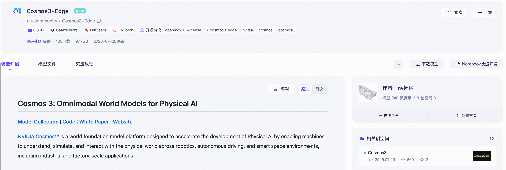

- **07-21 · Laguna S 2.1** — Poolside 开源 118B-A8B、1M 上下文模型，面向 Agent 编程和长周期任务。

  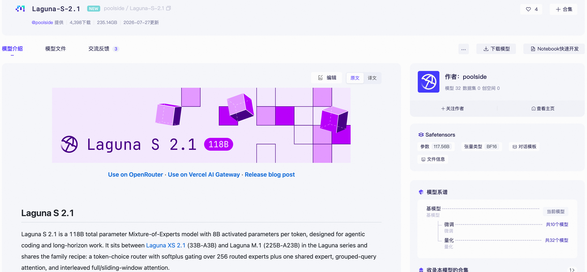

- **07-21 · HPD-Parsing** — 百度 Paddle 开源基于 InternVL3.5-1B 的分层并行文档解析模型。

  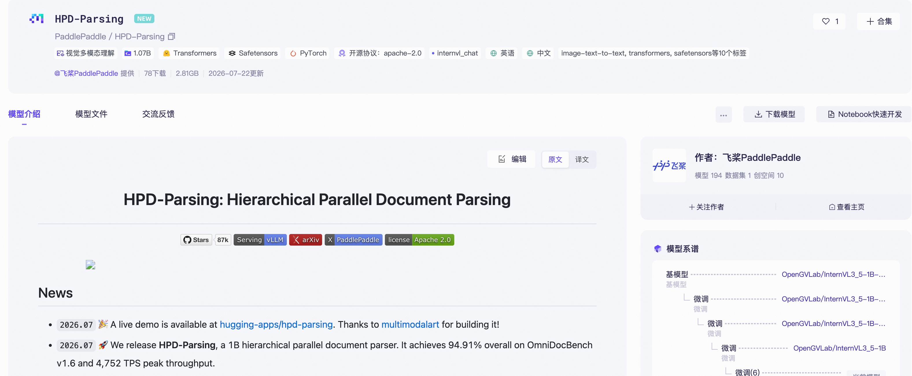

- **07-22 · Nanbeige 4.2-3B** — BOSS 直聘开源 3B 模型，面向代码、办公 Agent、复杂工具调用和通用推理。

  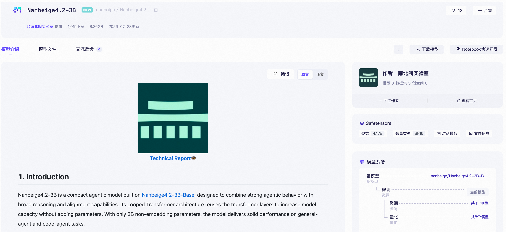

- **07-22 · Macaron-V1-Venti / Tall** — MindLab Research 分别基于 GLM-5.2 和 Qwen3.6-35B-A3B 开源后训练模型。

  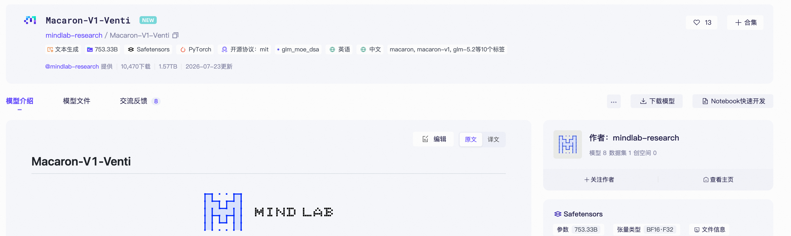

- **07-22 · Solar Open 2** — 韩国 Upstage 开源 250B-A15B 多语言模型，支持英语、韩语和日语。

  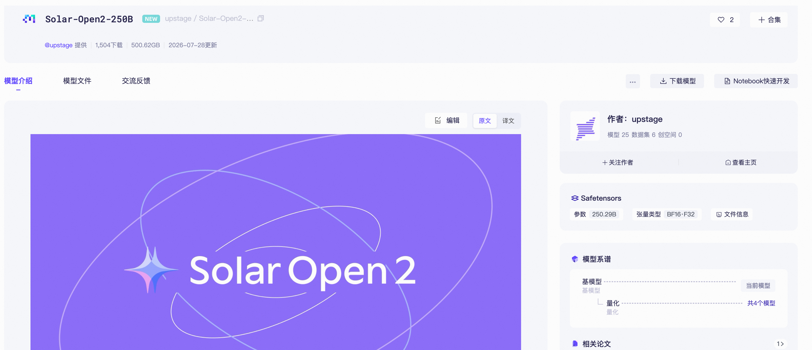

- **07-22 · Mage-Flow** — Microsoft 开源 4B 图像模型，支持文生图与指令式图像编辑。

  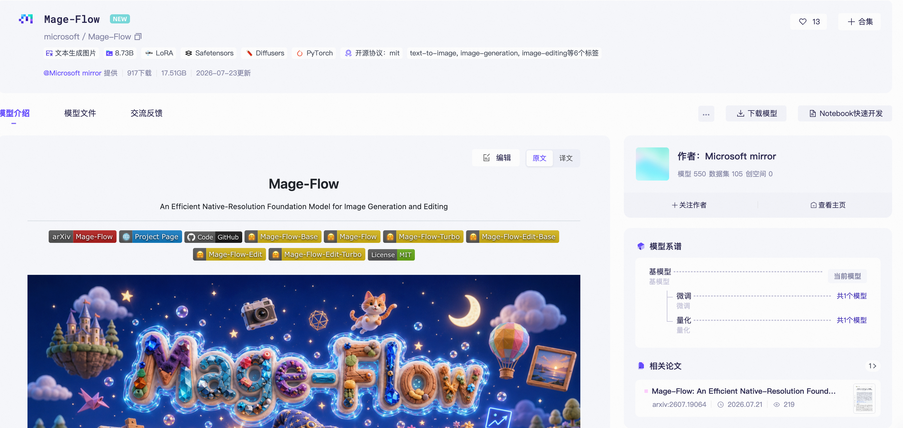

- **07-23 · Fara 1.5-27B** — Microsoft 开源多模态浏览器操作模型，可根据截图生成点击、输入、滚动和导航等工具调用。

  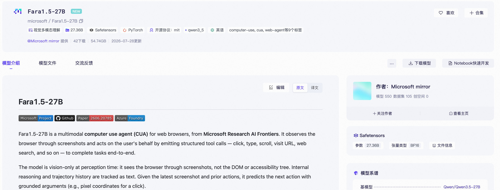

- **07-24 · Apertus 1.5** — Swiss AI Initiative 开源 8B 和 70B 多模态模型。

  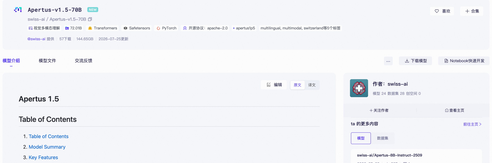

- **07-26 · Mage-VL** — Microsoft 开源基于 Qwen3-4B 训练的多模态模型。

  

- **07-26 · Inflect-Micro-v2** — 个人开发者开源 9.36M 参数的轻量语音合成模型。

  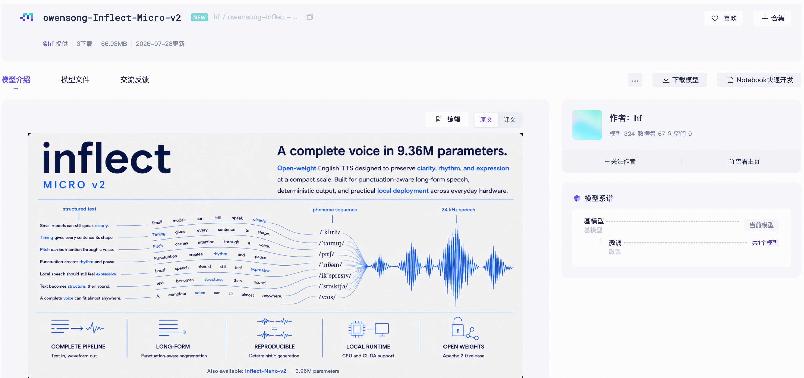

- **07-27 · Kimi K3** — 月之暗面开源 2.8T 原生多模态模型，采用 KDA、Attention Residuals 和 Stable LatentMoE 等技术。[相关文章](https://mp.weixin.qq.com/s/10iz46mZ_IhbDj-81Rnf1g)

  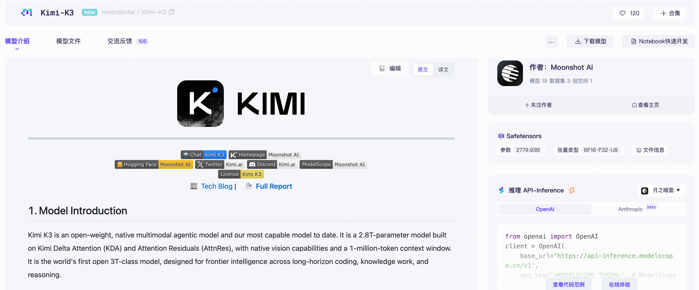

- **07-29 · A.X K2** — SK Telecom 开源 688B-A33B 模型，采用原生 FP8 训练。

  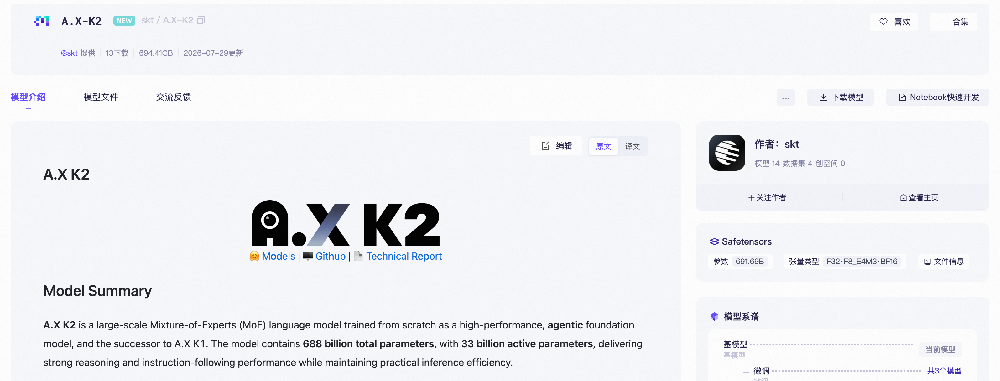

- **07-31 · DeepSeek-V4-Flash-0731** — DeepSeek 开源 V4 Flash 正式版，采用 284B 总参数、13B 激活参数，支持最高 1M 上下文。[性能对比](https://mp.weixin.qq.com/s/8hldXeA7Ou4Qu4AWYQA-6w) · [体验文章](https://mp.weixin.qq.com/s/GkCwMEhjjRFhmYkh60wAIw)

  

- **07-31 · openPangu-2.0-Pro** — 华为开源 505B 总参数、18B 激活参数的 MoE 模型，支持 512K 上下文，并结合 DSA、滑动窗口注意力与 mHC 等结构。

  

- **07-31 · K-EXAONE 2.0** — LG AI Research 开源 750B 总参数、37B 激活参数的多语言模型，覆盖 10 种语言，面向通用推理、知识和多语任务。

  
