# 2026 年 8 月开源模型

- **07-31 · DeepSeek-V4-Flash-0731** — DeepSeek 开源 V4 Flash 正式版，采用 284B 总参数、13B 激活参数，支持最高 1M 上下文。[性能对比](https://mp.weixin.qq.com/s/8hldXeA7Ou4Qu4AWYQA-6w) · [体验文章](https://mp.weixin.qq.com/s/GkCwMEhjjRFhmYkh60wAIw)

  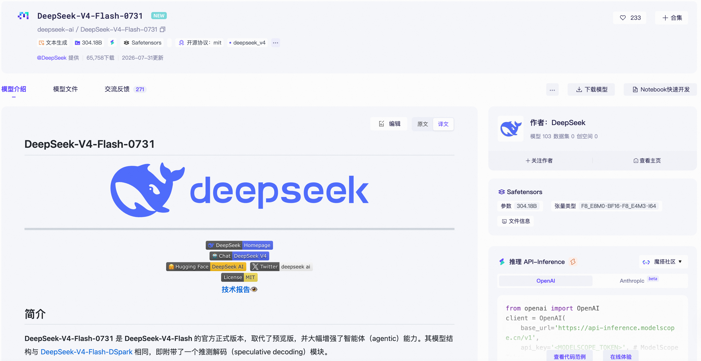

- **07-31 · openPangu-2.0-Pro** — 华为开源 505B 总参数、18B 激活参数的 MoE 模型，支持 512K 上下文，并结合 DSA、滑动窗口注意力与 mHC 等结构。

  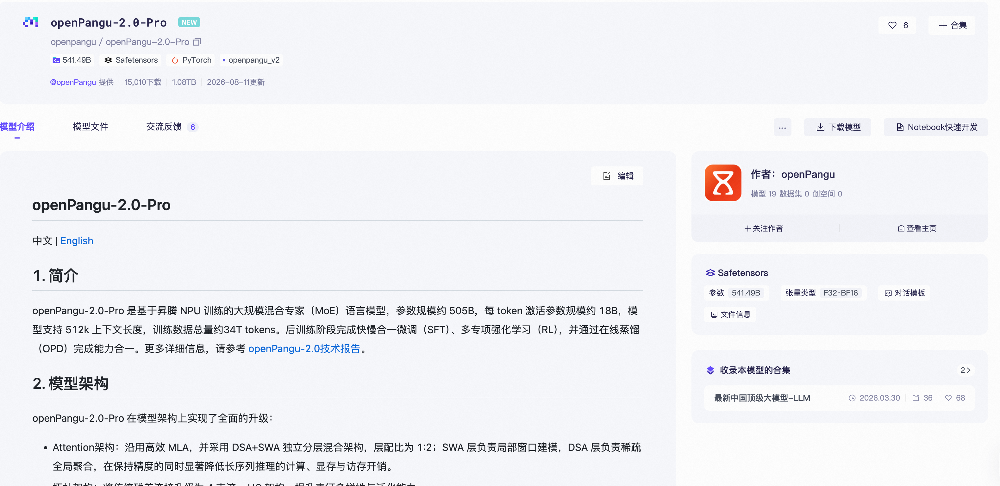

- **07-31 · K-EXAONE 2.0** — LG AI Research 开源 750B 总参数、37B 激活参数的多语言模型，覆盖 10 种语言，面向通用推理、知识和多语任务。

  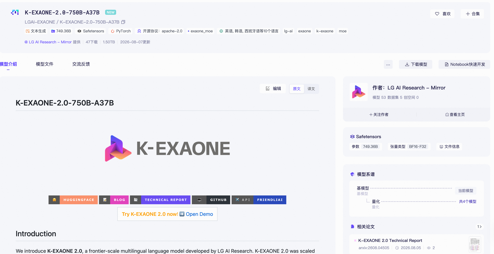

- **08-01 · SenseNova-U1.5-8B-MoT-Preview** — 商汤开源统一多模态模型，采用 NEO-unify 路线，覆盖图像生成与编辑，强调中英文文字渲染、局部编辑、多参考图和迭代式工作流，最高面向 4K 内容生成。

  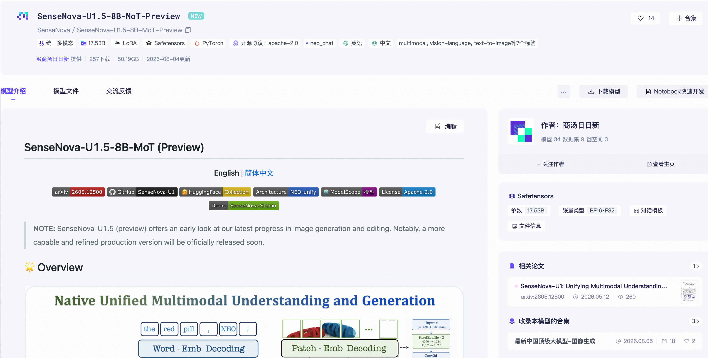

- **08-01 · LongCat-Flash-Lite-Sparse** — 美团开源 69B 总参数、3B 激活参数的模型，采用 LongCat Sparse Attention（LSA）稀疏注意力框架并原生支持 1M 上下文，通过分层跨层索引机制降低超长文本推理成本。

  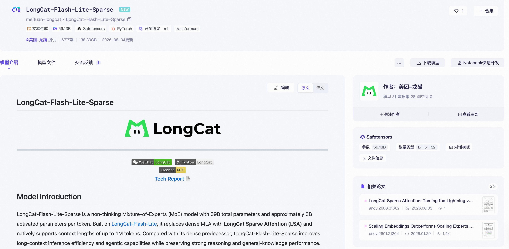

- **08-03 · MiniMax H3** — MiniMax 开源视频生成模型，可理解文本、图像、视频和音频，并生成带原生立体声音频的视频。开放版本包含 FL2VA 与 Ref2VA 等检查点，ComfyUI 提供原生工作流；本地基础流程以 768p 为主。

  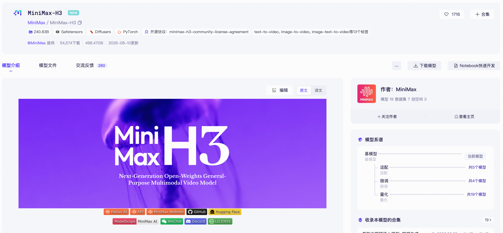

- **08-04 · Xiaomi-Robotics-1-5B** — 小米开源 VLA 模型，以 Qwen3-VL 与 DiT 为基础，通过 Mixture-of-Transformers 方式连接理解和动作生成。

  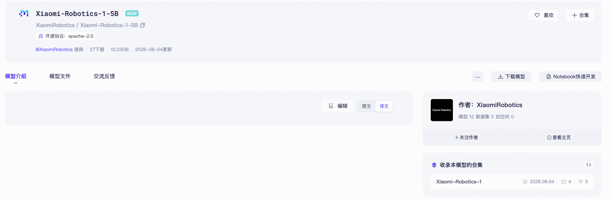

- **08-04 · Ling-3.0-flash** — 蚂蚁开源 124B 总参数、5.1B 激活参数的 MoE 模型，结合 KDA 与 MLA 的混合线性注意力，原生支持 256K 上下文并可扩展到 1M，针对工具调用、长上下文和 Agent 场景做了专门后训练。

  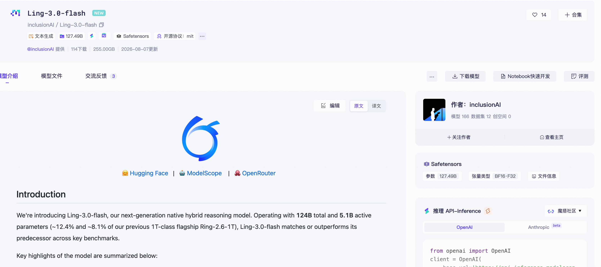

- **08-05 · JoyAI-Video-Edit** — 京东开源 16B 实时视频编辑模型，在单张 NVIDIA B200 上可达到端到端 30.19 FPS，最低可使用 32GB 显存部署。[相关文章](https://mp.weixin.qq.com/s/wwLXO3HHFyHvqoqUjNI3Gw)

  

- **08-05 · Maple-Preview** — DeepGrove 实验室开源 20.2B 总参数、1.49B 激活参数的高效模型，在 Mac mini M4 上可达到每秒 200 多个 token，比 Gemma 4、Qwen3.5 和 gpt-oss 等高效模型快 5–16 倍。

  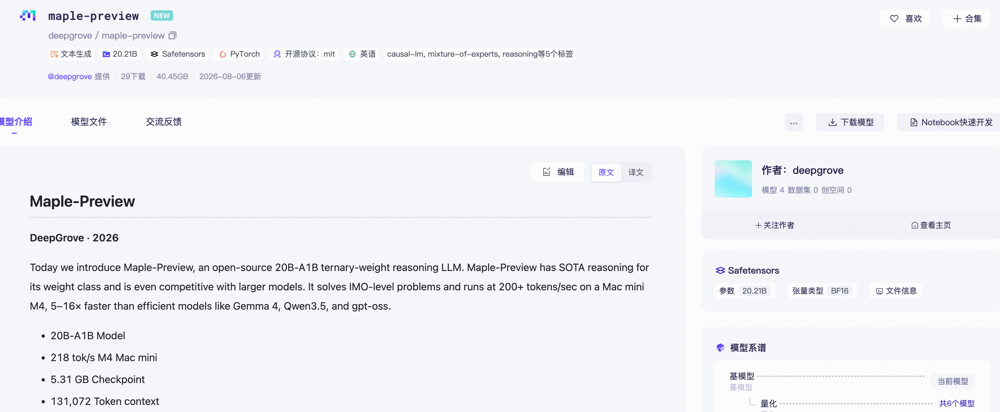

- **08-05 · Shieldstral-1.0-3B** — Mistral AI 开源自适应多模态安全分类器，可处理文本、图像或图文混合输入。用户可直接用自然语言描述安全政策，模型输出连续安全分数。

  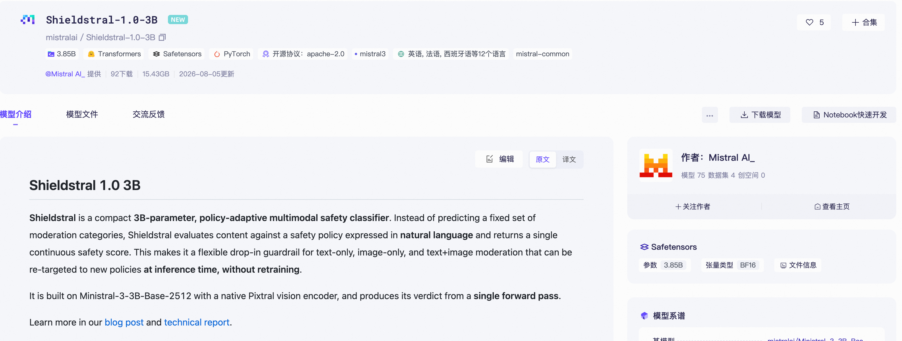

- **08-06 · LFM2.5-2.6B** — Liquid AI 开源面向手机、笔记本、PC 与机器人的端侧混合架构模型，支持 128K 上下文。Agentic 后训练重点覆盖工具调用、指令遵循与多步任务执行，适合离线或隐私敏感的本地 Agent。

  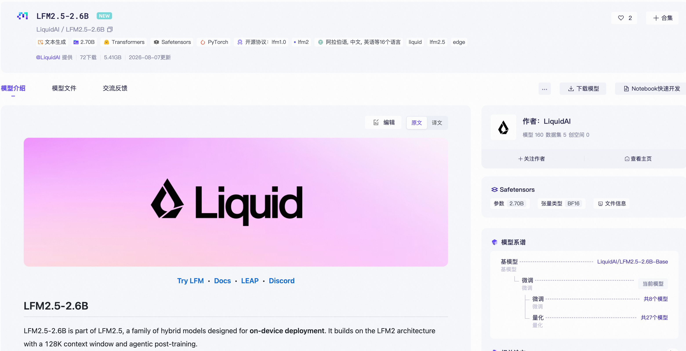

- **08-07 · Wan-Animate-2-14B** — 阿里开源面向角色动画与角色替换的模型，可将参考视频中的动作、表情和节奏迁移到目标人物。

  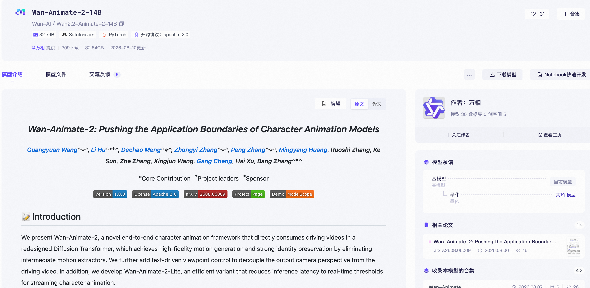

- **08-07 · Alpamayo2-Super** — NVIDIA 开源 34B 推理型 VLA 基础模型，面向自动驾驶与机器人场景。

  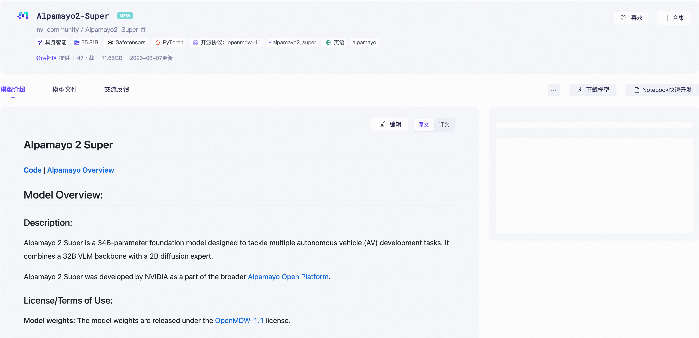

- **08-10 · Muse-Glimmer-30B** — Meta 开源由 Muse Spark 蒸馏而来的模型，面向消费级硬件上的本地 Agent 任务，强调长上下文、多步推理、工具调用、视觉理解与失败恢复；4-bit 量化可在约 20GB 显存内运行。

  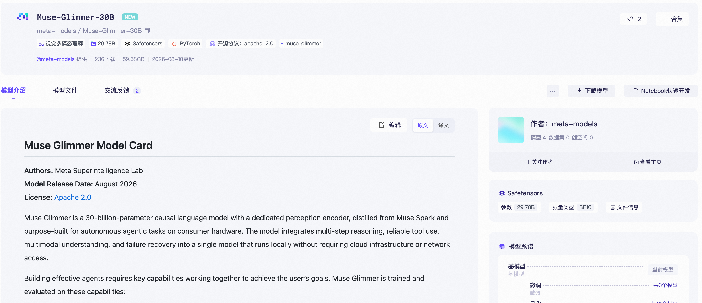

- **08-10 · Ling-3.0-tiny** — 蚂蚁开源 7.9B 总参数、约 1.3B 激活参数的混合推理 MoE 模型，兼顾低延迟与推理能力。

  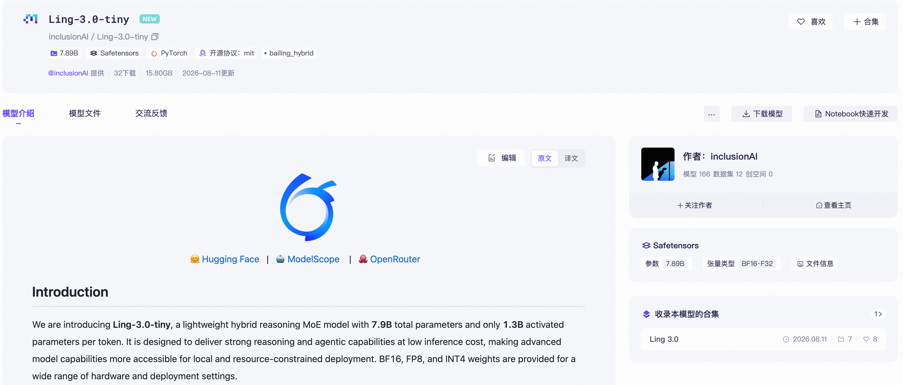
