# 2026 年 8 月开源模型

- **08-01 · SenseNova-U1.5-8B-MoT-Preview** — 商汤开源统一多模态模型，采用 NEO-unify 路线，覆盖图像生成与编辑，强调中英文文字渲染、局部编辑、多参考图和迭代式工作流，最高面向 4K 内容生成。

  

- **08-01 · LongCat-Flash-Lite-Sparse** — 美团开源 69B 总参数、3B 激活参数的模型，采用 LongCat Sparse Attention（LSA）稀疏注意力框架并原生支持 1M 上下文，通过分层跨层索引机制降低超长文本推理成本。

  

- **08-03 · MiniMax H3** — MiniMax 开源视频生成模型，可理解文本、图像、视频和音频，并生成带原生立体声音频的视频。开放版本包含 FL2VA 与 Ref2VA 等检查点，ComfyUI 提供原生工作流；本地基础流程以 768p 为主。

  

- **08-04 · Xiaomi-Robotics-1-5B** — 小米开源 VLA 模型，以 Qwen3-VL 与 DiT 为基础，通过 Mixture-of-Transformers 方式连接理解和动作生成。

  

- **08-04 · Ling-3.0-flash** — 蚂蚁开源 124B 总参数、5.1B 激活参数的 MoE 模型，结合 KDA 与 MLA 的混合线性注意力，原生支持 256K 上下文并可扩展到 1M，针对工具调用、长上下文和 Agent 场景做了专门后训练。

  

- **08-05 · JoyAI-Video-Edit** — 京东开源 16B 实时视频编辑模型，在单张 NVIDIA B200 上可达到端到端 30.19 FPS，最低可使用 32GB 显存部署。[相关文章](https://mp.weixin.qq.com/s/wwLXO3HHFyHvqoqUjNI3Gw)

  

- **08-05 · Maple-Preview** — DeepGrove 实验室开源 20.2B 总参数、1.49B 激活参数的高效模型，在 Mac mini M4 上可达到每秒 200 多个 token，比 Gemma 4、Qwen3.5 和 gpt-oss 等高效模型快 5–16 倍。

  

- **08-05 · Shieldstral-1.0-3B** — Mistral AI 开源自适应多模态安全分类器，可处理文本、图像或图文混合输入。用户可直接用自然语言描述安全政策，模型输出连续安全分数。

  

- **08-06 · LFM2.5-2.6B** — Liquid AI 开源面向手机、笔记本、PC 与机器人的端侧混合架构模型，支持 128K 上下文。Agentic 后训练重点覆盖工具调用、指令遵循与多步任务执行，适合离线或隐私敏感的本地 Agent。

  

- **08-07 · Wan-Animate-2-14B** — 阿里开源面向角色动画与角色替换的模型，可将参考视频中的动作、表情和节奏迁移到目标人物。

  

- **08-07 · Alpamayo2-Super** — NVIDIA 开源 34B 推理型 VLA 基础模型，面向自动驾驶与机器人场景。

  

- **08-10 · Muse-Glimmer-30B** — Meta 开源由 Muse Spark 蒸馏而来的模型，面向消费级硬件上的本地 Agent 任务，强调长上下文、多步推理、工具调用、视觉理解与失败恢复；4-bit 量化可在约 20GB 显存内运行。

  

- **08-10 · Ling-3.0-tiny** — 蚂蚁开源 7.9B 总参数、约 1.3B 激活参数的混合推理 MoE 模型，兼顾低延迟与推理能力。

  

- **08-13 · MiniMax-Music3** — MiniMax 开源音乐生成模型，可根据创意描述和可选歌词一次生成最长约 5 分钟的完整歌曲，由 Global LLM、Local LLM、Flow Matching 与 Flow-VAE 组成，输出 32kHz 立体声。

  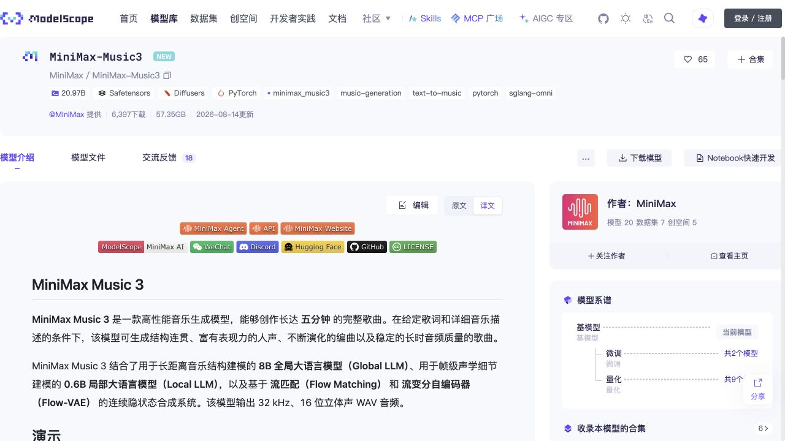

- **08-14 · dots3-note-prev** — 小红书开源约 280B 总参数、16B 激活参数的多模态模型，支持 512K 上下文，可理解文本、图像、视频与音频并输出文本，面向复杂多模态笔记与长上下文推理。

  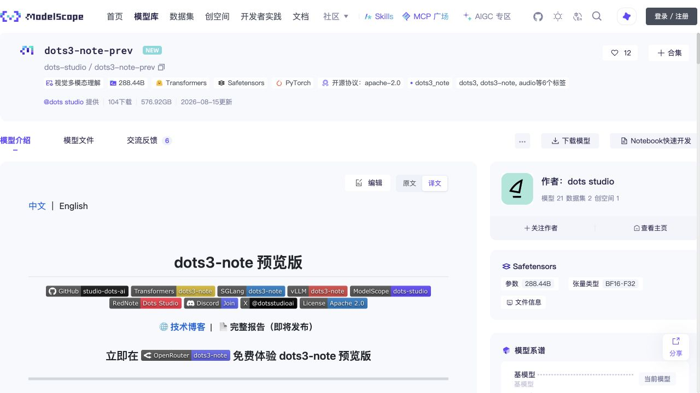

- **08-14 · Qwen3.8-27B** — 阿里千问开源 27B 稠密原生视觉语言模型，兼顾视觉理解、文本推理与端侧部署效率。[相关文章](https://mp.weixin.qq.com/s/7TAgPsbTXUBTvg7to7z-dQ)

  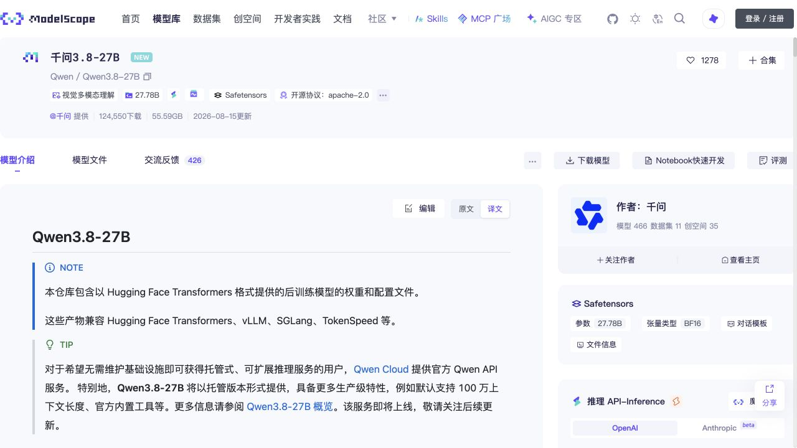

- **08-18 · Ornith-1.5** — Ornith 开源 1.5 系列模型，包含 9B 稠密模型、35B-A3B MoE 与 397B MoE 等规模，强调基于自我改进循环训练，在推理、代码与 Agent 任务上提升能力。

  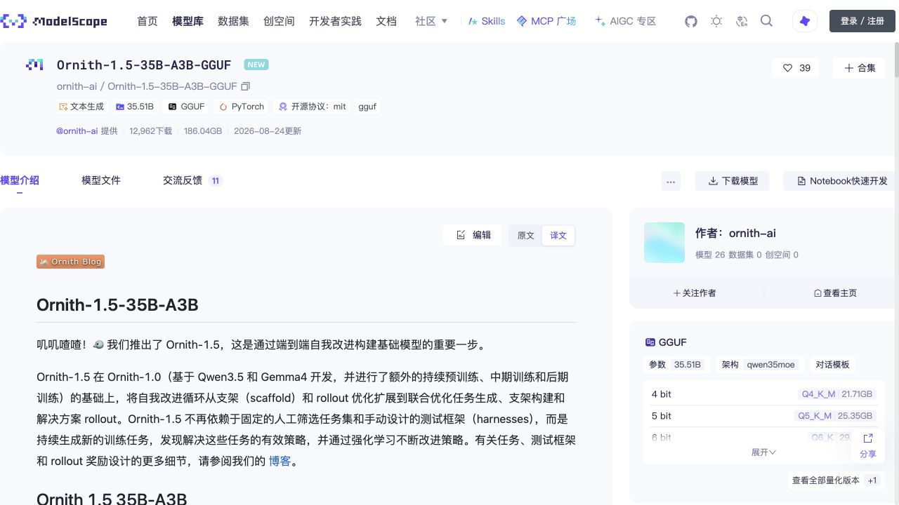

- **08-20 · Ling-3.0-flash-base** — 蚂蚁百灵开源 Ling-3.0-flash 的 Base 模型，采用 124B 总参数、5.1B 激活参数的 MoE 架构，适合续训、领域适配、强化学习、蒸馏及 MoE 研究。

  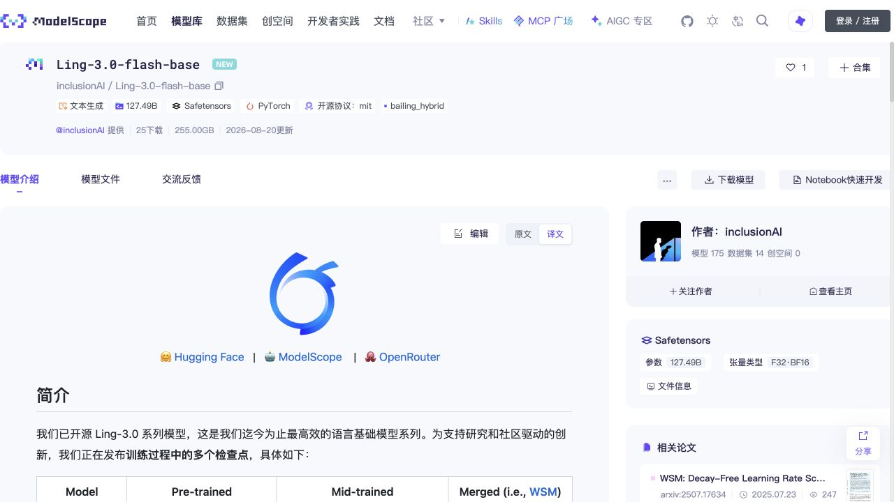

- **08-20 · Ling-3.0-tiny-base** — 蚂蚁百灵开源 Ling-3.0-tiny 的 Base 模型，采用 7.9B 总参数、约 1.3B 激活参数的 MoE 架构，面向轻量续训、领域适配与蒸馏实验。

  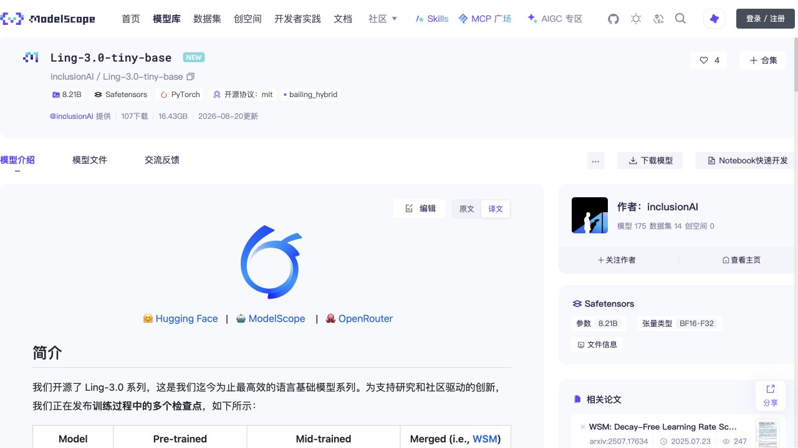

- **08-20 · SenseNova-U1.5-8B-MoT** — 商汤开源正式版统一多模态模型，以 8B 级理解、生成与编辑能力为核心，支持原生 4K 图像生成，并强化图像编辑与任意模态交互。

  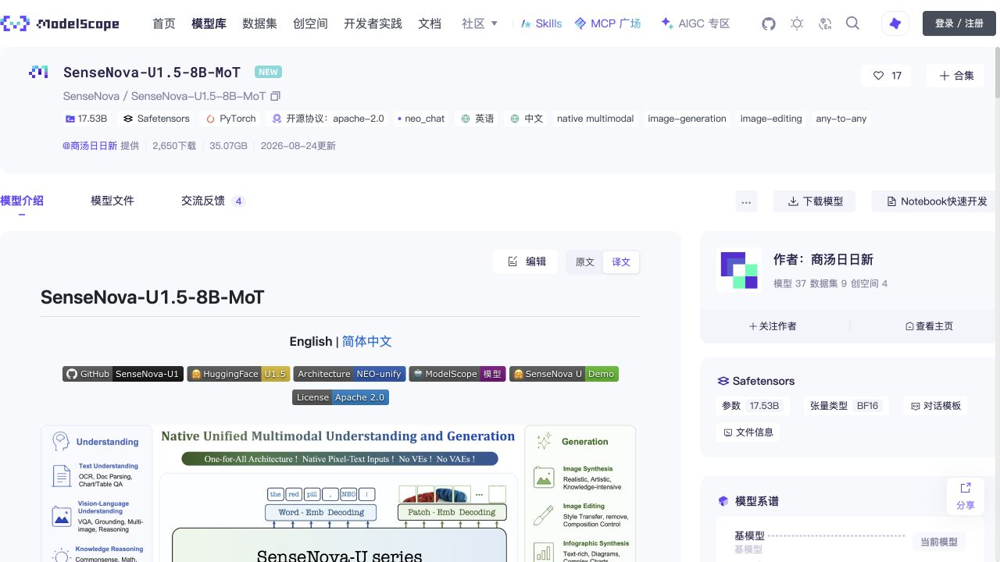

- **08-25 · Granite 4.2-30B** — IBM 开源 Granite 4.2 系列 30B 模型，面向企业 Agentic AI，在原生推理、工具调用与代码任务上进行了增强。

  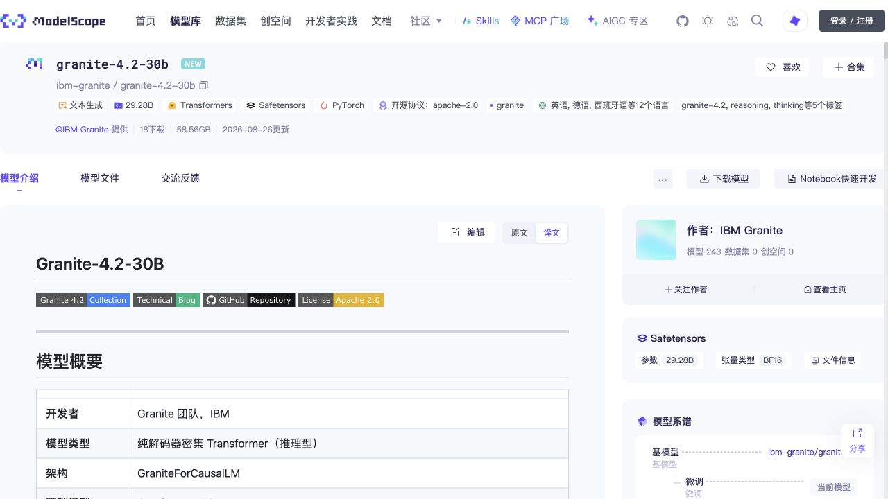

- **08-25 · WeMM-Embedding-2B** — 腾讯混元开源 2B 多模态向量模型，以统一向量空间处理文本、图像、视频、视觉文档和图文交错内容，可用于跨模态检索、聚类与下游 RAG。

  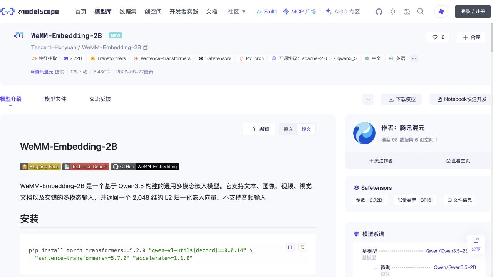

- **08-25 · Breeze TTS 2** — BreezeBlue 开源实时语音合成模型，支持中英文、无需参考音频的声音设计、参考音频引导、声音克隆与低延迟流式输出。

  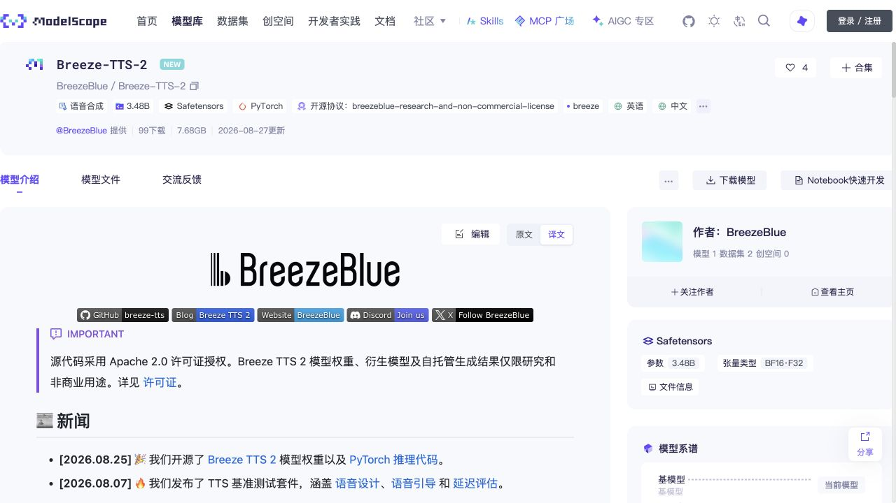

- **08-25 · LFM2.5-350M-GGUF** — Liquid AI 开源约 354M 参数的 LFM2.5 量化模型，支持 8 种语言并提供 4-bit、5-bit、6-bit 等 GGUF 规格，适合资源受限设备上的本地部署。

  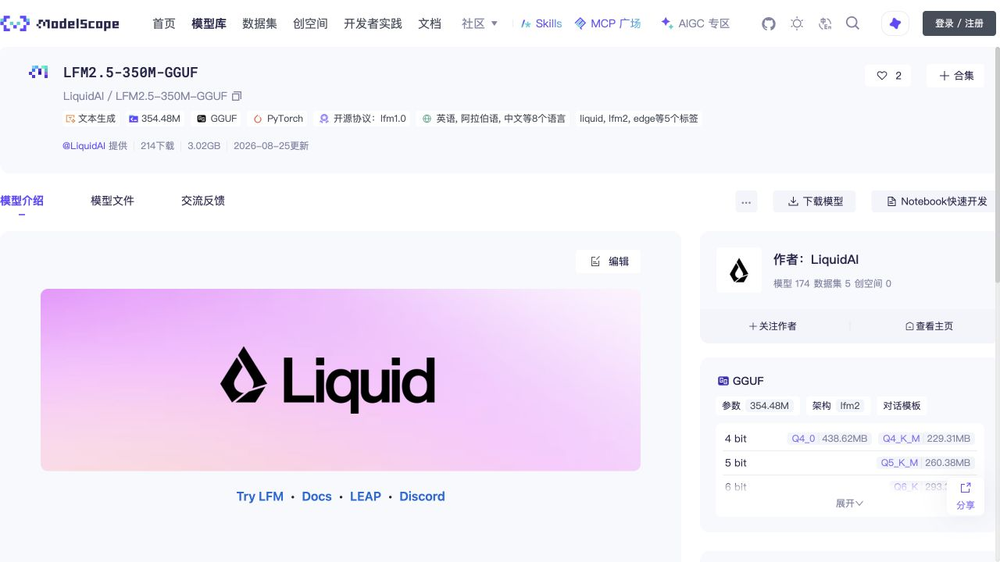

- **08-26 · Qwen3.8-Flash-Next** — 阿里千问开源新一代 Flash 模型，在高效推理路线之上预览下一代 Qwen 架构演进。[相关文章](https://mp.weixin.qq.com/s/jiRPbxMtHM-IvIpIa9KgIA)

  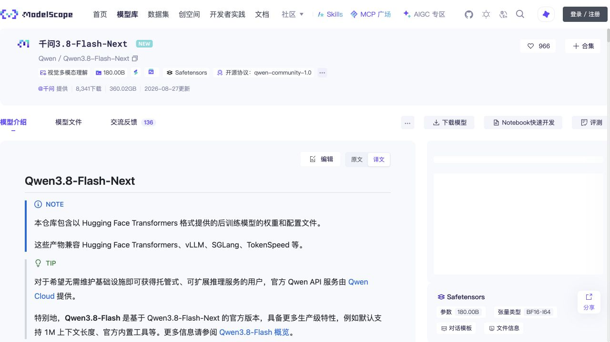

- **08-26 · GLM-5.3-Flash** — 智谱开源约 320B 总参数、18B 激活参数的模型，结合稀疏与线性注意力，原生处理文本、图像、视频和文件，强调低成本多模态 Agent 使用。[相关文章](https://mp.weixin.qq.com/s/qYv0cDXbLE3cD2C8L5-ZzA)

  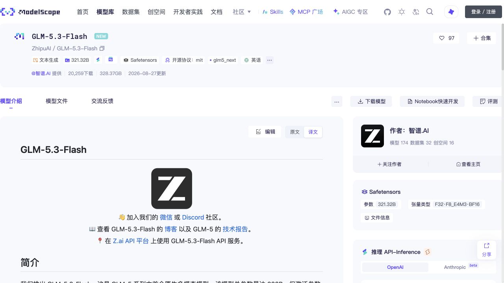

- **08-28 · Hy4-preview** — 腾讯混元开源约 770B 总参数、49B 激活参数的预览模型，支持百万级长上下文，面向代码、办公和科学任务中的复杂 Agent 场景。[相关文章](https://mp.weixin.qq.com/s/0fl-4VeSI71DEsThF47KDg)

  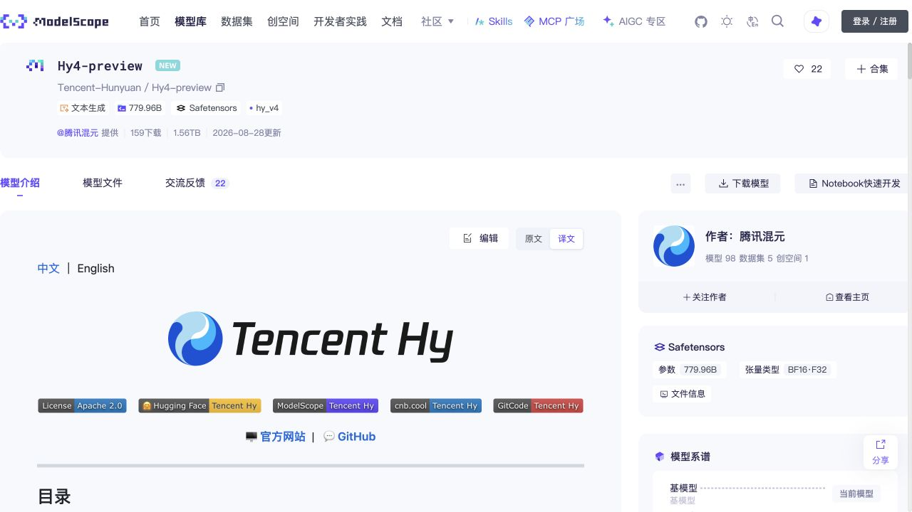

- **08-31 · DeepSeek-V4-Flash-Vision** — DeepSeek 开源首个多模态模型，在 DeepSeek-V4-Flash 路线之上加入视觉理解能力。[相关文章](https://mp.weixin.qq.com/s/YPHE8LjEpzz0I3LI0PW5VQ)

  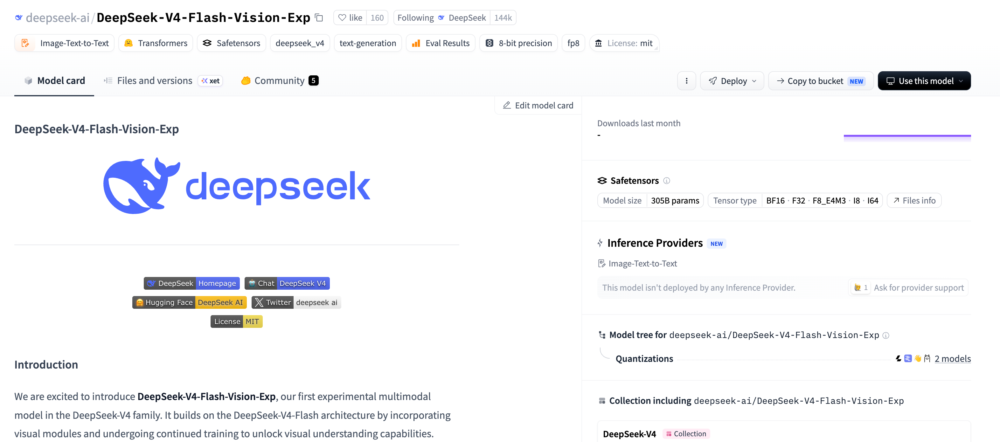
