# 2026 年 9 月开源模型

- **09-01 · Spark-X2.5** — 科大讯飞开源端侧模型系列，包含 Spark-X2.5-4B 和 Spark-X2.5-1.7B 两款 Dense 模型，覆盖对话、写作、翻译、推理、编程、工具使用与 Agent 工作流，原生支持最高 1M 上下文和超过 200 种语言。

  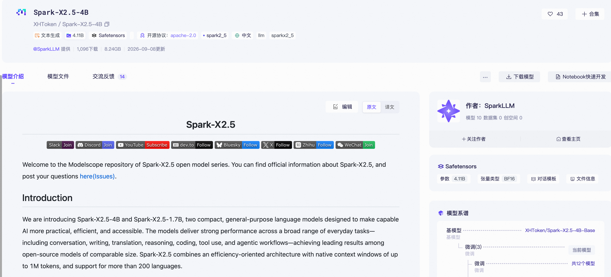

- **09-01 · TimesFM-3** — Google 开源第三代时间序列基础模型，专门面向零样本多元时间序列预测。

  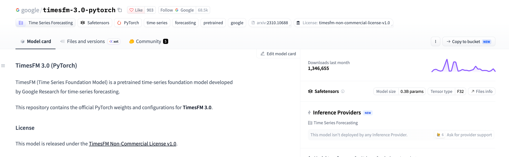

- **09-03 · Qwen-Drive-1.0** — 阿里千问开源自动驾驶视觉语言基础模型，采用 Qwen3.5 视觉语言架构，在统一框架内集成 3D 感知、视觉问答与运动规划。

  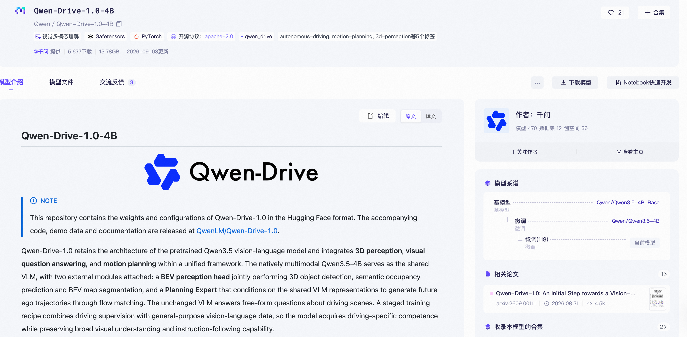

- **09-03 · K2-Horizon** — IFM 开源 K2-Horizon 系列模型，提供 375B-A23B、32B、7B、3.7B 和 0.9B 等多种规模。

  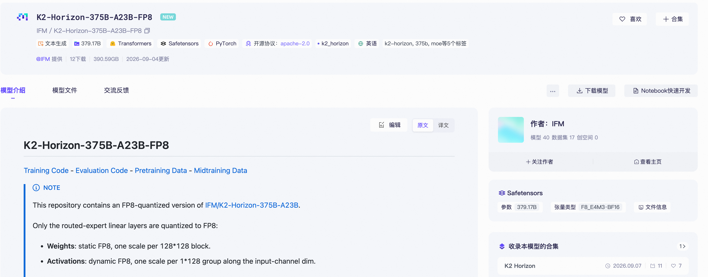

- **09-04 · LLaDA-Image** — 蚂蚁开源图像生成与编辑模型，包含 50 步高质量基础版 LLaDA-Image，以及面向快速生成和编辑的 4 步 LLaDA-Image-Turbo。

  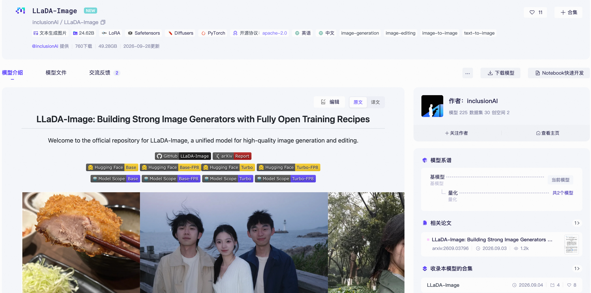

- **09-05 · H3-World** — 新加坡国立大学开源基于 MiniMax-H3 构建的交互式世界模型，可根据初始帧与键盘控制信号生成角色和摄像机运动协调的动作控制视频。

  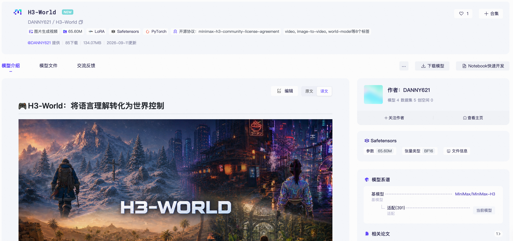

- **09-07 · MiniCPM5-2B** — 面壁智能开源 2B 模型，并同步开放模型权重、训练数据、数据处理方法、部分训练 Recipe 与 RL 训练框架 Meshy。[相关文章](https://mp.weixin.qq.com/s/rMVOLGSgjX5sr15lW9GSKA)

  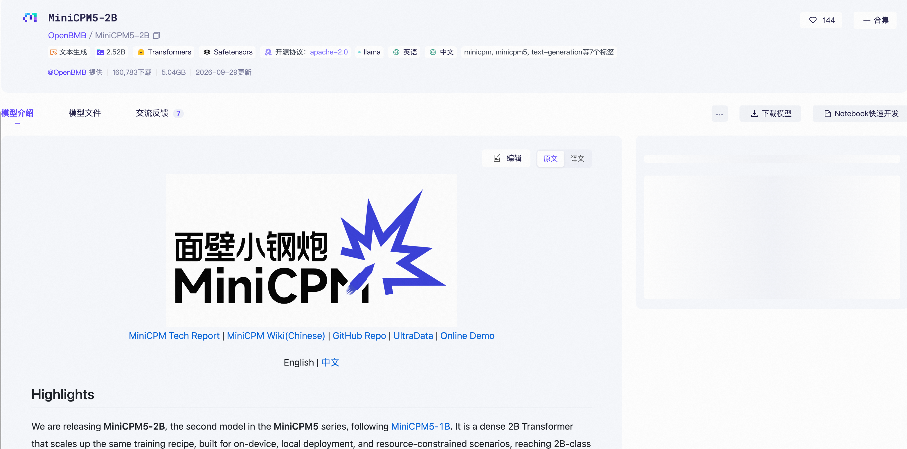

- **09-07 · NeoHorse-1** — 基元律动开源基于 Qwen3.5-4B 与 Qwen3.5-9B 后训练的模型系列。

  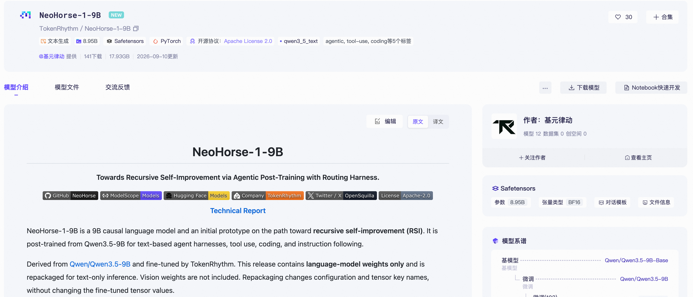

- **09-08 · OUI-1** — OpenUI 开源生成式界面扩散模型，基于 Google DiffusionGemma 26B-A4B-it 微调，可依据自然语言需求生成适配组件库的声明式界面代码。

  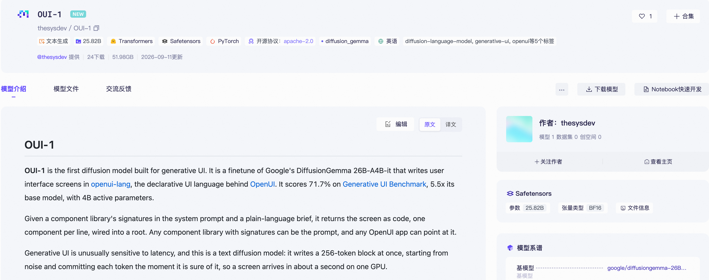

- **09-09 · Ling-3.0-flash-Fin** — 蚂蚁开源金融任务增强模型，采用约 124B 总参数、5.1B 激活参数的 MoE 架构，支持长文档与金融 Agent 工作流。

  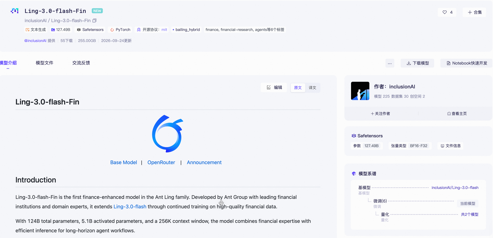

- **09-09 · Ling-3.0-flash-VL** — 蚂蚁开源视觉语言模型，总参数 124B、单次推理激活 5.5B，原生兼容图像、文本和视频输入，最高支持 256K 上下文。

  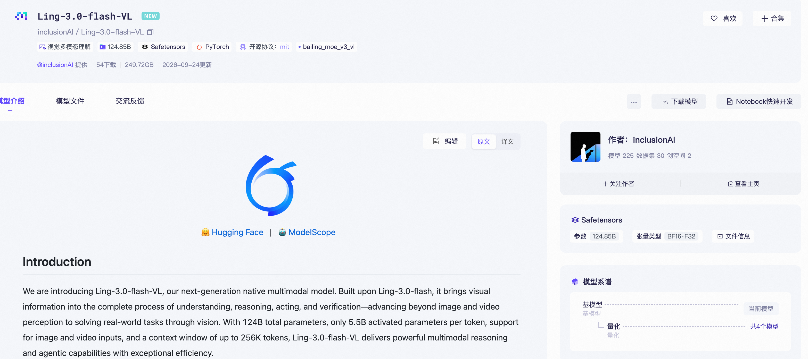

- **09-09 · AuK** — 腾讯混元开源 1.5B 语音生成与编辑基础模型，以统一自然语言指令支持零样本文本到语音、内容与声学编辑、副语言编辑、语音增强和源分离。

  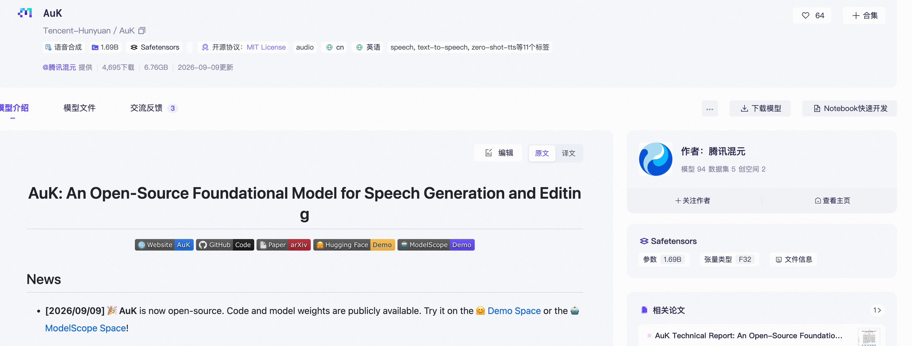

- **09-09 · North Small Translate 1.0** — Cohere Labs 开源机器翻译模型，约 218B 总参数、25B 激活参数，覆盖 50 种语言。

  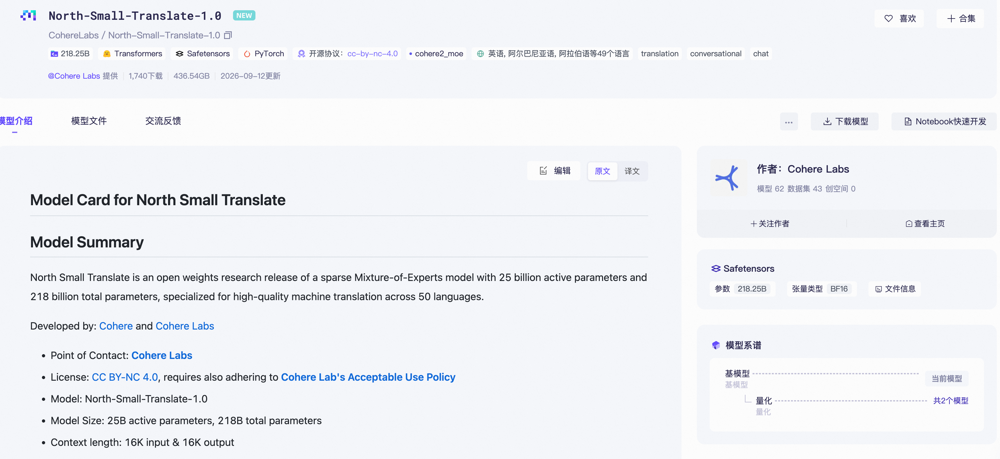

- **09-09 · EVIE** — 腾讯开源视觉文档检索模型，面向视觉文档内容的理解与检索。

  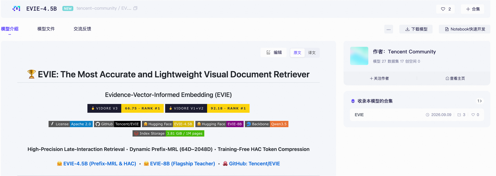

- **09-10 · Nex-N2.5** — Nex-AGI 开源 Agent 模型系列，包含 mini、Pro 和 Max 三种尺寸，重点提升计算机操作、网页浏览和视觉智能体能力。

  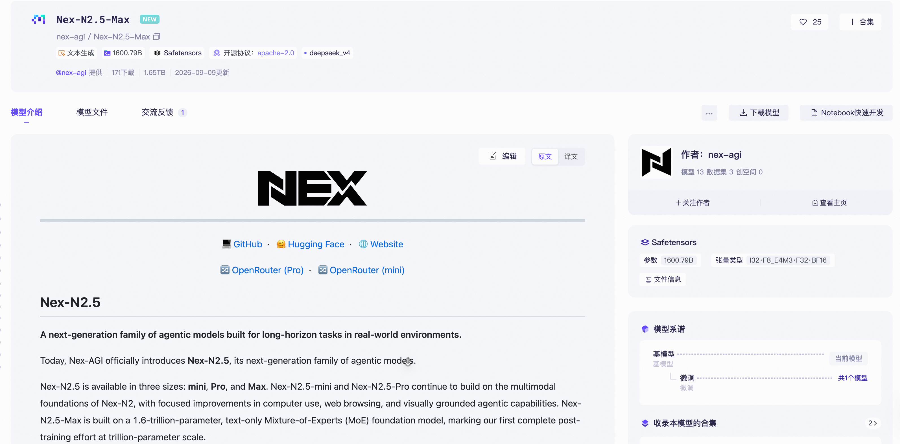

- **09-10 · DeepSeek-V4.1-Flash** — 深度求索开源多模态 MoE 模型，原生处理图文并支持最高 1M 上下文，重点优化 KV 缓存效率。

  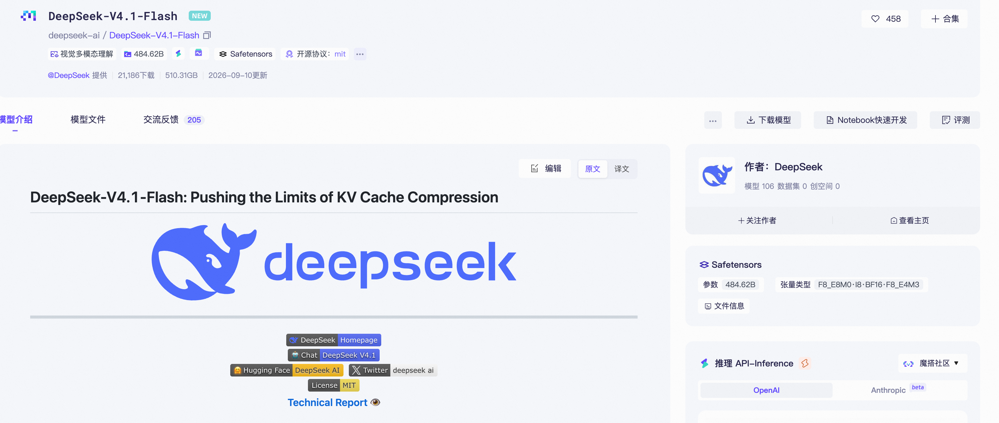

- **09-10 · YuE2-3B** — Multimodal Art Projection 开源音乐生成模型，输入歌词和风格描述即可生成包含人声与伴奏的歌曲。

  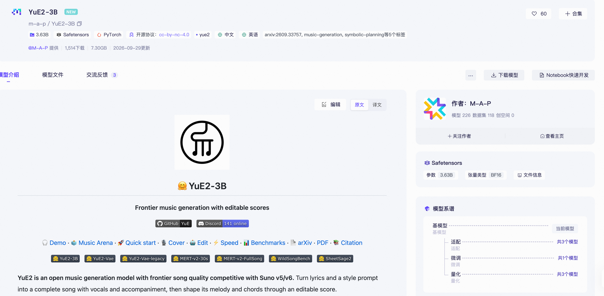

- **09-11 · Xiaomi-CocktailASR-1** — 小米开源目标说话人语音识别大模型，面向复杂多人语音环境中的指定说话人转写。

  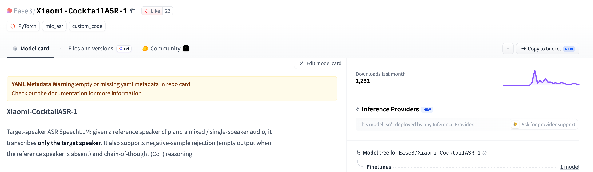

- **09-11 · UnifoLM-ER-1 & UnifoLM-ER-Flow** — 宇树开源两款具身模型，分别面向具身场景中的感知推理，以及视觉、语言与动作之间的联合建模。

  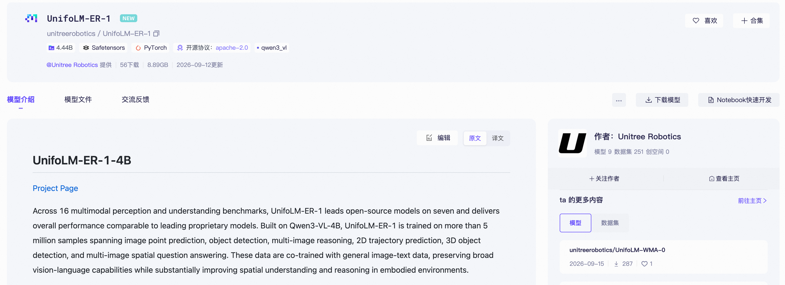

- **09-14 · Intern-S2-397B** — 上海人工智能实验室开源科学多模态大模型 Intern-S2-397B 正式版。

  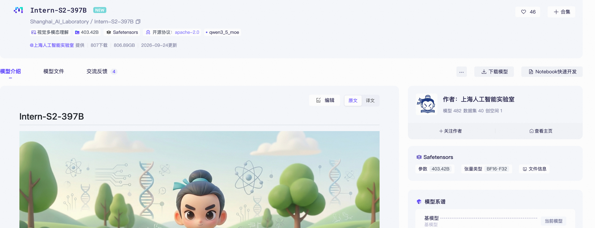

- **09-14 · jina-ocr-v1** — Jina AI 开源端到端 OCR 与文档解析模型，主要面向复杂页面中的高效文字和结构提取。

  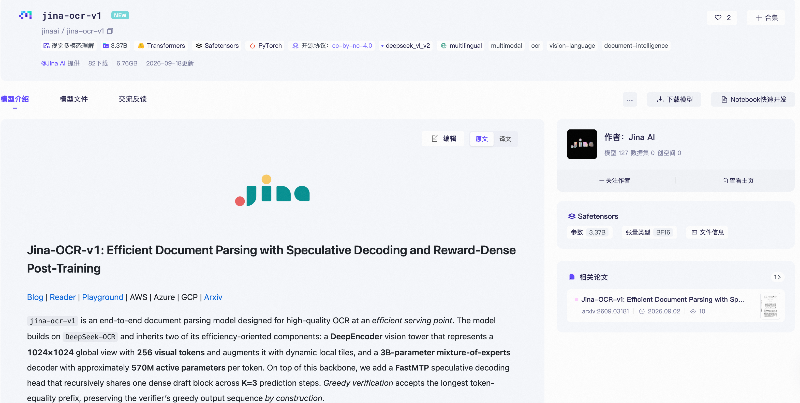

- **09-15 · Atria-Dawn-Preview** — 上海人工智能实验室开源基于 GLM-5.2 微调的模型，将开放式问题推进为可执行、可验证、可复现的结果，支持从分析、工具调用和代码实现到实验执行、结果分析及失败恢复的完整闭环。

  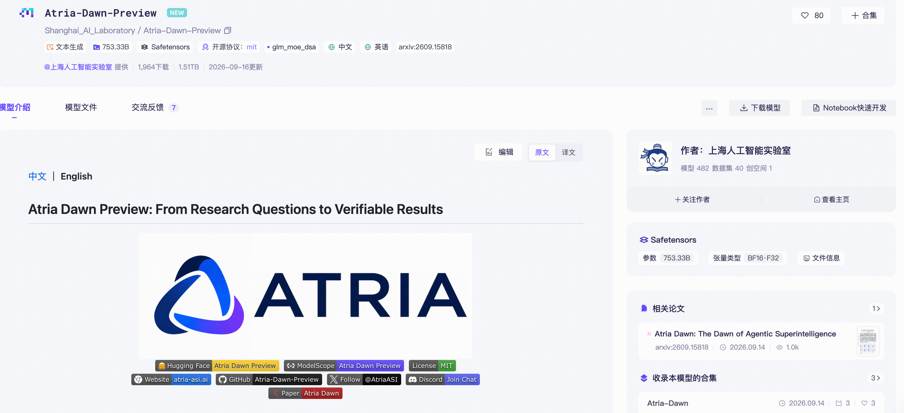

- **09-16 · Confucius4-R2T2** — 网易有道开源流式语音识别模型，基于 Qwen3-ASR 构建，支持从 80 毫秒到 2 秒的细粒度可配置解码块。

  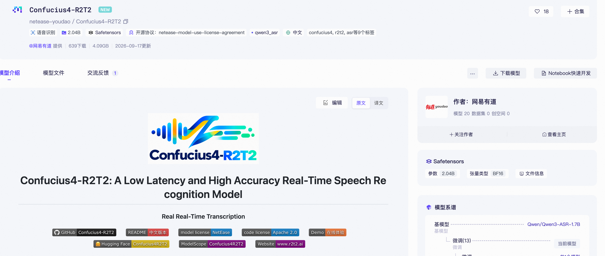

- **09-16 · Confucius4-T3PO** — 网易有道开源 14B 同声传译模型，支持流式文本输入，并实时做出 READ/WRITE 决策。

  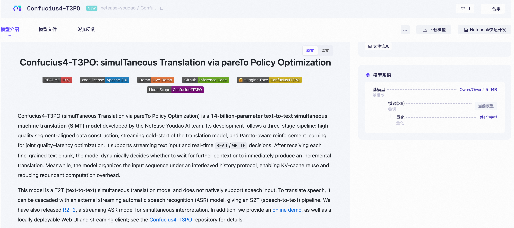

- **09-16 · ZDTaichu5.0-9B** — 紫东太初团队开源多模态模型，采用 Qwen3.5-9B 语言主干和 C-RADIOv4-H 视觉编码器，支持文本、图像、视频及任意分辨率视觉输入。

  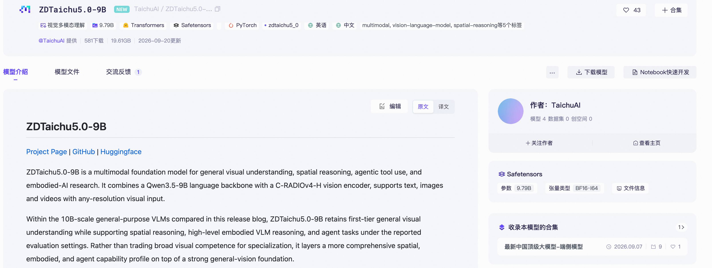

- **09-16 · WeVisDoc** — 腾讯开源端到端文档解析模型，提供 2B 与 4B 两种尺寸，基于 Qwen3-VL-Instruct 微调。

  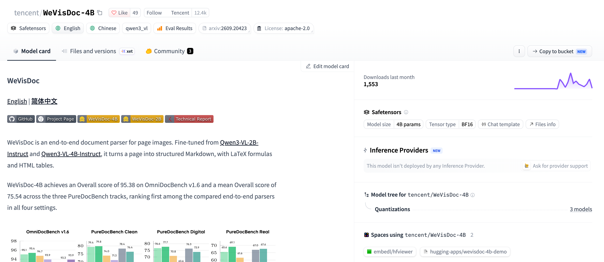

- **09-17 · Xing4.0-29B-A4B** — 中国电信开源星辰模型，约 29B 总参数、4B 激活参数，支持长上下文与工具调用。[相关文章](https://mp.weixin.qq.com/s/BJp2Mz_Y-PRYm51ZG7_bXQ)

  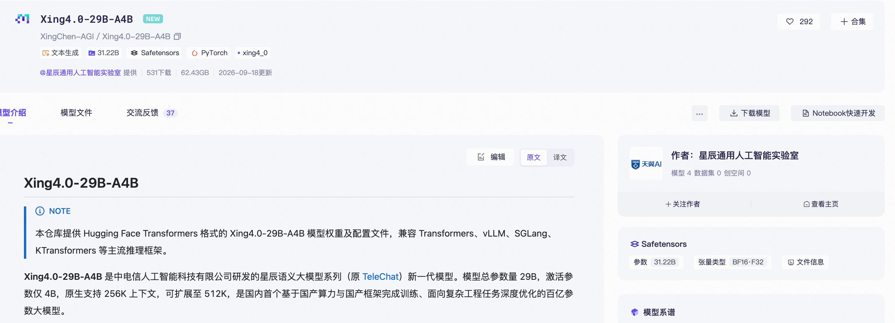

- **09-18 · Realtime-Venus** — 蚂蚁开源支持异步委托的全双工交互系统，包含音视频交互模型 Realtime-Venus-Omni 与音频理解模型 Realtime-Venus-Audio。

  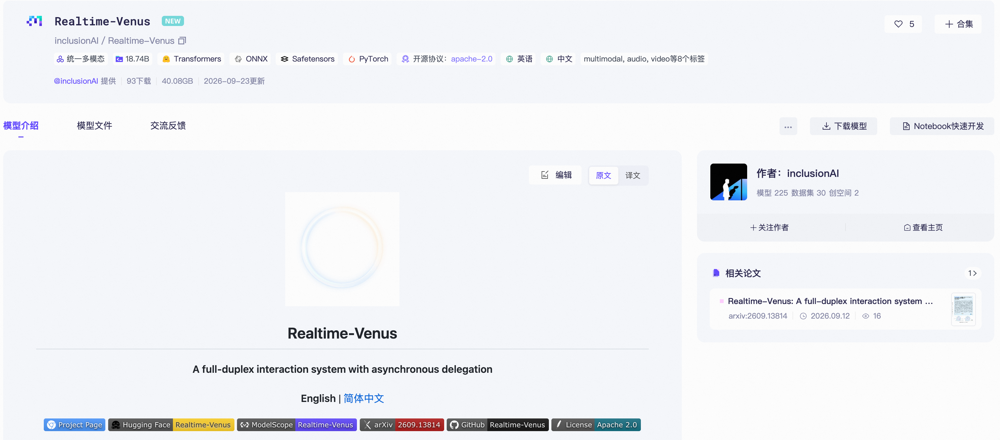

- **09-18 · RADAR** — 阿里巴巴开源面向腹部 CT 的通用视觉语言诊断研究模型，使用超过 40 万例增强 CT 检查和 1500 万对具备解剖结构感知能力的图文数据训练，并直接从临床报告中学习。

  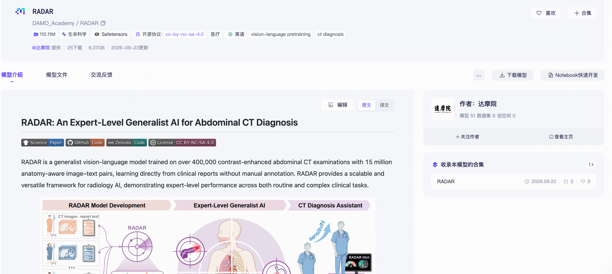

- **09-20 · Qwen-Image-2.1** — 阿里千问开源统一的文本到图像生成与图像编辑模型，视觉生成组件采用 7B DiT。

  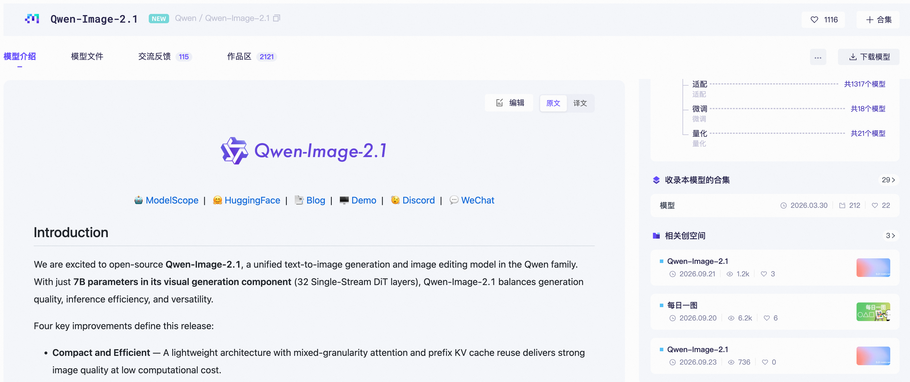

- **09-22 · Logics-Parsing-V3** — 阿里巴巴开源 0.8B 视觉语言文档解析模型，可跨页追踪结构并重建长文档层级。

  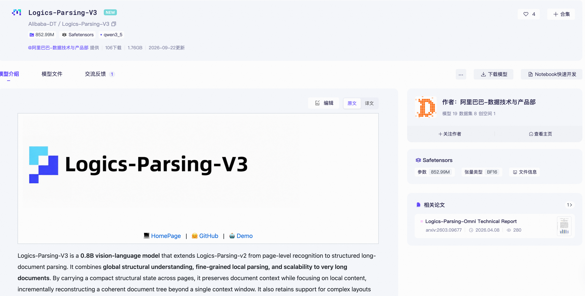

- **09-22 · MiMo-V2.6** — 小米开源包含 Distill-Qwen-9B、Flash 与 Pro 的模型系列，单一模型支持文本、图像、视频和音频，具备 1M 上下文，适用于长代码仓库、工具调用轨迹与多会话 Agent。

  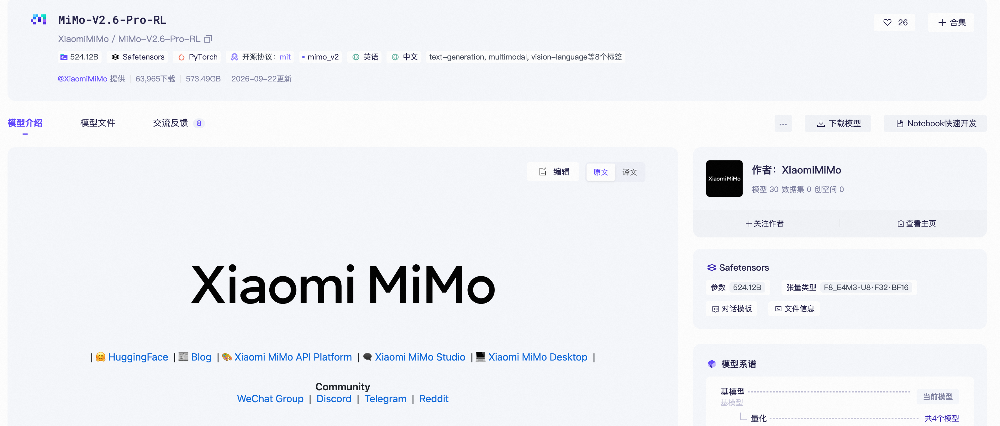

- **09-23 · Ming-Image-0.1-Design** — 蚂蚁开源 6B 文生图模型，专为 UI、信息图、海报及其他富含文字的视觉设计打造。

  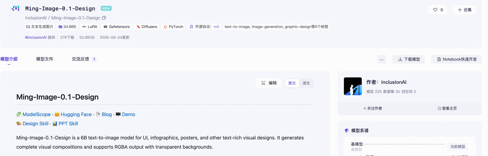

- **09-23 · Ming-Image-0.1-Design-Layer** — 蚂蚁开源设计图层分解模型，可根据输入图像和图层规划，将扁平设计图分解为指定数量的 RGBA 图层。

  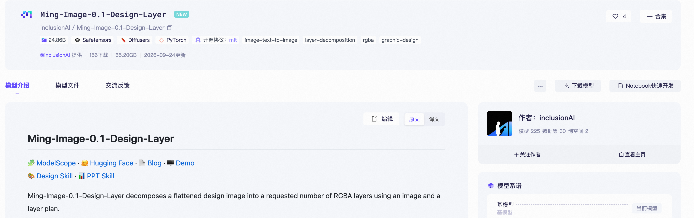

- **09-23 · flux-3-action** — Black Forest Labs 开源 7B 世界动作模型，可依据相机画面、机器人状态与文本指令预测动作。

  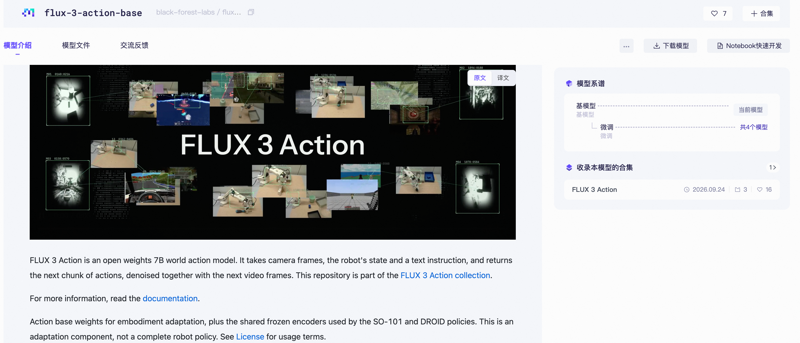

- **09-23 · Nemotron-3-Diarization** — NVIDIA 开源说话人分离模型，用于识别音频中谁在何时说话，支持流式与离线处理。

  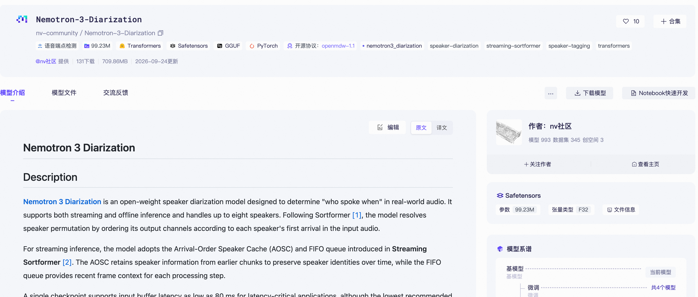

- **09-23 · APUS-OpenJev-v1** — APUS AI-LAB 开源包含 4B、9B 和 35B-A3B 三种尺寸的模型系列，可结合任务、上下文与候选动作对候选项评分。

  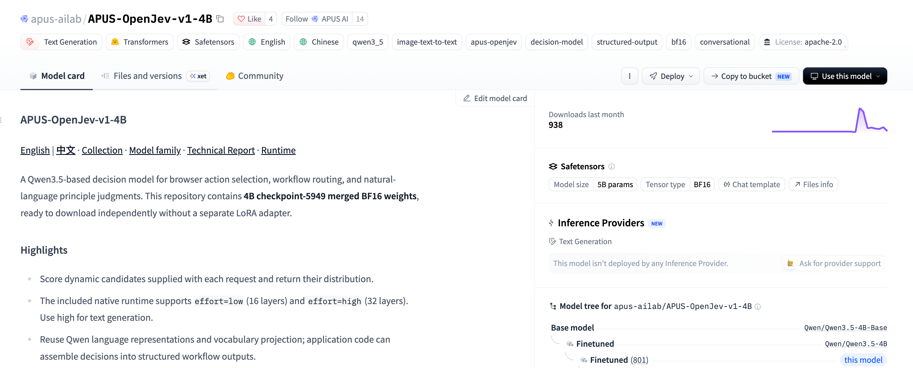

- **09-25 · CLM-v0.1-8B** — 斯坦福开源对比学习模型，通过训练将状态与动作关联，在计算机使用、游戏和工具调用任务上取得与 Jev 相当的表现，同时将延迟最高降低 9 倍。

  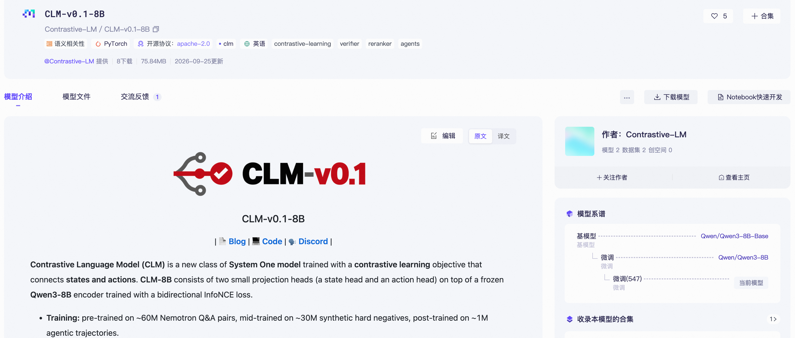

- **09-26 · Intern-Decision** — 上海人工智能实验室开源多模态结构化决策模型，基于 Qwen3.5-4B 微调。

  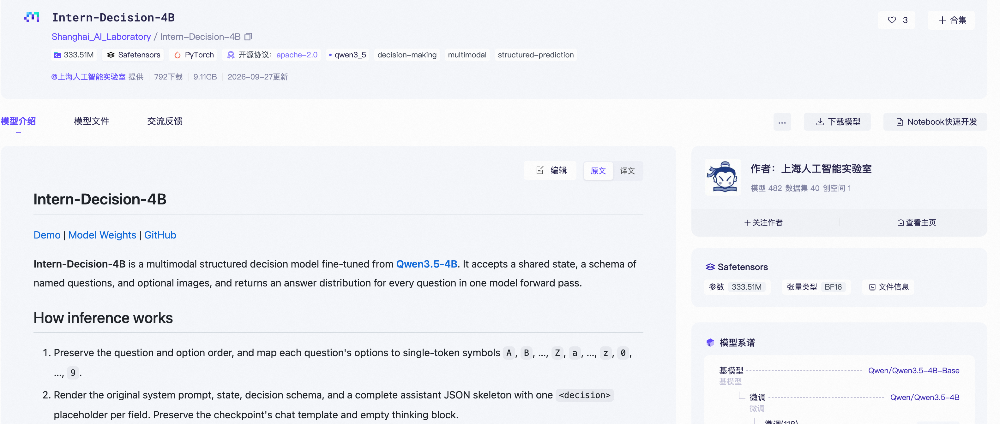

- **09-27 · Naive-N0.5-Flash** — NaiveAI 开源 309B 总参数、15.5B 激活参数的 MoE 模型。

  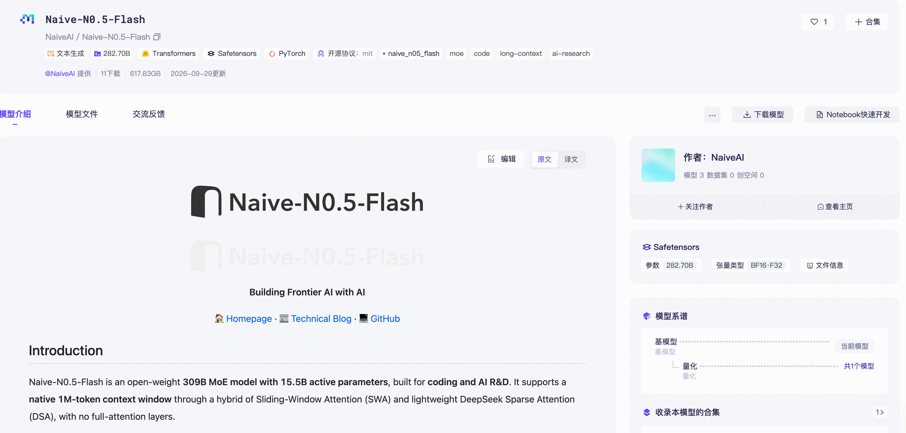

- **09-28 · Holo4** — H Company 开源 GUI 模型系列，提供 27B 与 35B-A3B 两种尺寸，基于 Qwen3.8 微调，可接收屏幕截图和工具结果并执行点击、输入、代码及工具调用。

  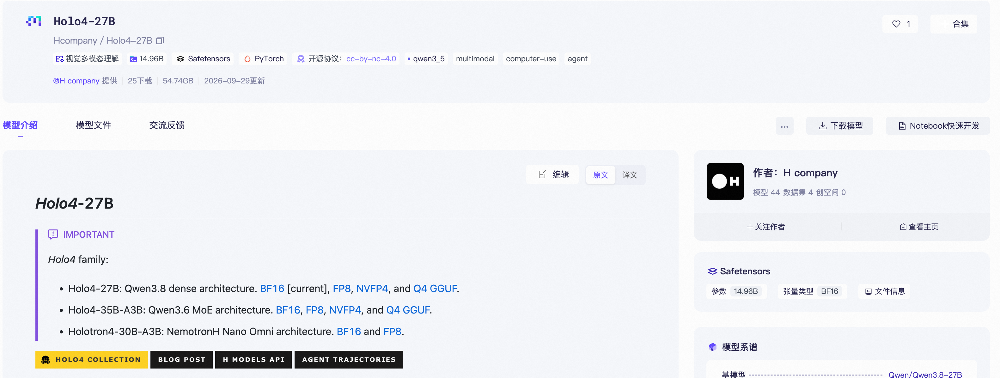

- **09-29 · IQuest-Q1** — IQuest 开源 320B 总参数、15B 激活参数的模型，支持 520K 上下文。

  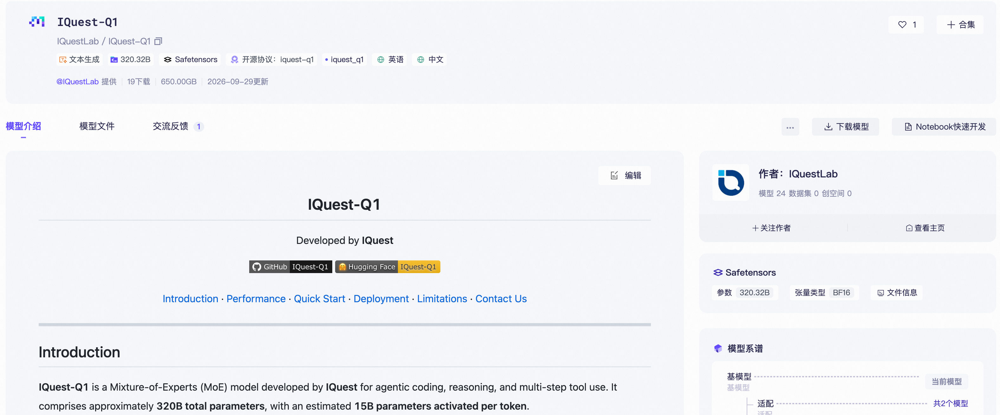
